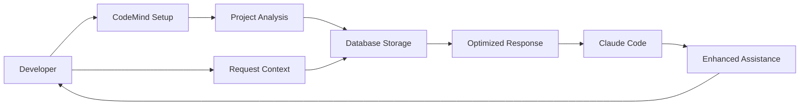

# CodeMind - Intelligent Code Auxiliary System

**Enhance your Claude Code experience with intelligent context management and project analysis**

## What is CodeMind?

CodeMind is a comprehensive intelligent code auxiliary system that provides:

### 🏗️ **Multi-Role AI Orchestration**
- 19 specialized AI roles coordinating development workflows
- Automated quality gates and scoring (Security ≥90%, Coverage ≥85%, SOLID ≥90%)
- Parallel workflow execution with intelligent resource management
- Branch-based development with automated merge strategies

### 🧠 **Semantic Knowledge Graph**
- Triad-based (Subject-Predicate-Object) code relationship analysis
- Deep architectural pattern detection and anti-pattern identification
- Cross-project knowledge integration and learning
- Persistent knowledge base with SQLite/PostgreSQL backend

### 🔍 **Advanced Code Analysis**
- Multi-level duplication detection (exact, structural, semantic, renamed)
- Configuration centralization with migration planning
- Vector-based semantic code search across projects  
- Dependency tree analysis with circular dependency detection

### 🎯 **Automated Improvement**
- Self-improvement engine using dogfooding strategy
- Scheduled analysis and optimization cycles
- Technical debt quantification and reduction planning
- Performance bottleneck detection and optimization

### 🚀 **Smart Context Management**  
- Claude-optimized context compression and management
- Token-efficient project context generation
- Intelligent queue management with priority handling
- Real-time limit detection and adaptive strategies

## Why Use CodeMind?

### Without CodeMind
```
You: "Help me implement authentication"
Claude: "What framework are you using? What's your current setup? Do you have a database?"
[Back and forth questions eating up context...]
```

### With CodeMind
```bash
# Get optimized context first
curl "http://localhost:3004/claude/context/my-app?intent=coding"

You: "Help me implement authentication. Context: [paste response]"
Claude: "Based on your Express + PostgreSQL setup with JWT patterns, here's the implementation..."
[Immediate, accurate assistance]
```

## 🚀 Quick Start (5 Minutes)

### 1. Start CodeMind
```bash
git clone https://github.com/yourusername/CodeMind.git
cd CodeMind
docker-compose -f docker-compose.postgres.yml up -d
```

### 2. Install Claude CLI (Recommended)
```bash
npm install -g @anthropics/claude-cli
```

### 3. Auto-Improve Existing Project ⭐ **NEW!**
```bash
# Automatically analyze and fix issues in existing codebase
npx codemind auto-fix /path/to/your-project

# Preview changes without modifying files
npx codemind auto-fix /path/to/your-project --dry-run

# Fix specific issue types only
npx codemind auto-fix /path/to/your-project --types duplicates centralization
```

### 4. Setup Your Project
```bash
# Interactive setup (ask questions)
./scripts/interactive-setup.sh -p "/path/to/your-project"

# Auto-discovery setup (analyze codebase automatically) ⭐ NEW!
./scripts/interactive-setup.sh -p "/path/to/your-project" --auto-discovery

# Update existing project data ⭐ NEW!
./scripts/interactive-setup.sh -p "/path/to/your-project" -a -u

# Examples:
./scripts/interactive-setup.sh -p "/home/user/my-ecommerce-app" --auto-discovery
# → Automatically detects: Node.js, Express, TypeScript, Jest testing
# → Project name: "my-ecommerce-app"  
# → API calls: curl ".../context/my-ecommerce-app?intent=coding"

# Professional short flags (recommended):
./scripts/interactive-setup.sh -p "/home/user/my-app" -a -u
# → -a (auto-discovery), -u (update existing data)

# Update existing project configuration:
./scripts/interactive-setup.sh -p "/home/user/my-app" --auto-discovery --update
# → Overrides existing database entry with fresh analysis

# For Windows PowerShell:
.\scripts\interactive-setup.ps1 -p "C:\Projects\MyApp" -Auto
.\scripts\interactive-setup.ps1 -p "C:\Projects\MyApp" -Auto -Override
```

### 5. Use During Development
```bash
# Before coding - get context
curl "http://localhost:3004/claude/context/your-project?intent=coding"

# When stuck - get smart questions
curl "http://localhost:3004/claude/suggest-questions/your-project"

# Paste context/questions into Claude Code for enhanced assistance
```

## 📖 Documentation

- **[Quick Start Guide](docs/QUICKSTART.md)** - Get up and running in 5 minutes
- **[Auto-Improvement Mode](docs/AUTO_IMPROVEMENT_MODE.md)** - Automatic project analysis and fixes ⭐ **NEW!**
- **[Features Documentation](docs/FEATURES_DOCUMENTATION.md)** - Comprehensive feature overview
- **[Complete Setup Guide](SETUP.md)** - Detailed installation and configuration
- **[API Documentation](docs/API.md)** - All endpoints and examples
- **[Development Plans](docs/PHASE4_DEVELOPMENT_PLANS.md)** - Plan management system

## 🎯 Key Features

### 1. Automatic Project Improvement ⭐ **NEW!**
- **Legacy Modernization**: Automatically fix code duplications, centralize configs, resolve dependencies
- **Quality Enhancement**: Apply systematic improvements with configurable aggressiveness levels
- **Safe Refactoring**: Preview changes with dry-run mode, automatic backups, comprehensive reports

### 2. Context-Aware Setup
- **Greenfield Projects**: Get architectural guidance and best practices
- **Existing Projects**: Validate decisions against actual codebase
- **Claude CLI Integration**: Automatic enhancement without copy-paste

### 3. Token-Efficient API
- **Optimized Responses**: ~200-800 tokens based on intent
- **Smart Caching**: 5-minute cache for repeated queries
- **Intent-Based**: Different contexts for coding, review, or overview

### 4. Intelligent Analysis
- **Pattern Detection**: Identify architectural patterns and inconsistencies
- **Smart Questions**: AI-generated questions specific to your project
- **Progress Tracking**: Monitor project evolution over time

### 5. Development Planning (Phase 4)
- **Plan Templates**: Feature development, bug fixes, refactoring, testing
- **Progress Tracking**: Task completion and milestone monitoring
- **AI Suggestions**: Get plan recommendations based on project analysis

## 💻 How It Works



1. **Setup**: Run interactive setup to configure your project
2. **Analysis**: CodeMind analyzes your codebase and patterns
3. **Storage**: Project metadata stored in PostgreSQL database
4. **Context**: Request optimized context before Claude interactions
5. **Enhancement**: Use context for better Claude Code assistance

## 🔧 System Architecture

### Components
- **API Server**: Express.js REST API (Port 3004)
- **Database**: PostgreSQL with comprehensive schema
- **CLI Tools**: Bash and PowerShell setup scripts
- **Claude Integration**: CLI and API support

### Technology Stack
- **Backend**: Node.js, Express, TypeScript
- **Database**: PostgreSQL with node-postgres
- **Container**: Docker & Docker Compose
- **Integration**: Claude CLI, Anthropic API

## 📊 API Examples

### Get Project Context
```bash
# Quick overview
curl "http://localhost:3004/claude/context/my-app?intent=overview"

# Coding context
curl "http://localhost:3004/claude/context/my-app?intent=coding&maxTokens=800"

# Review context
curl "http://localhost:3004/claude/context/my-app?intent=review"
```

### Get Smart Questions
```bash
curl "http://localhost:3004/claude/suggest-questions/my-app?maxQuestions=5"

# Response:
{
  "questions": [
    "How should you handle authentication token refresh?",
    "What caching strategy would work best for your API?",
    "How will you manage database migrations?"
  ]
}
```

### Deep Analysis
```bash
curl -X POST http://localhost:3004/claude/analyze-with-context \
  -H "Content-Type: application/json" \
  -d '{
    "projectPath": "my-app",
    "analysisType": "code_review",
    "context": {
      "intent": "quality_improvement",
      "includePatterns": true
    }
  }'
```

## 🚦 Project Status

### ✅ Phase 1: Active
- Token-efficient Claude integration
- Interactive setup with Claude CLI
- Smart context generation
- Question suggestions

### 🔧 Phase 4: Designed
- Development plan management
- Progress tracking
- Task dependencies
- Milestone monitoring

### 📅 Future Phases
- **Phase 2**: Direct CLI integration (`code-knowledge` commands)
- **Phase 3**: Web dashboard and visualization
- **Phase 5**: IDE plugins and extensions

## 🤝 Contributing

We welcome contributions! See [CONTRIBUTING.md](CONTRIBUTING.md) for guidelines.

### Development Setup
```bash
# Clone repository
git clone https://github.com/yourusername/CodeMind.git
cd CodeMind

# Install dependencies
npm install

# Run locally
npm run dev

# Run tests
npm test
```

## 📝 License

MIT License - See [LICENSE](LICENSE) for details.

## 🆘 Support

- **Documentation**: [Full docs](SETUP.md)
- **Issues**: [GitHub Issues](https://github.com/yourusername/CodeMind/issues)
- **Discussions**: [GitHub Discussions](https://github.com/yourusername/CodeMind/discussions)

## 🌟 Why CodeMind?

> "Instead of spending time explaining your project context to Claude over and over, let CodeMind provide that context automatically, so you can focus on getting actual coding help."

CodeMind bridges the gap between your codebase and AI assistance, making every interaction more productive and context-aware.

---

**Ready to enhance your Claude Code experience?** [Get started in 5 minutes →](docs/QUICKSTART.md)