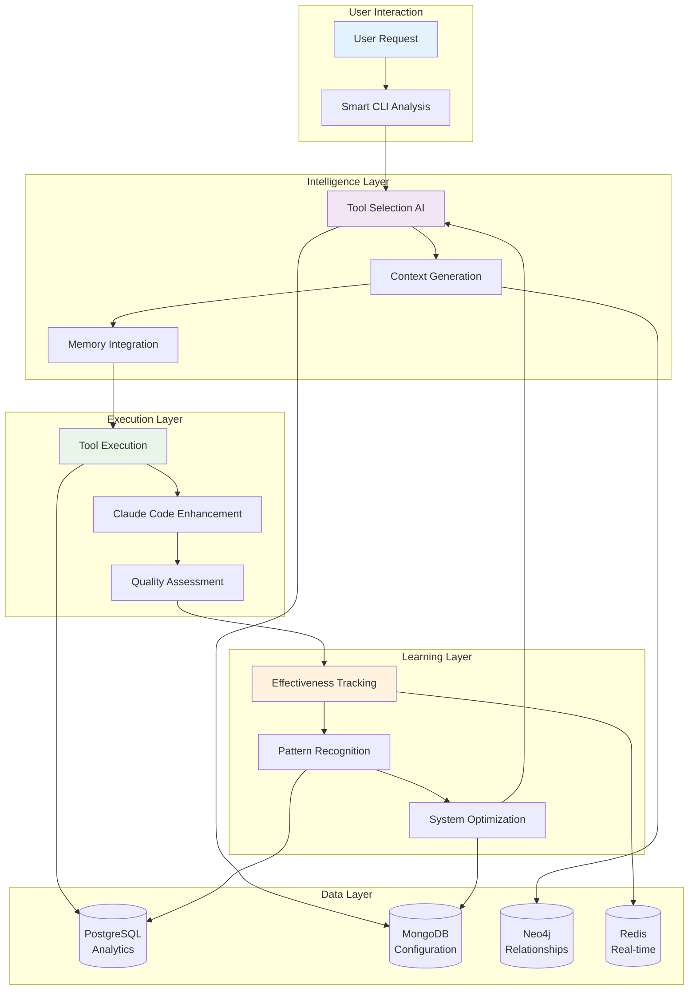

# CodeMind Architecture Documentation

## Overview

This directory contains the consolidated architecture documentation for CodeMind - an intelligent Claude Code enhancement platform. The documentation has been cleaned up and organized into four fundamental documents that comprehensively cover the system architecture.

## Core Architecture Documents

### 📋 [Three-Layer Architecture](three-layer-architecture.md)
**Complete system architecture overview**
- Layer 1: Smart CLI (Context Enhancement)
- Layer 2: Orchestrator (Workflow Coordination) 
- Layer 3: Planner (Idea to Implementation)
- Cross-layer integration and data flow
- Implementation status and roadmap

### 🧠 [CodeMind CLI System](codemind-cli-system.md)
**Detailed CLI architecture and intelligent tool selection**
- Request analysis and intent classification
- AI-powered tool selection with confidence scoring
- Context optimization and token efficiency
- Learning and continuous improvement
- Integration patterns and usage examples

### 🧮 [Memory System](memory-system.md) 
**Comprehensive memory and learning architecture**
- Multi-layered memory hierarchy (Active, Session, Project, Global)
- Context continuity across requests and sessions
- Intelligent compression and learning patterns
- Cross-request knowledge preservation
- Performance optimization and caching strategies

### 🗄️ [Database Usage](database-usage.md)
**Polyglot persistence strategy and database specialization**
- PostgreSQL: Structured analytics and project intelligence
- MongoDB: Flexible documents and tool configuration
- Neo4j: Semantic relationships and graph analysis
- Redis: Real-time operations and workflow coordination
- Integration patterns and CodeMind cycle usage

## Architecture Principles

### 🎯 **Database-First Design**
Each database is specialized for specific data patterns and use cases:
- **PostgreSQL**: ACID transactions, complex analytics, structured project data
- **MongoDB**: Flexible schemas, rapid development, tool configurations  
- **Neo4j**: Graph relationships, semantic analysis, pattern recognition
- **Redis**: Real-time operations, message queues, caching layer

### 🤖 **AI-Driven Intelligence** 
- **Dynamic Tool Selection**: AI chooses optimal tools based on request analysis
- **Context Optimization**: 75-90% token reduction through intelligent context generation
- **Continuous Learning**: System improves effectiveness through usage patterns
- **Pattern Recognition**: Cross-project learning and best practice identification

### 🔄 **Zero Context Loss**
- **Multi-layered Memory**: From active memory to global knowledge preservation
- **Intelligent Compression**: 4.8x compression without losing critical insights
- **Session Continuity**: Perfect handoffs between requests with complete context
- **Learning Integration**: Every interaction teaches the system

### 🏗️ **Layered Architecture**
- **Clear Separation**: Each layer has distinct responsibilities and interfaces
- **Natural Progression**: Layers build upon each other organically
- **Fault Tolerance**: Graceful degradation when components are unavailable
- **Scalable Growth**: Architecture supports evolution from CLI to full platform

## System Integration Flow



## Key Architectural Benefits

### 🚀 **For Developers**
- **Intelligent Context**: Relevant project insights with every Claude Code request
- **Token Efficiency**: 75-90% reduction in manual context gathering
- **Learning System**: Continuously improving recommendations and tool selection
- **Quality Assurance**: Systematic multi-perspective analysis and quality tracking

### 🔧 **For Teams**
- **Consistent Analysis**: Standardized approaches across team members
- **Knowledge Preservation**: Comprehensive project memory and pattern recognition
- **Workflow Automation**: Complex analysis through coordinated AI roles
- **Scalable Quality**: Role-based analysis that scales with project complexity

### 🏢 **For Organizations**
- **Architectural Consistency**: Systematic design pattern enforcement and guidance
- **Risk Mitigation**: Early detection of security, performance, and quality issues
- **Development Efficiency**: Streamlined AI-assisted development workflows
- **Knowledge Management**: Cross-project learning and best practice propagation

## Implementation Status

### ✅ **Production Ready** (Layer 1: Smart CLI)
- Multi-database integration (PostgreSQL, MongoDB, Neo4j, Redis)
- AI-powered tool selection with confidence scoring
- Context optimization and intelligent caching
- Learning and effectiveness tracking
- Comprehensive quality analysis tools

### ✅ **Feature Complete** (Layer 2: Orchestrator)
- Sequential workflow coordination with Redis message queues
- Role-based AI terminal integration
- REST API for workflow management
- Context enrichment across workflow steps
- Real-time monitoring and progress tracking

### 🚧 **In Development** (Layer 3: Planner)
- Interactive idea dashboard interface
- AI-powered planning conversations and requirement gathering
- Business analysis and market research integration
- Automated implementation roadmap generation
- Cross-layer workflow automation and handoffs

## Usage Examples

### Layer 1: Smart CLI Context Enhancement
```bash
# Intelligent tool selection and context optimization
codemind "optimize authentication system security"

# Output: Selected tools, generated context, Claude Code enhancement
# 🔍 Tools: security-scanner (0.94), semantic-graph (0.91), centralization-detector (0.87)
# 📊 Context: 1,245 tokens optimized from potential 8,900 tokens
# ✅ Enhanced request sent to Claude Code with comprehensive security context
```

### Layer 2: Orchestrated Multi-Role Analysis
```bash
# Complex workflow with sequential role coordination  
codemind orchestrate "comprehensive production readiness review" ./app

# Output: 5-role sequential analysis with context enrichment
# 🏗️ Architect → 🔒 Security → ✅ Quality → ⚡ Performance → 🎯 Coordinator
# 📈 Complete analysis with actionable recommendations and implementation plan
```

### Layer 3: Idea to Implementation (Future)
```bash
# Interactive planning from high-level idea
codemind plan "build customer analytics dashboard with real-time insights"

# Output: AI conversation → Detailed plan → Implementation roadmap
# 💡 Idea refinement → 📊 Technical specification → 🛠️ Development phases
# 🚀 Automatic handoff to orchestrator for implementation
```

## Architecture Evolution

### Phase 1: Foundation (Complete)
- ✅ Core CLI with database integration
- ✅ Tool selection and context optimization  
- ✅ Multi-database polyglot architecture
- ✅ Learning and effectiveness tracking

### Phase 2: Orchestration (Complete)
- ✅ Sequential workflow coordination
- ✅ Role-based AI terminal integration
- ✅ Redis message queue system
- ✅ REST API and monitoring dashboard

### Phase 3: Intelligence (In Progress)
- 🚧 Interactive planning interface
- 🚧 AI-powered business analysis
- 🚧 Cross-layer automation
- 🚧 Advanced analytics and insights

### Phase 4: Platform (Planned)
- 📋 Multi-model AI support (GPT-4, Claude, local models)
- 📋 Enterprise collaboration and team workflows
- 📋 Advanced reporting and performance analytics
- 📋 Marketplace for custom tools and workflows

## Getting Started

1. **Understand the Architecture**: Start with [Three-Layer Architecture](three-layer-architecture.md)
2. **Explore the CLI**: Read [CodeMind CLI System](codemind-cli-system.md) 
3. **Learn the Memory System**: Study [Memory System](memory-system.md)
4. **Database Integration**: Review [Database Usage](database-usage.md)
5. **Try the System**: Follow the [Initialization Guide](../../INITIALIZATION_GUIDE.md)

## Archive

Historical architecture documents have been moved to `docs/archive/` for reference. The current documentation represents the cleaned-up, consolidated view of the CodeMind architecture as implemented in the codebase.

---

**CodeMind Architecture**: Intelligent, layered, database-first AI development platform  
**Design Philosophy**: Zero context loss, continuous learning, optimal efficiency  
**From Ideas to Implementation** 🚀