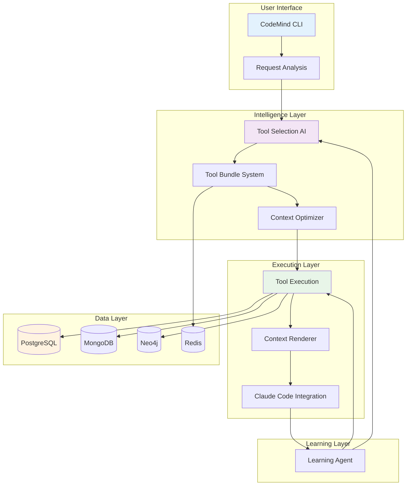
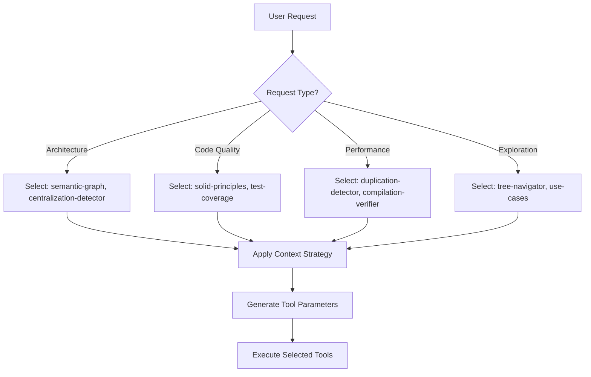

# CodeMind CLI System Architecture

## Overview

The CodeMind CLI is the primary interface for intelligent Claude Code enhancement. It serves as Layer 1 of the three-layer architecture, focusing on context optimization, tool selection, and seamless integration with Claude Code workflows.

## Core Architecture



## Key Components

### 1. Request Analysis Engine

**Location**: `src/cli/context-optimizer.ts`

**Purpose**: Analyzes user requests to understand intent and determine optimal context strategy.

```typescript
interface RequestAnalysis {
  intent: 'explore' | 'refactor' | 'debug' | 'implement' | 'analyze';
  complexity: number;
  domains: string[];
  suggestedTools: ToolSuggestion[];
  contextStrategy: 'minimal' | 'balanced' | 'comprehensive';
}
```

**Process**:
1. **Natural Language Processing**: Parse user request for key concepts
2. **Intent Classification**: Determine primary goal (exploration, refactoring, debugging, etc.)
3. **Complexity Assessment**: Estimate effort and tool requirements
4. **Strategy Selection**: Choose optimal context and tool selection strategy

### 2. Tool Selection AI

**Location**: `src/cli/enhanced-tool-selector.ts`

**Purpose**: AI-powered selection of the most relevant tools for each request.

```typescript
interface ToolSelection {
  selectedTools: Array<{
    name: string;
    confidence: number;
    parameters: Record<string, any>;
    reasoning: string;
  }>;
  totalConfidence: number;
  estimatedTokens: number;
  selectionStrategy: string;
}
```

**Selection Process**:


**Key Features**:
- **Dynamic Selection**: Tools chosen based on request analysis, not hardcoded rules
- **Confidence Scoring**: Each tool selection includes confidence level and reasoning
- **Parameter Optimization**: AI generates optimal parameters for each tool
- **Token Budget Management**: Balances thoroughness with token efficiency

### 3. Tool Bundle System

**Location**: `src/cli/tool-bundle-system.ts`

**Purpose**: Manages collections of tools and their configurations for different use cases.

```typescript
interface ToolBundle {
  id: string;
  name: string;
  description: string;
  tools: string[];
  defaultParameters: Record<string, any>;
  useCases: string[];
  effectiveness: number;
}
```

**Predefined Bundles**:
- **Architecture Bundle**: `semantic-graph`, `centralization-detector`, `solid-principles`
- **Quality Bundle**: `test-coverage`, `duplication-detector`, `compilation-verifier`
- **Performance Bundle**: `performance-analyzer`, `centralization-detector`
- **Security Bundle**: `security-scanner`, `dependency-analyzer`
- **Exploration Bundle**: `tree-navigator`, `use-cases`, `documentation-analyzer`

### 4. Context Optimizer

**Location**: `src/cli/context-optimizer.ts`

**Purpose**: Optimizes context generation for maximum relevance and minimal token usage.

```typescript
interface ContextOptimization {
  originalSize: number;
  optimizedSize: number;
  compressionRatio: number;
  preservedInsights: string[];
  removedRedundancy: string[];
}
```

**Optimization Strategies**:
1. **Semantic Deduplication**: Remove redundant information across tool outputs
2. **Relevance Scoring**: Prioritize most relevant insights for the specific request
3. **Token Budget Management**: Ensure context fits within optimal token limits
4. **Insight Synthesis**: Combine related findings into coherent narratives

## CLI Execution Flow

### Phase 1: Request Processing
```bash
codemind "optimize user authentication system"
```

1. **Input Parsing**: Extract request and project path
2. **Project Context**: Load project metadata and history
3. **Intent Analysis**: Classify as refactoring/optimization request
4. **Strategy Selection**: Choose "balanced" context strategy

### Phase 2: Tool Selection
```typescript
// AI-generated tool selection
const selection = {
  selectedTools: [
    {
      name: "semantic-graph",
      confidence: 0.95,
      parameters: { focusArea: "authentication", depth: 3 },
      reasoning: "Need to understand auth system structure"
    },
    {
      name: "centralization-detector", 
      confidence: 0.88,
      parameters: { pattern: "auth-logic", threshold: 0.7 },
      reasoning: "Identify scattered auth logic for optimization"
    },
    {
      name: "security-scanner",
      confidence: 0.92,
      parameters: { focus: "authentication", severity: "medium+" },
      reasoning: "Security critical for auth optimization"
    }
  ],
  estimatedTokens: 1200,
  selectionStrategy: "security-focused-optimization"
};
```

### Phase 3: Tool Execution
```typescript
// Parallel execution of selected tools
const results = await Promise.all([
  semanticGraph.analyze(projectPath, projectId, { focusArea: "authentication", depth: 3 }),
  centralizationDetector.analyze(projectPath, projectId, { pattern: "auth-logic" }),
  securityScanner.analyze(projectPath, projectId, { focus: "authentication" })
]);
```

### Phase 4: Context Generation
```typescript
const context = await contextOptimizer.generateContext({
  request: "optimize user authentication system",
  toolResults: results,
  strategy: "balanced",
  tokenBudget: 2000
});

// Generated context includes:
// - Current authentication architecture
// - Identified optimization opportunities  
// - Security considerations
// - Specific code locations and patterns
```

### Phase 5: Claude Code Integration
```typescript
// Enhanced request sent to Claude Code
const enhancedRequest = {
  originalRequest: "optimize user authentication system",
  context: context,
  recommendations: [
    "Focus on JWT token management optimization",
    "Consider centralizing auth middleware", 
    "Review session management security"
  ],
  codeLocations: [
    "src/auth/AuthService.ts:45-120",
    "src/middleware/auth.ts:20-60"
  ]
};
```

## Database Integration

### PostgreSQL Usage
```sql
-- Tool execution tracking
INSERT INTO analysis_results (
  project_id, tool_name, execution_time, 
  result_data, confidence_score, tokens_used
) VALUES ($1, $2, $3, $4, $5, $6);

-- Pattern recognition
SELECT pattern_type, confidence_score, evidence 
FROM detected_patterns 
WHERE project_id = $1 AND pattern_type LIKE '%auth%';

-- Performance tracking
UPDATE tool_effectiveness 
SET avg_confidence = (avg_confidence + $1) / 2,
    usage_count = usage_count + 1
WHERE tool_name = $2 AND request_type = $3;
```

### MongoDB Usage
```javascript
// Tool configuration management
await db.collection('tool_configs').findOneAndUpdate(
  { projectId, toolName: 'semantic-graph' },
  {
    $set: {
      config: optimizedConfig,
      lastUsed: new Date(),
      effectiveness: newEffectivenessScore
    },
    $inc: { usageCount: 1 }
  },
  { upsert: true }
);

// Learning data storage
await db.collection('learning_data').insertOne({
  requestType: 'authentication-optimization',
  toolsUsed: ['semantic-graph', 'security-scanner'],
  effectiveness: 0.89,
  patterns: ['jwt-optimization', 'middleware-consolidation'],
  timestamp: new Date()
});
```

### Neo4j Integration
```cypher
// Query authentication-related code structure
MATCH (f:File)-[r:CONTAINS]->(c:Class)-[:HAS_METHOD]->(m:Method)
WHERE m.name CONTAINS 'auth' OR m.name CONTAINS 'login'
RETURN f.path, c.name, m.name, m.complexity
ORDER BY m.complexity DESC;

// Trace authentication dependencies
MATCH path = (auth:Class {name: 'AuthService'})-[:DEPENDS_ON*..3]-(dep)
WHERE dep.type IN ['Class', 'Module', 'Service']
RETURN path;
```

### Redis Caching
```javascript
// Cache tool results for session reuse
await redis.setex(
  `tool_result:${projectId}:${toolName}:${contentHash}`,
  3600, // 1 hour TTL
  JSON.stringify(toolResult)
);

// Cache context for similar requests
await redis.setex(
  `context:${projectId}:${requestHash}`,
  1800, // 30 minutes TTL  
  JSON.stringify(optimizedContext)
);
```

## Learning and Optimization

### Tool Effectiveness Tracking
```typescript
interface ToolEffectiveness {
  toolName: string;
  requestType: string;
  averageConfidence: number;
  successRate: number;
  averageExecutionTime: number;
  tokenEfficiency: number;
  userSatisfaction: number;
}
```

### Pattern Recognition
```typescript
interface DetectedPattern {
  patternType: string;
  occurrences: number;
  confidence: number;
  contexts: string[];
  recommendedTools: string[];
  effectiveness: number;
}
```

### Continuous Improvement
1. **Success Tracking**: Monitor which tool combinations produce the best results
2. **Parameter Optimization**: Learn optimal parameters for different contexts
3. **Pattern Recognition**: Identify recurring request patterns and optimize for them
4. **User Feedback Integration**: Incorporate user satisfaction into effectiveness scoring

## CLI Variants and Evolution

### Current Implementations
- **`codemind.ts`**: Core CLI with basic tool selection
- **`codemind-unified.ts`**: Enhanced version with AI-powered selection
- **`codemind-context-enhancer.ts`**: Specialized for context optimization
- **`codemind-cycle-enhanced.ts`**: Full-cycle implementation with learning

### Future Developments
- **Voice Integration**: Natural language request processing
- **Visual Interface**: GUI for complex tool configuration
- **Team Collaboration**: Shared context and learning across team members
- **Custom Tools**: User-defined tools and analysis pipelines

## Usage Examples

### Basic Context Enhancement
```bash
# Simple request with automatic tool selection
codemind "find security vulnerabilities in authentication"

# Output includes:
# 🔍 Selected tools: security-scanner (0.94), semantic-graph (0.87)
# 🎯 Found 3 security issues in auth system
# 📊 Enhanced request sent to Claude Code (1,245 tokens)
```

### Advanced Workflow
```bash
# Complex refactoring with specific tool bundle
codemind "refactor database layer" --bundle architecture --depth 3

# Output includes:
# 🧠 Using architecture bundle: semantic-graph, centralization-detector, solid-principles  
# 📈 Analysis complete: 15 optimization opportunities identified
# 🎯 Context generated: database refactoring roadmap (2,100 tokens)
```

### Learning Optimization
```bash
# View tool effectiveness for current project
codemind --stats --project ./

# Output includes:
# 📊 Tool Performance Summary:
# - semantic-graph: 91% confidence, 1.2s avg time
# - security-scanner: 87% confidence, 2.8s avg time  
# - test-coverage: 95% confidence, 0.8s avg time
# 🎯 Most effective for 'refactoring': centralization-detector (94%)
```

## Integration with Layer 2 (Orchestrator)

### Workflow Handoff
When CLI analysis indicates complex requirements:
1. **Complexity Assessment**: Determine if multi-role analysis would be beneficial
2. **Orchestrator Trigger**: Automatically initiate workflow with enhanced context
3. **Result Integration**: Combine CLI insights with orchestrated analysis
4. **Learning Feedback**: Update CLI effectiveness based on orchestrated results

### Context Enrichment
```typescript
// CLI provides enriched context to orchestrator
const orchestratorInput = {
  originalRequest: userRequest,
  cliAnalysis: {
    selectedTools: toolSelection,
    generatedContext: optimizedContext,
    identifiedPatterns: patterns,
    complexityScore: complexityAssessment
  },
  recommendedRoles: ['architect', 'security', 'performance'],
  estimatedWorkflowTime: estimatedDuration
};
```

## Performance and Efficiency

### Token Optimization
- **Target**: 75-90% reduction in token usage compared to manual context gathering
- **Method**: AI-driven relevance scoring and semantic deduplication
- **Monitoring**: Track token efficiency across different request types

### Execution Speed
- **Parallel Processing**: Execute multiple tools simultaneously
- **Caching Strategy**: Cache results for similar requests and contexts
- **Incremental Updates**: Update only changed analysis components

### Resource Management
- **Memory Efficiency**: Stream large results rather than loading entirely in memory
- **Database Optimization**: Use connection pooling and query optimization
- **Error Handling**: Graceful degradation when individual tools fail

The CodeMind CLI system represents a sophisticated approach to AI-assisted development, providing intelligent context enhancement while continuously learning and optimizing its effectiveness through real-world usage patterns.