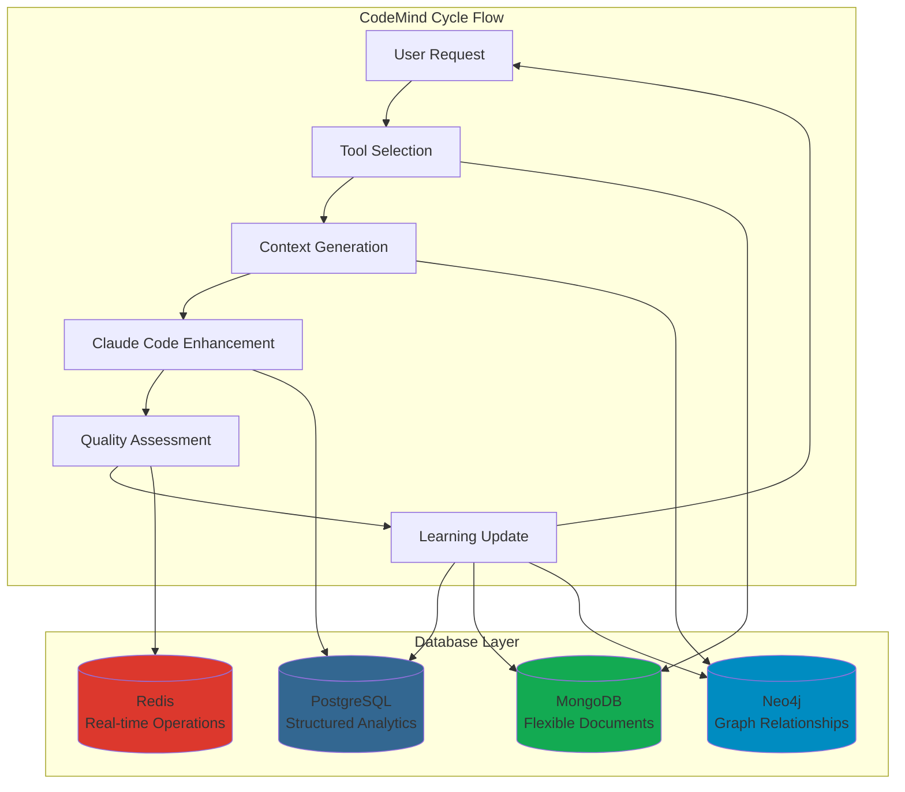
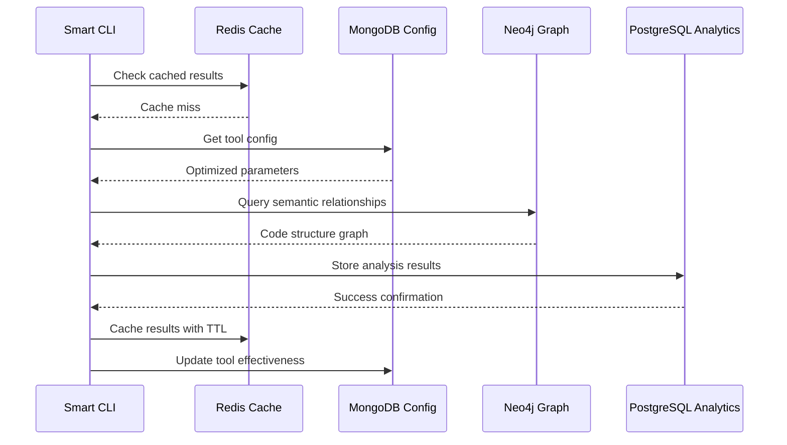

# CodeMind Database Usage Architecture

## Database Strategy Overview

CodeMind employs a polyglot persistence architecture with four specialized databases, each optimized for specific data patterns and use cases within the CodeMind cycle of intelligent tool selection, quality assurance, and continuous learning.

## Database Specialization Matrix



## PostgreSQL: Structured Analytics & Project Intelligence

### Primary Role
**Structured data management, project analytics, performance tracking, and ACID-compliant operations**

### Core Schema Architecture

#### Project Management
```sql
-- Central project registry
CREATE TABLE projects (
  id UUID PRIMARY KEY DEFAULT uuid_generate_v4(),
  project_path TEXT UNIQUE NOT NULL,
  project_name TEXT NOT NULL,
  project_type TEXT,
  languages JSONB NOT NULL DEFAULT '[]'::jsonb,
  frameworks JSONB DEFAULT '[]'::jsonb,
  total_files INTEGER DEFAULT 0,
  status TEXT DEFAULT 'active',
  created_at TIMESTAMPTZ DEFAULT NOW(),
  updated_at TIMESTAMPTZ DEFAULT NOW()
);

-- Tool execution results and analytics  
CREATE TABLE analysis_results (
  id UUID PRIMARY KEY DEFAULT uuid_generate_v4(),
  project_id UUID REFERENCES projects(id) ON DELETE CASCADE,
  tool_name TEXT NOT NULL,
  file_path TEXT,
  analysis_type TEXT NOT NULL, -- 'quality', 'security', 'performance'
  analysis_result JSONB NOT NULL,
  confidence_score DECIMAL(3,2),
  execution_time_ms INTEGER,
  tokens_used INTEGER,
  created_at TIMESTAMPTZ DEFAULT NOW()
);
```

#### Quality Assurance Tables
```sql
-- Tree navigation and code structure
CREATE TABLE tree_navigation_data (
  id UUID PRIMARY KEY DEFAULT uuid_generate_v4(),
  project_id UUID REFERENCES projects(id) ON DELETE CASCADE,
  file_path TEXT NOT NULL,
  node_type TEXT NOT NULL, -- 'file', 'directory', 'class', 'function'
  node_name TEXT NOT NULL,
  parent_path TEXT,
  depth INTEGER DEFAULT 0,
  children_count INTEGER DEFAULT 0,
  complexity_score DECIMAL(3,2),
  metadata JSONB DEFAULT '{}'::jsonb
);

-- Code duplication detection
CREATE TABLE code_duplications (
  id UUID PRIMARY KEY DEFAULT uuid_generate_v4(),
  project_id UUID REFERENCES projects(id) ON DELETE CASCADE,
  duplication_type TEXT NOT NULL, -- 'exact', 'similar', 'structural'
  similarity_score DECIMAL(3,2) NOT NULL,
  source_file TEXT NOT NULL,
  source_start_line INTEGER,
  source_end_line INTEGER,
  target_file TEXT NOT NULL,
  target_start_line INTEGER,
  target_end_line INTEGER,
  code_snippet TEXT,
  tokens_count INTEGER,
  refactor_suggestion TEXT,
  priority TEXT DEFAULT 'medium', -- 'low', 'medium', 'high', 'critical'
  status TEXT DEFAULT 'detected' -- 'detected', 'acknowledged', 'fixed'
);

-- Centralization opportunities  
CREATE TABLE centralization_opportunities (
  id UUID PRIMARY KEY DEFAULT uuid_generate_v4(),
  project_id UUID REFERENCES projects(id) ON DELETE CASCADE,
  opportunity_type TEXT NOT NULL, -- 'scattered_logic', 'repeated_pattern'
  pattern_name TEXT NOT NULL,
  occurrences INTEGER DEFAULT 1,
  affected_files TEXT[] NOT NULL,
  centralization_benefit TEXT,
  suggested_location TEXT,
  suggested_approach TEXT,
  complexity_reduction DECIMAL(3,2), -- 0.0 to 1.0
  priority TEXT DEFAULT 'medium',
  status TEXT DEFAULT 'identified'
);

-- Test coverage analysis
CREATE TABLE test_coverage_data (
  id UUID PRIMARY KEY DEFAULT uuid_generate_v4(),
  project_id UUID REFERENCES projects(id) ON DELETE CASCADE,
  file_path TEXT NOT NULL,
  coverage_type TEXT NOT NULL, -- 'line', 'branch', 'function'
  total_items INTEGER NOT NULL,
  covered_items INTEGER NOT NULL,
  coverage_percentage DECIMAL(5,2) NOT NULL,
  uncovered_lines INTEGER[],
  test_files TEXT[],
  complexity_score DECIMAL(3,2),
  risk_level TEXT, -- 'low', 'medium', 'high', 'critical'
  last_test_run TIMESTAMPTZ DEFAULT NOW()
);
```

#### Build & Compilation Tracking
```sql
-- Compilation results
CREATE TABLE compilation_results (
  id UUID PRIMARY KEY DEFAULT uuid_generate_v4(),
  project_id UUID REFERENCES projects(id) ON DELETE CASCADE,
  build_id TEXT NOT NULL,
  build_status TEXT NOT NULL, -- 'success', 'warning', 'error'
  compiler TEXT, -- 'tsc', 'babel', 'webpack'
  total_files INTEGER,
  successful_files INTEGER,
  files_with_errors INTEGER,
  files_with_warnings INTEGER,
  build_time_ms INTEGER,
  output_size_bytes BIGINT,
  errors JSONB DEFAULT '[]'::jsonb,
  warnings JSONB DEFAULT '[]'::jsonb,
  created_at TIMESTAMPTZ DEFAULT NOW()
);

-- Individual compilation issues
CREATE TABLE compilation_issues (
  id UUID PRIMARY KEY DEFAULT uuid_generate_v4(),
  project_id UUID REFERENCES projects(id) ON DELETE CASCADE,
  build_id TEXT NOT NULL,
  file_path TEXT NOT NULL,
  line_number INTEGER,
  column_number INTEGER,
  issue_type TEXT NOT NULL, -- 'syntax', 'type', 'import', 'reference'
  severity TEXT NOT NULL, -- 'error', 'warning', 'info'
  message TEXT NOT NULL,
  suggestion TEXT
);
```

#### SOLID Principles Analysis
```sql
CREATE TABLE solid_violations (
  id UUID PRIMARY KEY DEFAULT uuid_generate_v4(),
  project_id UUID REFERENCES projects(id) ON DELETE CASCADE,
  file_path TEXT NOT NULL,
  class_name TEXT,
  principle TEXT NOT NULL, -- 'SRP', 'OCP', 'LSP', 'ISP', 'DIP'
  violation_type TEXT NOT NULL,
  description TEXT NOT NULL,
  line_number INTEGER,
  severity TEXT DEFAULT 'medium', -- 'minor', 'moderate', 'major', 'critical'
  refactoring_suggestion TEXT,
  estimated_effort TEXT, -- 'small', 'medium', 'large'
  status TEXT DEFAULT 'detected'
);
```

### CodeMind Cycle Integration

#### Tool Selection Phase
```sql
-- Query historical tool effectiveness
SELECT tool_name, AVG(confidence_score) as avg_confidence, COUNT(*) as usage_count
FROM analysis_results 
WHERE project_id = $1 
GROUP BY tool_name
ORDER BY avg_confidence DESC, usage_count DESC;

-- Find similar past requests
SELECT ar.tool_name, ar.analysis_result, ar.confidence_score
FROM analysis_results ar
JOIN projects p ON ar.project_id = p.id
WHERE p.languages @> $1::jsonb -- Similar tech stack
  AND ar.analysis_type = $2
  AND ar.confidence_score > 0.8
ORDER BY ar.created_at DESC;
```

#### Quality Assessment Phase
```sql
-- Generate project quality score
WITH quality_metrics AS (
  SELECT 
    AVG(coverage_percentage) as avg_coverage,
    COUNT(*) FILTER (WHERE priority = 'critical') as critical_issues,
    COUNT(*) FILTER (WHERE duplication_type = 'exact') as exact_duplicates,
    COUNT(*) FILTER (WHERE severity = 'major') as solid_violations
  FROM test_coverage_data tcd
  FULL OUTER JOIN code_duplications cd ON tcd.project_id = cd.project_id
  FULL OUTER JOIN solid_violations sv ON tcd.project_id = sv.project_id
  WHERE tcd.project_id = $1
)
SELECT 
  CASE 
    WHEN avg_coverage > 80 AND critical_issues = 0 THEN 'excellent'
    WHEN avg_coverage > 60 AND critical_issues < 3 THEN 'good'
    WHEN avg_coverage > 40 OR critical_issues < 10 THEN 'fair'
    ELSE 'poor'
  END as quality_rating,
  avg_coverage,
  critical_issues,
  exact_duplicates,
  solid_violations
FROM quality_metrics;
```

## MongoDB: Flexible Documents & Tool Configuration

### Primary Role
**Tool configurations, complex nested data, rapid prototyping, and flexible document storage**

### Collection Schema

#### Tool Configuration Management
```javascript
// tool_configs collection
{
  "_id": ObjectId("..."),
  "projectId": "uuid-string",
  "toolName": "semantic-search",
  "config": {
    "embeddingModel": "text-embedding-ada-002",
    "chunkSize": 4000,
    "overlapSize": 200,
    "similarity": "cosine", 
    "cacheEnabled": true,
    "thresholds": {
      "relevance": 0.7,
      "confidence": 0.8
    }
  },
  "version": "1.0.0",
  "effectiveness": 0.89,
  "usagePatterns": ["architecture", "refactoring", "exploration"],
  "lastOptimized": ISODate("2025-01-15T10:30:00Z"),
  "updatedAt": ISODate("2025-01-15T14:22:33Z")
}

// tool_bundles collection
{
  "_id": ObjectId("..."),
  "bundleName": "architecture-analysis",
  "description": "Comprehensive architectural analysis bundle",
  "tools": ["semantic-graph", "centralization-detector", "solid-principles"],
  "defaultParameters": {
    "semantic-graph": {
      "depth": 3,
      "includeRelationships": true,
      "maxNodes": 100
    },
    "centralization-detector": {
      "threshold": 0.7,
      "minOccurrences": 3
    }
  },
  "useCases": ["architecture review", "refactoring analysis"],
  "effectiveness": 0.91,
  "usageCount": 47,
  "createdAt": ISODate("2025-01-01T00:00:00Z")
}
```

#### Project Intelligence Storage
```javascript
// project_intelligence collection  
{
  "_id": ObjectId("..."),
  "projectId": "uuid-string",
  "intelligence": {
    "codePatterns": [
      {
        "pattern": "Repository Pattern",
        "confidence": 0.94,
        "locations": ["src/repositories/", "src/data/"],
        "implementations": ["UserRepository", "ProductRepository"]
      }
    ],
    "architecturalDecisions": [
      {
        "decision": "Layered Architecture",
        "rationale": "Separation of concerns and testability",
        "confidence": 0.89,
        "evidence": ["clear layer separation", "dependency injection"]
      }
    ],
    "qualityInsights": {
      "strengths": ["good test coverage", "consistent error handling"],
      "weaknesses": ["code duplication in services", "missing input validation"],
      "recommendations": ["centralize validation logic", "implement shared utilities"]
    },
    "learningHistory": [
      {
        "timestamp": ISODate("2025-01-15T10:00:00Z"),
        "insight": "JWT implementation pattern successful",
        "effectiveness": 0.92,
        "context": "authentication refactoring"
      }
    ]
  },
  "lastAnalysis": ISODate("2025-01-15T14:30:00Z"),
  "analysisCount": 23
}
```

#### Workflow State Management
```javascript
// workflow_states collection
{
  "_id": ObjectId("..."),
  "workflowId": "wf_12345",
  "projectId": "uuid-string",
  "state": "executing",
  "currentStep": 2,
  "totalSteps": 5,
  "steps": [
    {
      "stepId": 1,
      "role": "architect",
      "status": "completed",
      "input": {
        "originalQuery": "review authentication system",
        "projectPath": "/app"
      },
      "output": {
        "analysis": "JWT implementation with bcrypt hashing",
        "recommendations": ["add rate limiting", "improve token refresh"],
        "confidence": 0.91
      },
      "duration": 12000,
      "timestamp": ISODate("2025-01-15T14:10:00Z")
    },
    {
      "stepId": 2, 
      "role": "security",
      "status": "executing",
      "input": {
        "contextFromPrevious": "JWT implementation analysis...",
        "focusAreas": ["authentication", "authorization", "session management"]
      },
      "startedAt": ISODate("2025-01-15T14:10:15Z")
    }
  ],
  "metadata": {
    "priority": "high",
    "estimatedDuration": 45000,
    "createdBy": "cli",
    "tags": ["authentication", "security-review"]
  }
}
```

### CodeMind Cycle Integration

#### Tool Selection Optimization
```javascript
// Find most effective tool configurations
db.tool_configs.aggregate([
  { $match: { projectId: projectId } },
  { $group: {
    _id: "$toolName",
    avgEffectiveness: { $avg: "$effectiveness" },
    bestConfig: { $first: "$config" },
    usagePatterns: { $addToSet: "$usagePatterns" }
  }},
  { $sort: { avgEffectiveness: -1 } }
]);

// Dynamic parameter optimization
db.tool_configs.find({
  toolName: "semantic-graph",
  "usagePatterns": { $in: [detectedPattern] },
  effectiveness: { $gte: 0.8 }
}).sort({ effectiveness: -1 }).limit(1);
```

#### Learning and Adaptation
```javascript
// Update tool effectiveness based on results
db.tool_configs.updateOne(
  { projectId: projectId, toolName: toolName },
  { 
    $set: {
      effectiveness: newEffectiveness,
      lastOptimized: new Date()
    },
    $push: {
      "learningHistory": {
        timestamp: new Date(),
        context: requestContext,
        effectiveness: newEffectiveness,
        parameters: usedParameters
      }
    }
  },
  { upsert: true }
);

// Aggregate learning insights across projects
db.project_intelligence.aggregate([
  { $match: { "intelligence.codePatterns.pattern": targetPattern } },
  { $group: {
    _id: "$intelligence.codePatterns.pattern",
    avgConfidence: { $avg: "$intelligence.codePatterns.confidence" },
    projectCount: { $sum: 1 },
    commonLocations: { $addToSet: "$intelligence.codePatterns.locations" }
  }}
]);
```

## Neo4j: Semantic Graph & Relationship Intelligence

### Primary Role
**Code relationships, semantic connections, impact analysis, and graph-based pattern recognition**

### Graph Schema

#### Core Node Types
```cypher
// Project nodes
(:Project {
  id: "uuid",
  name: "CodeMind",
  type: "api_service",
  languages: ["TypeScript", "JavaScript"],
  created: datetime()
})

// File and code structure nodes
(:File {
  projectId: "uuid",
  path: "/src/cli/codemind.ts",
  type: "typescript",
  size: 12543,
  complexity: 8.5
})

(:Class {
  projectId: "uuid", 
  name: "CodeMindCLI",
  file: "/src/cli/codemind.ts",
  methods: ["analyze", "selectTools", "generateContext"],
  complexity: 7.2
})

(:Function {
  projectId: "uuid",
  name: "generateContext",
  class: "CodeMindCLI",
  parameters: ["request", "tools", "options"],
  complexity: 4.1,
  exported: true
})

// Concept and pattern nodes
(:Concept {
  name: "Authentication",
  domain: "security",
  abstractionLevel: "high"
})

(:Pattern {
  name: "Repository Pattern",
  type: "design_pattern",
  confidence: 0.94,
  implementations: 5
})
```

#### Relationship Types
```cypher
// Code structure relationships
(:File)-[:CONTAINS]->(:Class)
(:Class)-[:HAS_METHOD]->(:Function)
(:Function)-[:CALLS]->(:Function)
(:Class)-[:IMPLEMENTS]->(:Interface)
(:File)-[:IMPORTS]->(:File)

// Semantic relationships
(:Concept)-[:RELATES_TO]->(:Concept)
(:Pattern)-[:APPLIES_TO]->(:File)
(:Class)-[:IMPLEMENTS_PATTERN]->(:Pattern)

// Dependency relationships
(:File)-[:DEPENDS_ON {strength: 0.8}]->(:File)
(:Class)-[:USES {frequency: 12}]->(:Class)
(:Function)-[:INVOKES {callCount: 45}]->(:Function)

// Quality relationships  
(:File)-[:HAS_ISSUE {severity: "high"}]->(:QualityIssue)
(:Class)-[:VIOLATES {principle: "SRP"}]->(:SOLIDViolation)
```

### CodeMind Cycle Integration

#### Context Generation
```cypher
// Find related code for authentication context
MATCH path = (auth:Class {name: "AuthService"})-[:DEPENDS_ON|USES*1..3]-(related)
WHERE related.projectId = $projectId
RETURN related.name, related.file, length(path) as distance,
       avg(rel.strength) as connectionStrength
ORDER BY distance, connectionStrength DESC;

// Impact analysis for code changes
MATCH (target:File {path: $filePath})
MATCH affectedPath = (target)-[:IMPORTS|USES*1..5]-(affected)
WHERE affected.projectId = $projectId
RETURN affected.path, length(affectedPath) as impactDistance,
       affected.complexity as affectedComplexity
ORDER BY impactDistance, affectedComplexity DESC;
```

#### Pattern Recognition  
```cypher
// Detect architectural patterns
MATCH (f:File)-[:CONTAINS]->(c:Class)
WHERE c.projectId = $projectId
WITH f, c, 
  CASE WHEN c.name ENDS WITH "Repository" THEN "Repository"
       WHEN c.name ENDS WITH "Service" THEN "Service"  
       WHEN c.name ENDS WITH "Controller" THEN "Controller"
       ELSE "Other" END as layerType
WHERE layerType <> "Other"
RETURN layerType, count(c) as classCount, collect(c.name) as classes
ORDER BY classCount DESC;

// Cross-reference concepts with code
MATCH (concept:Concept {name: $conceptName})
MATCH (f:File)-[:CONTAINS]->(c:Class)-[:IMPLEMENTS_CONCEPT]->(concept)  
RETURN f.path, c.name, c.methods, 
       [(concept)-[:RELATES_TO]-(related) | related.name] as relatedConcepts;
```

#### Learning and Evolution
```cypher
// Track pattern effectiveness over time
MATCH (p:Pattern)<-[:IMPLEMENTS_PATTERN {confidence: score, timestamp: time}]-(c:Class)
WHERE p.name = $patternName
RETURN p.name, 
  avg(score) as avgConfidence,
  count(c) as implementations,
  max(time) as lastSeen,
  min(time) as firstSeen;

// Update concept relationships based on code analysis
MERGE (c1:Concept {name: $concept1})
MERGE (c2:Concept {name: $concept2})  
MERGE (c1)-[r:RELATES_TO]-(c2)
SET r.strength = COALESCE(r.strength, 0) + $strengthIncrement,
    r.lastSeen = datetime(),
    r.contexts = COALESCE(r.contexts, []) + [$context];
```

## Redis: Real-time Operations & Workflow Coordination

### Primary Role
**Message queues, caching, session management, real-time coordination, and workflow orchestration**

### Data Structure Usage

#### Workflow Message Queues
```redis
# Role-based message queues for sequential workflows
LPUSH queue:architect "{'workflowId':'wf_123','query':'review auth','projectPath':'/app'}"
BRPOP queue:architect 30  # Blocking pop with 30s timeout

# Workflow coordination
HMSET workflow:wf_123 
  status "executing" 
  currentStep "2" 
  totalSteps "5"
  startTime "1678901234567"

# Step completion tracking  
ZADD workflow:wf_123:steps 1678901234567 "architect:completed"
ZADD workflow:wf_123:steps 1678901244567 "security:executing"

# Dead letter queue for failed messages
LPUSH dlq:failed "{'workflowId':'wf_124','error':'timeout','originalQueue':'architect'}"
```

#### Context Caching
```redis
# Tool result caching with intelligent TTL
SETEX cache:tool:semantic-graph:${projectId}:${contentHash} 1800 ${jsonResult}

# Session-based context caching
HMSET session:${sessionId}
  lastRequest "optimize authentication"
  selectedTools "semantic-graph,security-scanner"
  context ${compressedContext}
  patterns "jwt-optimization,middleware-consolidation"

# Real-time request tracking
HMSET request:${requestId}
  status "executing"
  progress "0.65"
  currentTool "semantic-graph"
  estimatedCompletion ${timestamp}
```

#### Performance Metrics & Monitoring
```redis
# Tool performance tracking
ZADD performance:tools:${projectId} ${effectiveness} ${toolName}
ZREVRANGE performance:tools:${projectId} 0 4 WITHSCORES  # Top 5 tools

# Real-time effectiveness stream
XADD effectiveness:stream * 
  tool ${toolName} 
  effectiveness ${score}
  duration ${ms}
  tokens ${count}
  timestamp ${now}

# Request rate limiting
INCR ratelimit:${userId}:${hour}
EXPIRE ratelimit:${userId}:${hour} 3600

# Circuit breaker pattern
SET circuit:${serviceName} "open"
EXPIRE circuit:${serviceName} 60  # 1 minute cooldown
```

#### Learning Coordination
```redis
# Pattern effectiveness voting
ZINCRBY patterns:effectiveness ${effectivenessScore} ${patternName}
ZREVRANGE patterns:effectiveness 0 9 WITHSCORES  # Top 10 patterns

# Tool learning synchronization  
PUBLISH learning:updates "{'tool':'semantic-graph','effectiveness':0.91,'project':'${projectId}'}"

# Adaptive caching TTL based on effectiveness
SET cache:adaptive:${key} ${value}
EXPIRE cache:adaptive:${key} ${Math.floor(effectiveness * 3600)}  # Higher effectiveness = longer cache
```

### CodeMind Cycle Integration

#### Tool Selection Phase
```redis
# Cache tool recommendations
ZADD recommendations:${projectId}:${requestType} ${confidence} ${toolName}

# Session continuity for tool selection  
HMGET session:${sessionId} lastTools patterns successfulCombinations
```

#### Orchestration Coordination
```redis
# Sequential workflow message passing
MULTI
LPUSH queue:architect ${workflowMessage}
HMSET workflow:${workflowId} status "queued" step "1"
EXEC

# Cross-role context passing
HSET context:${workflowId} architect:output ${analysisResults}
HGET context:${workflowId} architect:output  # Retrieved by security role
```

#### Real-time Quality Monitoring
```redis
# Live quality metrics
HSET quality:${projectId} 
  coverage ${coveragePercent}
  duplications ${duplicationCount}  
  violations ${violationCount}
  lastUpdate ${timestamp}

# Alert thresholds
SET alert:${projectId}:coverage "threshold:60,current:${coverage}"
PUBLISH alerts:quality "{'project':'${projectId}','metric':'coverage','value':${coverage}}"
```

## Cross-Database Integration Patterns

### Data Flow Orchestration


### Consistency Patterns
1. **Eventually Consistent**: Learning updates propagate asynchronously
2. **Read-Through Cache**: Redis caches PostgreSQL query results
3. **Write-Behind**: Batch updates to reduce database load
4. **Event Sourcing**: Redis streams capture all tool executions

### Performance Optimization
1. **Connection Pooling**: Shared connection pools across all databases
2. **Query Optimization**: Materialized views and indexes for frequent queries  
3. **Batch Operations**: Group related updates to minimize round trips
4. **Intelligent Caching**: Context-aware TTL and cache invalidation

## Summary: Database Usage in CodeMind Cycle

### 🔄 **Tool Selection** (MongoDB + Redis)
- **MongoDB**: Store and optimize tool configurations based on effectiveness
- **Redis**: Cache tool recommendations and session patterns

### 🎯 **Context Generation** (Neo4j + PostgreSQL)  
- **Neo4j**: Query code relationships and semantic connections
- **PostgreSQL**: Retrieve structured analysis results and project patterns

### 🧠 **Claude Code Enhancement** (All Databases)
- **PostgreSQL**: Track request patterns and tool effectiveness
- **Redis**: Real-time request monitoring and progress tracking

### ✅ **Quality Assessment** (PostgreSQL + Redis)
- **PostgreSQL**: Store comprehensive quality metrics and trends
- **Redis**: Real-time quality monitoring and alerting

### 📈 **Learning Update** (All Databases)
- **PostgreSQL**: Update effectiveness metrics and performance data
- **MongoDB**: Evolve tool configurations and intelligence insights
- **Neo4j**: Strengthen concept relationships and pattern recognition
- **Redis**: Propagate learning updates and invalidate stale cache

This polyglot approach ensures each database operates within its strengths while maintaining consistency and performance across the entire CodeMind platform.