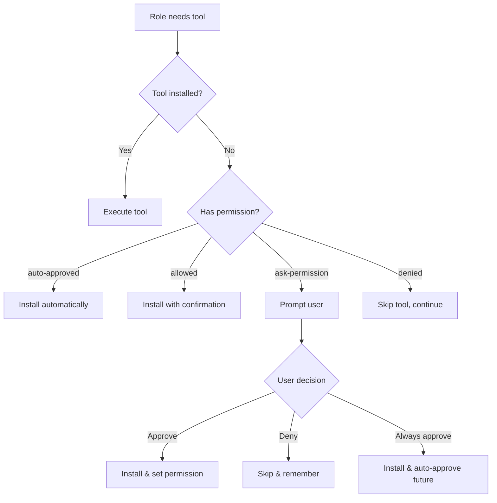

# External Tool Integration System

The CodeMind External Tool Integration System enables AI roles to automatically discover, recommend, install, and execute external development tools based on project context and role requirements.

## Architecture Overview

```
┌─────────────────────┐    ┌──────────────────────┐    ┌─────────────────────┐
│   Role Execution    │────│  Workflow Tool       │────│  External Tool      │
│                     │    │  Integrator          │    │  Manager            │
├─────────────────────┤    ├──────────────────────┤    ├─────────────────────┤
│ • Code Review       │    │ • Role-aware tool    │    │ • Tech stack        │
│ • Security Audit    │    │   recommendations    │    │   detection         │
│ • Testing           │    │ • Permission mgmt    │    │ • Tool execution    │
│ • Quality Analysis  │    │ • Installation flow  │    │ • Installation mgmt │
│ • Documentation     │    │ • Event handling     │    │ • Cache management  │
└─────────────────────┘    └──────────────────────┘    └─────────────────────┘
           │                           │                           │
           └───────────────────────────┼───────────────────────────┘
                                       │
┌─────────────────────┐    ┌──────────────────────┐    ┌─────────────────────┐
│  Claude Code CLI    │────│  Claude Tool         │────│  PostgreSQL         │
│  Integration        │    │  Integration         │    │  Database           │
├─────────────────────┤    ├──────────────────────┤    ├─────────────────────┤
│ • User prompts      │    │ • Permission prompts │    │ • Tool registry     │
│ • Installation UI   │    │ • Status notifications│   │ • Installations     │
│ • Progress display  │    │ • Decision logging   │    │ • Permissions       │
│ • Error handling    │    │ • Analytics          │    │ • Usage analytics   │
└─────────────────────┘    └──────────────────────┘    └─────────────────────┘
```

## Key Components

### 1. ExternalToolManager (`external-tool-manager.ts`)

Core service that manages the external tool ecosystem:

- **Tech Stack Detection**: Automatically analyzes projects to identify languages, frameworks, and existing tools
- **Tool Recommendations**: AI-powered suggestions based on project context and role requirements  
- **Installation Management**: Handles tool installation, verification, and tracking
- **Cache Management**: Maintains in-memory caches for performance

**Key Methods:**
```typescript
detectTechStack(projectPath: string): Promise<TechStackDetection>
getToolRecommendations(projectPath: string, roleType: string): Promise<ToolRecommendation[]>
installTool(toolId: string, projectPath: string, roleType: string): Promise<boolean>
executeTool(toolId: string, args: string[], projectPath: string): Promise<ToolExecutionResult>
```

### 2. WorkflowToolIntegrator (`workflow-tool-integrator.ts`)

Orchestrates tool usage within role execution workflows:

- **Role Integration**: Seamlessly integrates with the existing role system
- **Contextual Execution**: Provides role-specific context for tool operations
- **Event System**: Emits events for monitoring and external integration
- **Auto-Installation**: Handles automatic tool installation with permissions

**Key Methods:**
```typescript
onRoleStart(context: ToolExecutionContext): Promise<ToolRecommendation[]>
executeTool(toolId: string, args: string[], context: ToolExecutionContext): Promise<ToolExecutionResult>
preInstallWorkflowTools(projectPath: string, workflowId: string, roles: RoleType[]): Promise<InstallationResults>
```

### 3. ClaudeToolIntegration (`claude-tool-integration.ts`)

Manages user interaction through Claude Code CLI:

- **User Prompts**: Generates structured prompts for tool permissions and recommendations
- **Decision Processing**: Handles user responses and updates permissions
- **Notification System**: Provides feedback on tool installation and usage
- **Analytics**: Tracks user decisions for improving recommendations

**Key Methods:**
```typescript
handleUserResponse(promptId: string, response: UserResponse): Promise<void>
getPendingPrompts(): Map<string, ClaudeToolPrompt>
getUrgentRecommendations(projectPath: string): Promise<ToolRecommendation[]>
```

## Database Schema

### Core Tables

1. **`external_tools`** - Tool registry with metadata
2. **`tool_installations`** - Installation tracking per project  
3. **`role_tool_permissions`** - Permission matrix (role ↔ tool)
4. **`tool_recommendations`** - AI-generated suggestions
5. **`tech_stack_detections`** - Cached project analysis
6. **`tool_usage_analytics`** - Usage metrics and performance
7. **`tool_approval_history`** - User decision tracking

### Key Relationships
- Projects ← → Tool Installations (many-to-many)
- Roles ← → Tool Permissions (many-to-many)
- Tools ← → Recommendations → Projects (many-to-many-to-many)

## Workflow Integration Points

### 1. Project Setup Phase
**Timing**: During project initialization or first workflow execution

```typescript
// Detect tech stack and recommend setup tools
const techStack = await toolManager.detectTechStack(projectPath);
const setupRecommendations = await getRecommendationsByTiming('project-setup');

// Pre-install critical tools with existing permissions
await preInstallWorkflowTools(projectPath, workflowId, allRoles);
```

**Best Use Cases:**
- Linters and formatters (ESLint, Prettier, Black)
- Build tools detection and setup
- Package manager optimization
- Git hooks and commit tools

### 2. Before Coding Phase  
**Timing**: When roles like `IMPLEMENTATION_DEVELOPER` or `CODE_REVIEWER` start

```typescript
// Role-specific tool recommendations
const recommendations = await toolIntegrator.onRoleStart({
  roleType: RoleType.IMPLEMENTATION_DEVELOPER,
  projectPath,
  purpose: 'implement new features'
});
```

**Best Use Cases:**
- IDE extensions and language servers
- Code analysis tools (SonarQube, CodeClimate)
- Testing framework setup
- Debug tooling

### 3. As-Needed Execution
**Timing**: During active role execution when specific tools are required

```typescript
// Execute tool within role context
const result = await toolIntegrator.executeTool('eslint', ['--fix', 'src/'], {
  workflowId,
  roleType: RoleType.CODE_REVIEWER,
  projectPath,
  purpose: 'code quality review'
});
```

**Best Use Cases:**
- Security scanners (npm audit, safety)
- Test coverage tools (jest, pytest-cov)
- Performance profilers
- Documentation generators

### 4. Continuous Monitoring
**Timing**: Throughout workflow execution for optimization

```typescript
// Monitor tool effectiveness and usage patterns
await toolManager.logToolUsage(projectPath, toolId, roleType, {
  usageType: 'execute',
  success: true,
  executionDuration: 1250
});
```

## Permission System

### Permission Levels

1. **`auto-approved`**: Tools install automatically without prompts
2. **`allowed`**: Tools can be installed with single approval
3. **`ask-permission`**: Each use requires explicit approval (default)
4. **`denied`**: Tool is blocked from installation/use

### Trust Levels

1. **`safe`**: Well-known, widely-used tools (ESLint, Prettier)
2. **`verified`**: Tools verified by maintainers (pytest, black)
3. **`community`**: Popular community tools (default)
4. **`experimental`**: New or less-tested tools

### Decision Flow



## Configuration

### System Settings

```typescript
// External tool system configuration
{
  "external_tools_enabled": true,
  "auto_tool_recommendations": true, 
  "tool_permission_timeout_hours": 24,
  "max_tool_installations_per_project": 50,
  "tool_usage_analytics": true
}
```

### Role-Specific Tool Affinities

```typescript
const roleToolAffinities = {
  'IMPLEMENTATION_DEVELOPER': ['linting', 'formatting', 'testing', 'debugging'],
  'SECURITY_AUDITOR': ['vulnerability-scanning', 'static-analysis', 'security-testing'],
  'QUALITY_AUDITOR': ['coverage', 'complexity-analysis', 'duplication-detection'],
  'CODE_REVIEWER': ['static-analysis', 'formatting', 'documentation'],
  'DEVOPS_ENGINEER': ['ci-cd', 'deployment', 'monitoring', 'infrastructure']
};
```

## Example Usage Scenarios

### Scenario 1: New JavaScript Project

1. **Project Setup**: CodeMind detects `package.json` and TypeScript files
2. **Recommendations**: Suggests ESLint, Prettier, Jest, Husky
3. **Auto-Install**: ESLint and Prettier auto-install (marked as 'safe')
4. **User Prompt**: Asks about Jest setup for testing
5. **Role Execution**: CODE_REVIEWER role uses ESLint automatically

### Scenario 2: Security Audit Role

1. **Role Start**: SECURITY_AUDITOR begins execution
2. **Tool Detection**: Finds Python project with requirements.txt
3. **Critical Tool**: Identifies 'safety' for vulnerability scanning
4. **Permission Check**: Requests user approval for safety installation
5. **Execution**: Runs `safety check --json` and analyzes results
6. **Reporting**: Includes security scan results in role output

### Scenario 3: Quality Analysis Workflow

1. **Workflow Init**: Multi-role workflow for code quality improvement
2. **Pre-Install**: Installs approved tools (ESLint, Prettier, Jest)
3. **QUALITY_AUDITOR**: Executes coverage analysis with Jest
4. **Tool Missing**: Needs SonarQube scanner, prompts user
5. **Installation**: User approves, tool installs and executes
6. **Analytics**: Logs tool effectiveness and user satisfaction

## Monitoring and Analytics

### Key Metrics

- **Tool Adoption Rate**: How often recommended tools are installed
- **Execution Success Rate**: Tool execution reliability  
- **User Approval Patterns**: Which tools users trust/deny
- **Performance Impact**: Tool execution times and resource usage
- **Quality Correlation**: Tool usage vs. code quality improvements

### Dashboard Views

1. **Project Tool Status**: Installation status across projects
2. **Role Tool Usage**: Which roles use which tools most
3. **Recommendation Effectiveness**: Confidence vs. adoption rates
4. **Permission Trends**: User approval/denial patterns over time
5. **Performance Metrics**: Tool execution times and success rates

## Security Considerations

### Tool Verification
- All tools include trust level and license information
- Prerequisites are checked before installation
- Installation commands are validated and sandboxed

### Permission Management
- User decisions are logged and auditable
- Permissions can be revoked or modified
- Project-specific permission restrictions supported

### Execution Safety  
- Tools execute in project directories with limited permissions
- Output is captured and sanitized before processing
- Timeout limits prevent runaway processes
- Error handling prevents system compromise

## Future Enhancements

### Planned Features

1. **Custom Tool Registry**: Allow users to add organization-specific tools
2. **Tool Marketplace**: Community-driven tool recommendations
3. **Performance Learning**: ML-based tool effectiveness optimization  
4. **Integration Plugins**: Direct IDE and editor integrations
5. **Cloud Tool Execution**: Serverless tool execution for resource-intensive tasks
6. **Team Permissions**: Organization-level tool approval workflows

### Integration Opportunities

1. **CI/CD Pipeline**: Automatic tool setup in build environments
2. **Code Review**: Tool results embedded in PR comments
3. **Documentation**: Auto-generated tool usage guides
4. **Metrics Dashboard**: Real-time tool performance monitoring
5. **Package Managers**: Direct integration with npm, pip, cargo, etc.

This system provides a foundation for intelligent, context-aware tool management that enhances the capabilities of AI roles while maintaining user control and security.