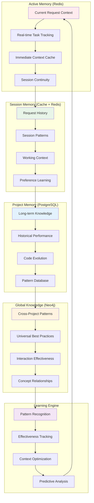

# CodeMind Memory System Architecture

## Overview

CodeMind's memory system provides intelligent context preservation, cross-request learning, and zero-context-loss interactions across all layers of the architecture. It ensures that every interaction builds upon previous work while continuously optimizing for efficiency and relevance.

## Memory Architecture



## Memory Layers

### Layer 1: Active Memory (Redis)

**Purpose**: Handle immediate request context and real-time operations.

**Data Types**:
```javascript
// Current request context
{
  "requestId": "req_12345",
  "sessionId": "sess_67890", 
  "context": {
    "originalRequest": "optimize authentication system",
    "projectPath": "/app",
    "selectedTools": ["semantic-graph", "security-scanner"],
    "executionContext": {
      "startTime": 1678901234567,
      "estimatedDuration": 45000,
      "tokenBudget": 2000
    }
  }
}

// Real-time task tracking
{
  "taskId": "task_54321",
  "status": "executing",
  "progress": 0.65,
  "currentTool": "semantic-graph",
  "completedTools": ["centralization-detector"],
  "metrics": {
    "tokensUsed": 800,
    "executionTime": 12000
  }
}
```

**Redis Data Structures**:
```redis
# Request context (Hash)
HSET request:req_12345 originalRequest "optimize authentication"
HSET request:req_12345 projectPath "/app"
HSET request:req_12345 status "executing"

# Session continuity (Sorted Set for temporal ordering)
ZADD session:sess_67890 1678901234567 "req_12345"
ZADD session:sess_67890 1678901244567 "req_12346"

# Real-time progress (Stream)
XADD progress:task_54321 * tool "semantic-graph" progress "0.65" tokens "800"

# Cache with TTL (String with expiration)
SETEX cache:context:hash123 1800 "{\"optimized\":\"context\"}"
```

### Layer 2: Session Memory (Cache + Redis)

**Purpose**: Maintain context across multiple requests within a session.

**Key Features**:
- **Request Continuity**: Each new request builds on previous work
- **Pattern Recognition**: Identify user work patterns within session
- **Preference Learning**: Track user preferences and optimize accordingly
- **Conflict Detection**: Identify potential conflicts with previous changes

**Data Structure**:
```typescript
interface SessionMemory {
  sessionId: string;
  projectId: string;
  requests: Array<{
    requestId: string;
    timestamp: number;
    request: string;
    context: RequestContext;
    results: ToolResults[];
    effectiveness: number;
  }>;
  patterns: {
    workflowType: string;
    commonTools: string[];
    avgComplexity: number;
    successRate: number;
  };
  continuity: {
    lastWorkingDirectory: string;
    currentBranch: string;
    recentFiles: string[];
    establishedPatterns: string[];
  };
}
```

**Context Transfer Example**:
```typescript
// Request 1: "create user authentication"
const context1 = {
  previousContext: null,
  suggestedApproach: "Create User model with auth fields",
  estimatedComplexity: 6
};

// Request 2: "add JWT tokens" (automatically enhanced)
const context2 = {
  previousContext: {
    whatWasDone: ["Created User model", "Added auth fields"],
    howItWasDone: ["TypeScript interfaces", "bcrypt hashing"],
    challengesEncountered: ["Type definition conflicts"],
    solutionsApplied: ["Updated interface definitions"]
  },
  buildingUpon: ["User model", "auth fields", "bcrypt integration"],
  suggestedApproach: "Add JWT service extending existing auth",
  continuityInstructions: [
    "Use existing User interface",
    "Follow established bcrypt patterns",
    "Maintain type consistency"
  ]
};
```

### Layer 3: Project Memory (PostgreSQL)

**Purpose**: Long-term project knowledge and historical performance tracking.

**Database Schema**:
```sql
-- Project knowledge base
CREATE TABLE project_memory (
  id UUID PRIMARY KEY,
  project_id UUID REFERENCES projects(id),
  knowledge_type TEXT NOT NULL, -- 'pattern', 'performance', 'architecture'
  knowledge_data JSONB NOT NULL,
  confidence_score DECIMAL(3,2),
  created_at TIMESTAMPTZ DEFAULT NOW(),
  last_accessed TIMESTAMPTZ DEFAULT NOW(),
  access_count INTEGER DEFAULT 1
);

-- Request history and learning
CREATE TABLE request_history (
  id UUID PRIMARY KEY,
  project_id UUID REFERENCES projects(id),
  session_id TEXT NOT NULL,
  request_text TEXT NOT NULL,
  selected_tools TEXT[],
  execution_time_ms INTEGER,
  token_usage INTEGER,
  effectiveness_score DECIMAL(3,2),
  user_satisfaction INTEGER, -- 1-5 rating
  created_at TIMESTAMPTZ DEFAULT NOW()
);

-- Performance patterns
CREATE TABLE performance_patterns (
  id UUID PRIMARY KEY,
  project_id UUID REFERENCES projects(id),
  pattern_name TEXT NOT NULL,
  tool_combination TEXT[],
  avg_effectiveness DECIMAL(3,2),
  usage_count INTEGER DEFAULT 1,
  last_used TIMESTAMPTZ DEFAULT NOW(),
  context_types TEXT[] -- 'refactoring', 'debugging', 'exploration'
);
```

**Learning Queries**:
```sql
-- Find most effective tool combinations
SELECT tool_combination, AVG(effectiveness_score) as avg_effectiveness
FROM request_history 
WHERE project_id = $1 
GROUP BY tool_combination
ORDER BY avg_effectiveness DESC;

-- Identify project-specific patterns
SELECT pattern_name, avg_effectiveness, usage_count
FROM performance_patterns
WHERE project_id = $1 AND context_types @> ARRAY[$2]
ORDER BY avg_effectiveness * LOG(usage_count) DESC;

-- Track improvement over time
SELECT DATE_TRUNC('week', created_at) as week,
       AVG(effectiveness_score) as weekly_avg
FROM request_history
WHERE project_id = $1
GROUP BY week
ORDER BY week;
```

### Layer 4: Global Knowledge (Neo4j)

**Purpose**: Cross-project learning and universal best practices.

**Graph Structure**:
```cypher
// Concept relationships
(:Concept {name: "JWT Authentication"})-[:RELATES_TO]->(:Concept {name: "Session Management"})
(:Concept {name: "JWT Authentication"})-[:IMPLEMENTS]->(:Pattern {name: "Token-Based Auth"})

// Tool effectiveness across projects
(:Tool {name: "security-scanner"})-[:EFFECTIVE_FOR {score: 0.89}]->(:Context {type: "authentication"})
(:Tool {name: "semantic-graph"})-[:EFFECTIVE_FOR {score: 0.94}]->(:Context {type: "architecture"})

// Cross-project patterns
(:Project {id: "proj1"})-[:USES_PATTERN {effectiveness: 0.91}]->(:Pattern {name: "Repository Pattern"})
(:Project {id: "proj2"})-[:USES_PATTERN {effectiveness: 0.87}]->(:Pattern {name: "Repository Pattern"})

// Universal best practices
(:BestPractice {name: "Centralized Error Handling"})-[:APPLIES_TO]->(:Domain {name: "Web Applications"})
```

**Global Learning Queries**:
```cypher
// Find universally effective patterns
MATCH (p:Pattern)<-[:USES_PATTERN {effectiveness: score}]-(proj:Project)
WHERE score > 0.8
RETURN p.name, AVG(score) as avg_effectiveness, COUNT(proj) as projects
ORDER BY avg_effectiveness DESC, projects DESC;

// Cross-project tool recommendations
MATCH (t:Tool)-[:EFFECTIVE_FOR {score: s}]->(c:Context {type: $contextType})
RETURN t.name, AVG(s) as effectiveness, COUNT(*) as usage_count
ORDER BY effectiveness DESC;

// Identify emerging patterns
MATCH (concept:Concept)-[:RELATES_TO]-(related:Concept)
WHERE concept.firstSeen > datetime().epochMillis - 86400000 * 30 // Last 30 days
RETURN concept.name, COUNT(related) as connections
ORDER BY connections DESC;
```

## Memory Operations

### Context Initialization
```typescript
async function initializeRequestMemory(
  request: string, 
  projectPath: string, 
  sessionId: string
): Promise<RequestContext> {
  
  // 1. Load session history
  const sessionMemory = await redis.hgetall(`session:${sessionId}`);
  
  // 2. Query project patterns
  const projectPatterns = await postgres.query(`
    SELECT pattern_name, avg_effectiveness, context_types
    FROM performance_patterns 
    WHERE project_id = $1
    ORDER BY avg_effectiveness DESC
  `, [projectId]);
  
  // 3. Find similar past requests
  const similarRequests = await postgres.query(`
    SELECT request_text, selected_tools, effectiveness_score
    FROM request_history
    WHERE project_id = $1 
    AND request_text % $2 -- PostgreSQL similarity operator
    ORDER BY similarity(request_text, $2) DESC
    LIMIT 5
  `, [projectId, request]);
  
  // 4. Generate context
  return {
    sessionContinuity: buildSessionContinuity(sessionMemory),
    projectPatterns: projectPatterns.rows,
    similarExperiences: similarRequests.rows,
    suggestedApproach: generateSuggestedApproach(request, projectPatterns.rows),
    potentialConflicts: detectPotentialConflicts(sessionMemory, request)
  };
}
```

### Learning Update
```typescript
async function updateMemoryFromResults(
  requestId: string,
  results: ToolResults[],
  effectiveness: number,
  userFeedback?: number
): Promise<void> {
  
  // 1. Update immediate context
  await redis.hset(`request:${requestId}`, {
    status: 'completed',
    effectiveness: effectiveness.toString(),
    completedAt: Date.now().toString()
  });
  
  // 2. Store in project memory
  await postgres.query(`
    INSERT INTO request_history 
    (project_id, session_id, request_text, selected_tools, effectiveness_score, user_satisfaction)
    VALUES ($1, $2, $3, $4, $5, $6)
  `, [projectId, sessionId, request, tools, effectiveness, userFeedback]);
  
  // 3. Update patterns
  for (const pattern of extractedPatterns) {
    await postgres.query(`
      INSERT INTO performance_patterns (project_id, pattern_name, tool_combination, avg_effectiveness)
      VALUES ($1, $2, $3, $4)
      ON CONFLICT (project_id, pattern_name) 
      DO UPDATE SET 
        avg_effectiveness = (performance_patterns.avg_effectiveness + $4) / 2,
        usage_count = performance_patterns.usage_count + 1,
        last_used = NOW()
    `, [projectId, pattern.name, pattern.tools, effectiveness]);
  }
  
  // 4. Update global knowledge graph
  await neo4j.session.run(`
    MERGE (t:Tool {name: $toolName})
    MERGE (c:Context {type: $contextType})
    MERGE (t)-[r:EFFECTIVE_FOR]->(c)
    SET r.score = (COALESCE(r.score, 0) + $effectiveness) / (COALESCE(r.usageCount, 0) + 1),
        r.usageCount = COALESCE(r.usageCount, 0) + 1,
        r.lastUsed = datetime()
  `, { toolName, contextType, effectiveness });
}
```

### Context Compression
```typescript
interface CompressionStrategy {
  preserve: {
    failedInteractions: boolean;
    criticalPriority: boolean;
    lowEffectiveness: boolean; // < 0.5
    novelPatterns: boolean;
    errorDetails: boolean;
  };
  compress: {
    routineSuccesses: boolean;
    repetitivePatterns: boolean;
    standardOperations: boolean;
  };
  compressionRatio: number; // Target ratio
}

async function compressSessionMemory(
  sessionId: string, 
  strategy: CompressionStrategy
): Promise<CompressionResult> {
  
  const interactions = await getSessionInteractions(sessionId);
  const compressed = {
    preserved: [],
    summaries: [],
    totalOriginalSize: 0,
    totalCompressedSize: 0
  };
  
  for (const interaction of interactions) {
    if (shouldPreserve(interaction, strategy.preserve)) {
      compressed.preserved.push(interaction);
      compressed.totalCompressedSize += JSON.stringify(interaction).length;
    } else {
      const summary = generateInteractionSummary(interaction);
      compressed.summaries.push(summary);
      compressed.totalCompressedSize += JSON.stringify(summary).length;
    }
    compressed.totalOriginalSize += JSON.stringify(interaction).length;
  }
  
  return {
    ...compressed,
    compressionRatio: compressed.totalOriginalSize / compressed.totalCompressedSize
  };
}
```

## Database-Specific Usage

### PostgreSQL: Structured Analysis & Performance
```sql
-- Tool effectiveness by project
SELECT 
  t.tool_name,
  COUNT(*) as usage_count,
  AVG(ar.confidence_score) as avg_confidence,
  AVG(ar.execution_time_ms) as avg_time
FROM tool_executions te
JOIN analysis_results ar ON te.result_id = ar.id  
JOIN tools t ON te.tool_id = t.id
WHERE te.project_id = $1
GROUP BY t.tool_name
ORDER BY avg_confidence DESC;

-- Pattern effectiveness over time
SELECT 
  DATE_TRUNC('month', created_at) as month,
  pattern_type,
  AVG(confidence_score) as effectiveness
FROM detected_patterns
WHERE project_id = $1 
GROUP BY month, pattern_type
ORDER BY month, effectiveness DESC;

-- Request complexity analysis
SELECT 
  request_type,
  AVG(token_usage) as avg_tokens,
  AVG(execution_time_ms) as avg_time,
  AVG(effectiveness_score) as avg_effectiveness
FROM request_history
WHERE project_id = $1
GROUP BY request_type;
```

### MongoDB: Flexible Configuration & Documents
```javascript
// Tool configuration learning
await db.collection('tool_configs').aggregate([
  { $match: { projectId: projectId } },
  { $group: {
    _id: '$toolName',
    avgEffectiveness: { $avg: '$effectiveness' },
    configurations: { $push: '$config' },
    usagePatterns: { $push: '$usagePattern' }
  }},
  { $sort: { avgEffectiveness: -1 } }
]);

// Session pattern analysis
await db.collection('session_patterns').findOneAndUpdate(
  { sessionId: sessionId },
  {
    $push: {
      requests: {
        timestamp: new Date(),
        request: request,
        tools: selectedTools,
        effectiveness: effectiveness
      }
    },
    $set: { lastActive: new Date() }
  },
  { upsert: true }
);

// Learning data aggregation
const learningInsights = await db.collection('learning_data').aggregate([
  { $match: { projectId: projectId } },
  { $group: {
    _id: '$requestType',
    successfulPatterns: { $push: { $cond: [{ $gte: ['$effectiveness', 0.8] }, '$patterns', null] }},
    avgEffectiveness: { $avg: '$effectiveness' },
    count: { $sum: 1 }
  }},
  { $project: {
    requestType: '$_id',
    successfulPatterns: { $filter: { input: '$successfulPatterns', cond: { $ne: ['$$this', null] }}},
    avgEffectiveness: 1,
    count: 1
  }}
]);
```

### Neo4j: Relationship Intelligence & Graph Analysis
```cypher
// Learning network effects
MATCH (tool:Tool)-[:USED_WITH]-(otherTool:Tool)
WHERE tool.name = $toolName
RETURN otherTool.name, COUNT(*) as coUsageCount, 
       AVG(rel.effectiveness) as avgCombinedEffectiveness
ORDER BY avgCombinedEffectiveness DESC;

// Concept relationship learning
MATCH path = (c1:Concept)-[:RELATES_TO*1..3]-(c2:Concept)
WHERE c1.name = $concept
RETURN c2.name, LENGTH(path) as distance, 
       AVG(rel.strength) as relationshipStrength
ORDER BY distance, relationshipStrength DESC;

// Cross-project pattern propagation
MATCH (p1:Project)-[:USES_PATTERN]->(pattern:Pattern)<-[:USES_PATTERN]-(p2:Project)
WHERE p1.id = $currentProject
RETURN p2.id as similarProject, pattern.name, 
       COUNT(*) as sharedPatterns,
       AVG(pattern.effectiveness) as avgEffectiveness
ORDER BY sharedPatterns DESC, avgEffectiveness DESC;
```

### Redis: Real-time Operations & Caching
```redis
# Real-time request tracking
HMSET request:active:{requestId} 
  status "executing" 
  startTime {timestamp} 
  estimatedEnd {estimated}
  currentTool {toolName}

# Session-based tool recommendations
ZADD session:tools:{sessionId} {effectiveness} {toolName}
ZREVRANGE session:tools:{sessionId} 0 4 WITHSCORES

# Context caching with intelligent TTL
SETEX context:{projectId}:{requestHash} {adaptiveTTL} {contextJSON}

# Real-time effectiveness tracking
LPUSH effectiveness:stream {JSON.stringify({toolName, effectiveness, timestamp})}
LTRIM effectiveness:stream 0 999 # Keep last 1000 entries

# Session continuity
HMSET session:{sessionId}
  lastRequest {request}
  lastTools {tools}
  workingDirectory {path}
  patterns {JSON.stringify(patterns)}
```

## Memory Performance Optimization

### Caching Strategy
1. **L1 Cache (Redis)**: Active request context (< 1 minute TTL)
2. **L2 Cache (Redis)**: Session patterns (30 minutes TTL)  
3. **L3 Cache (PostgreSQL)**: Project patterns (persistent, indexed)
4. **L4 Knowledge (Neo4j)**: Global patterns (persistent, relationship-optimized)

### Compression Techniques
1. **Semantic Deduplication**: Remove redundant information across requests
2. **Pattern Abstraction**: Convert specific instances to reusable patterns
3. **Temporal Compression**: Summarize time-series data into trends
4. **Relevance Pruning**: Remove low-relevance historical data

### Query Optimization
```sql
-- Index strategy for fast pattern lookup
CREATE INDEX CONCURRENTLY idx_performance_patterns_lookup 
ON performance_patterns(project_id, context_types) 
WHERE avg_effectiveness > 0.7;

-- Partition large tables by time
CREATE TABLE request_history_y2024m01 
PARTITION OF request_history
FOR VALUES FROM ('2024-01-01') TO ('2024-02-01');

-- Materialized views for common aggregations
CREATE MATERIALIZED VIEW project_effectiveness_summary AS
SELECT project_id, 
       AVG(effectiveness_score) as avg_effectiveness,
       COUNT(*) as total_requests,
       ARRAY_AGG(DISTINCT tool_name) as commonly_used_tools
FROM request_history 
GROUP BY project_id;
```

## Integration with CodeMind Layers

### Layer 1 Integration (Smart CLI)
- **Context Enhancement**: Provide relevant historical context for tool selection
- **Learning Feedback**: Update tool effectiveness based on CLI results
- **Pattern Recognition**: Identify request patterns for optimized tool selection

### Layer 2 Integration (Orchestrator)
- **Workflow Memory**: Track multi-step workflow effectiveness and optimization
- **Role Learning**: Learn which role combinations work best for different scenarios
- **Context Propagation**: Pass enriched context between workflow steps

### Layer 3 Integration (Planner)
- **Planning History**: Track successful planning patterns and implementation outcomes
- **Idea Evolution**: Maintain history of how ideas develop into implementations
- **Strategic Learning**: Learn long-term patterns across project lifecycles

The CodeMind memory system ensures that no valuable context or learning is ever lost, while continuously optimizing for relevance, efficiency, and actionable insights across all system interactions.