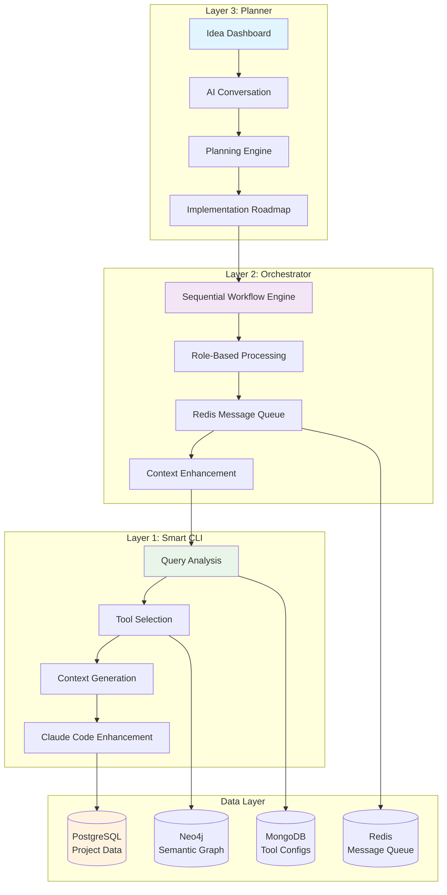
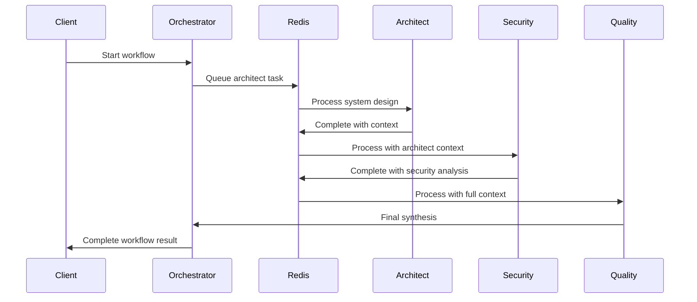

# CodeMind Three-Layer Architecture

## Overview

CodeMind implements a three-layer architecture designed to enhance Claude Code interactions through intelligent tool selection, workflow orchestration, and comprehensive memory management. Each layer builds upon the previous one, creating a cohesive system for AI-assisted development.

## Architecture Diagram



## Layer 1: Smart CLI - Context Enhancement

### Purpose
The foundational layer that enhances every Claude Code interaction with intelligent context selection and optimization.

### Key Components
- **Context Optimizer** (`src/cli/context-optimizer.ts`): Analyzes requests and selects optimal tools
- **Tool Bundle System** (`src/cli/tool-bundle-system.ts`): Manages tool collections and configurations  
- **Enhanced Tool Selector** (`src/cli/enhanced-tool-selector.ts`): AI-driven tool selection with confidence scoring

### Database Usage in Layer 1

#### PostgreSQL (Primary Storage)
```sql
-- Projects and analysis results
projects                    -- Project metadata and status
analysis_results           -- Tool execution results and patterns
detected_patterns          -- Code patterns and architecture insights
tool_effectiveness         -- Historical tool performance data

-- Quality and metrics tables
test_coverage_data         -- Coverage metrics per file
compilation_results        -- Build results and error tracking
solid_violations          -- SOLID principle analysis
performance_metrics       -- Response times and optimization data
```

#### MongoDB (Tool Configuration)
```javascript
// Tool configurations and learning data
{
  "tool_configs": {
    "projectId": "uuid",
    "toolName": "semantic-search", 
    "config": {
      "embeddingModel": "text-embedding-ada-002",
      "chunkSize": 4000,
      "threshold": 0.7
    },
    "effectiveness": 0.89,
    "usagePatterns": ["architecture", "refactoring"]
  }
}
```

#### Neo4j (Semantic Relationships)
```cypher
// Code relationship graph
(:File)-[:IMPORTS]->(:File)
(:Class)-[:IMPLEMENTS]->(:Interface)
(:Function)-[:CALLS]->(:Function)
(:Concept)-[:RELATES_TO]->(:Concept)
```

### Core Workflow
1. **Request Analysis**: Parse user intent and project context
2. **Tool Selection**: AI-driven selection of 2-7 relevant tools based on query analysis
3. **Context Generation**: Execute selected tools to gather relevant project insights
4. **Enhancement**: Package context with original request for Claude Code
5. **Learning**: Update tool effectiveness and pattern recognition from results

## Layer 2: Orchestrator - Workflow Coordination

### Purpose
Coordinates complex multi-step workflows using role-based AI terminals that build upon each other's analysis.

### Key Components
- **Sequential Workflow Orchestrator** (`src/orchestration/sequential-workflow-orchestrator.ts`): Manages workflow execution
- **Redis Queue System** (`src/messaging/redis-queue.ts`): Message passing between roles
- **Orchestrator Server** (`src/orchestration/orchestrator-server.ts`): HTTP API for workflow management

### Database Usage in Layer 2

#### Redis (Message Queue & Coordination)
```javascript
// Workflow message structure
{
  "workflowId": "wf_12345",
  "roleId": "architect", 
  "input": {
    "originalQuery": "review authentication system",
    "projectPath": "/app",
    "contextFromPrevious": {
      "patterns": ["jwt-usage", "bcrypt-hashing"],
      "issues": ["weak-session-management"]
    }
  },
  "metadata": {
    "step": 2,
    "totalSteps": 5,
    "priority": "high"
  }
}
```

#### PostgreSQL (Workflow State)
```sql
-- Workflow execution tracking
workflow_executions       -- Active and completed workflows
workflow_steps            -- Individual step results and timing
role_interactions         -- Communication between AI roles
workflow_patterns         -- Successful workflow templates
```

### Role-Based Processing
1. **Architect Role**: System design and dependency analysis
2. **Security Role**: Vulnerability assessment and security patterns
3. **Quality Role**: Code quality, testing, and maintainability analysis
4. **Performance Role**: Performance bottlenecks and optimization opportunities
5. **Coordinator Role**: Synthesis and actionable recommendations

### Workflow Execution


## Layer 3: Planner - Idea to Implementation

### Purpose
Transforms high-level ideas into detailed implementation plans through AI-powered conversations and automated planning.

### Key Components
- **Idea Dashboard** (`src/dashboard/index.html`): Interactive planning interface
- **Planning Engine** (In Development): Converts ideas to structured plans
- **Business Analysis Tools** (Planned): Market research and competitive analysis

### Database Usage in Layer 3

#### PostgreSQL (Planning Data)
```sql
-- Planning and business logic tables (Future)
project_roadmaps          -- Implementation timelines and milestones  
business_plans           -- Market analysis and revenue models
tech_stack_decisions     -- Technology choices with justifications
architecture_decisions   -- Design patterns and structural choices
implementation_phases    -- Detailed development phases
```

#### MongoDB (Rich Documents)
```javascript
// Complex planning documents
{
  "business_plans": {
    "projectId": "uuid",
    "marketAnalysis": {
      "targetMarket": "...",
      "competitorAnalysis": [...],
      "revenueModel": "..."
    },
    "implementationStrategy": {
      "phases": [...],
      "timeline": "...",
      "resources": [...]
    }
  }
}
```

### Planning Workflow (Planned)
1. **Idea Capture**: User describes concept through natural language
2. **AI Discussion**: Interactive refinement and requirement gathering
3. **Plan Generation**: Automated creation of implementation roadmap
4. **Layer Integration**: Hand-off to Orchestrator for execution
5. **Progress Tracking**: Monitor implementation against plan

## Database Specialization Strategy

### PostgreSQL (Structured Data & Analytics)
- **Primary Use**: Relational data, project metadata, structured analysis results
- **Optimized For**: Complex queries, reporting, data consistency
- **Key Features**: ACID transactions, complex joins, full-text search
- **Tables**: Projects, analysis results, metrics, workflow tracking

### MongoDB (Flexible Documents & Configuration)
- **Primary Use**: Tool configurations, complex nested data, rapid prototyping
- **Optimized For**: Flexible schemas, rapid development, document storage
- **Key Features**: Dynamic schemas, rich queries, horizontal scaling
- **Collections**: Tool configs, business plans, templates, user preferences

### Neo4j (Semantic Relationships & Graph Analysis)
- **Primary Use**: Code relationships, semantic connections, impact analysis
- **Optimized For**: Graph traversals, relationship queries, pattern matching
- **Key Features**: Native graph storage, Cypher queries, relationship-first design
- **Nodes/Relationships**: Files, classes, functions, concepts, dependencies

### Redis (Real-time & Coordination)
- **Primary Use**: Message queues, caching, session management, workflow coordination
- **Optimized For**: High-speed access, pub/sub, temporary data
- **Key Features**: In-memory performance, atomic operations, expiration
- **Data Types**: Queues, caches, sets, sorted sets, streams

## Cross-Layer Integration

### Data Flow
```
Planner (Ideas) 
    ↓ (Implementation Plans)
Orchestrator (Workflows)
    ↓ (Enhanced Requests) 
Smart CLI (Tool Selection)
    ↓ (Context & Results)
Database Layer (Learning & State)
```

### Quality Assurance
1. **Layer 1**: 75-90% token reduction through intelligent tool selection
2. **Layer 2**: Context enrichment through sequential role-based analysis  
3. **Layer 3**: Long-term planning and architecture consistency

### Learning & Optimization
- **Tool Effectiveness**: Track which tools work best for different request types
- **Workflow Patterns**: Identify successful multi-step workflow sequences
- **Project Insights**: Build comprehensive understanding of project structure and patterns
- **Cross-Layer Feedback**: Each layer learns from the results of others

## Implementation Status

### ✅ Completed (Layer 1)
- Smart CLI with database integration
- Tool bundle system with AI-driven selection
- Context optimization and enhancement
- Multi-database integration (PostgreSQL, MongoDB, Neo4j, Redis)

### ✅ Completed (Layer 2)  
- Sequential workflow orchestrator
- Redis-based message queuing
- Role-based AI terminal coordination
- REST API for workflow management

### 🚧 In Development (Layer 3)
- Interactive idea dashboard
- AI-powered planning conversations
- Business analysis integration
- Cross-layer workflow automation

## Benefits

### For Developers
- **Intelligent Context**: Get relevant project insights with every Claude Code request
- **Workflow Automation**: Complex analysis through coordinated AI roles
- **Learning System**: Continuously improving tool selection and recommendations
- **Time Savings**: 75-90% reduction in manual context gathering

### For Teams  
- **Consistent Analysis**: Standardized multi-perspective code reviews
- **Knowledge Preservation**: Comprehensive project memory and pattern recognition
- **Scalable Workflows**: Role-based analysis that scales with project complexity
- **Quality Assurance**: Systematic approach to code quality and architecture

### For Organizations
- **Architectural Consistency**: Systematic design pattern enforcement
- **Risk Mitigation**: Early detection of security and performance issues
- **Knowledge Management**: Comprehensive project intelligence and learning
- **Development Efficiency**: Streamlined AI-assisted development workflows

The three-layer architecture ensures that CodeMind grows from a simple context enhancer to a comprehensive AI development platform, with each layer building naturally upon the foundations established by the lower layers.