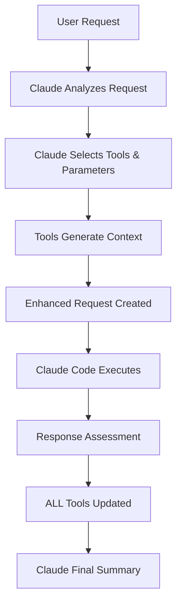

# 🧠 CodeMind Architecture - Context Enhancement for Claude Code

## Core Concept

**CodeMind CLI IS the context optimizer for Claude Code**, not a separate tool. The entire system is designed to enhance Claude Code requests with intelligent, relevant context before execution.

## 🔄 Complete Flow



### Detailed Flow Steps

1. **User Makes Request**
   - Natural language query
   - Project context implicit
   - Intent may be specified

2. **Claude Analyzes & Selects Tools**
   - Claude examines all tool descriptions
   - Selects 2-7 most relevant tools
   - Specifies parameters for each tool
   - Provides confidence and reasoning

3. **Tools Generate Context**
   - Each selected tool runs with Claude-specified parameters
   - Tools query their databases/graphs
   - Context sections generated with insights

4. **Enhanced Request Created**
   - Original query + tool context
   - Token-optimized packaging
   - Recommendations included

5. **Claude Code Executes**
   - Receives enriched request
   - Has full context for better decisions
   - Executes with higher accuracy

6. **Response Assessment**
   - Claude analyzes what changed
   - Determines which tools need updates
   - **ALL tools considered**, not just used ones

7. **Update ALL Tools**
   - Even unused tools may need updates
   - Learning patterns captured
   - Knowledge repository stays current

8. **Claude Final Summary**
   - Concise summary of accomplishments
   - Key insights highlighted
   - Next steps recommended

## 🛠️ Core Components

### 1. CodeMind Context Enhancer (`codemind-context-enhancer.ts`)
The main CLI that orchestrates the entire flow:
- Manages Claude interactions
- Coordinates tool execution
- Handles context assembly
- Displays colored output

### 2. Internal Tools
Each tool is a context provider with specific expertise:

#### Semantic Graph Tool (Core - Used Almost Always)
- **Purpose**: Understand code relationships and structure
- **Parameters**: depth, includeRelationships, maxNodes, focusArea
- **Always Used For**: Project-related queries
- **Database**: Neo4j graph database

#### Other Internal Tools
- **Centralization Detector**: Architecture patterns
- **Duplication Detector**: Code quality issues
- **Tree Navigator**: Code traversal
- **Test Coverage Analyzer**: Testing insights
- **Documentation Analyzer**: Documentation quality
- **Compilation Verifier**: Build health
- **SOLID Principles Analyzer**: Design patterns
- **UI Navigation Analyzer**: Frontend flow
- **Use Cases Analyzer**: Business logic

### 3. Tool Interface (`tool-interface.ts`)
```typescript
abstract class InternalTool {
  // Called with Claude-selected parameters
  analyzeProject(path: string, id: string, parameters?: any): Promise<AnalysisResult>
  
  // Called for ALL tools after execution
  updateAfterCliRequest(path: string, id: string, cmd: string, result: any): Promise<UpdateResult>
}
```

### 4. Autodiscovery Mechanism (`tool-autodiscovery.ts`)
- Automatically finds all tools
- Registers with descriptions
- Enables Claude to see available options
- No hardcoding required

## 📊 Key Architectural Principles

### 1. **Claude-Driven Selection**
Claude, not hardcoded logic, decides which tools to use based on:
- Tool descriptions
- User query analysis
- Confidence scoring
- Parameter optimization

### 2. **Universal Context Enhancement**
Every request gets enhanced context:
- Semantic graph almost always included
- Multiple perspectives provided
- Token budget respected
- Insights synthesized

### 3. **Comprehensive Learning**
ALL tools learn from EVERY request:
- Used tools update from direct results
- Unused tools update from indirect insights
- Pattern recognition across tools
- Knowledge graph evolution

### 4. **Transparent Execution**
Users see everything with colors:
- 🔵 Claude decisions (blue)
- 🟣 Tool execution (magenta)
- 🟢 Success states (green)
- 🟡 Warnings (yellow)
- 🔴 Errors (red)
- ⚪ Context data (white on blue)
- 🟩 Final results (white on green)

## 🎯 Why This Architecture?

### Traditional Approach Problems
- Static tool selection
- Limited context
- Isolated tool execution
- No cross-tool learning
- Opaque processes

### CodeMind Solutions
- **Dynamic Selection**: Claude picks tools per request
- **Rich Context**: Multiple tools provide perspectives
- **Holistic Learning**: All tools learn from all requests
- **Transparent**: Users see Claude's reasoning
- **Adaptive**: System improves over time

## 🔧 Tool Categories & Selection

### By Request Type

**Architecture Queries**
- Primary: semantic-graph, centralization-detector
- Secondary: tree-navigator, solid-principles-analyzer
- Parameters: depth=3, includeRelationships=true

**Performance Issues**
- Primary: duplication-detector, compilation-verifier
- Secondary: semantic-graph (performance nodes)
- Parameters: threshold=0.7, minLines=5

**Code Quality**
- Primary: solid-principles-analyzer, test-coverage-analyzer
- Secondary: documentation-analyzer
- Parameters: strictMode=true, minCoverage=80

**Exploration**
- Primary: semantic-graph, tree-navigator
- Secondary: use-cases-analyzer
- Parameters: depth=5, followImports=true

## 🌐 Integration Points

### Database Layer
- **PostgreSQL**: Tool metadata, analysis results, patterns
- **Neo4j**: Semantic graph, relationships, concepts
- **Redis**: Cache, real-time updates

### Dashboard
- Tool management interface
- Description editing
- Bundle configuration
- Analytics viewing
- All changes immediately available to Claude

### API Layer
- Tool registration endpoints
- Analysis result storage
- Update propagation
- Analytics aggregation

## 📈 Orchestrator & Planner

These are **higher-level abstractions** built on top of the core context enhancement:

### Orchestrator
- Multi-step workflow coordination
- Role-based task distribution
- Uses context-enhanced requests

### Planner
- Long-term project planning
- Milestone tracking
- Leverages enhanced context

**Important**: These are utilities that USE the core context enhancement, not separate systems.

## 🚀 Usage Examples

### Simple Query
```bash
codemind "optimize authentication flow"
```
**Claude selects**: semantic-graph, centralization-detector, security-analyzer
**Parameters**: focusArea="authentication", depth=3

### Complex Refactoring
```bash
codemind "refactor database layer for better performance" --intent refactor
```
**Claude selects**: semantic-graph, duplication-detector, solid-principles-analyzer, performance-analyzer
**Parameters**: focusArea="database", includeMetrics=true

### Exploration
```bash
codemind "understand payment processing logic" --intent explore
```
**Claude selects**: semantic-graph, tree-navigator, use-cases-analyzer, documentation-analyzer
**Parameters**: depth=5, includeDocumentation=true

## 🔮 Future Enhancements

### Planned Features
- **Learning Optimization**: Claude learns which tools work best together
- **Parameter Tuning**: Automatic parameter optimization based on results
- **Custom Tools**: User-defined tools with descriptions
- **External Tool Integration**: NPM packages as tools
- **Collaborative Context**: Team-shared context patterns

### Research Areas
- **Predictive Selection**: Anticipate needed tools
- **Context Compression**: Better token optimization
- **Cross-Project Learning**: Patterns across codebases
- **Real-time Adaptation**: Adjust during execution

## 📝 Key Takeaways

1. **CodeMind CLI = Context Optimizer** (not a separate tool)
2. **Claude Drives Everything** (tool selection, parameters, assessment)
3. **All Tools Learn** (comprehensive updates, not just used tools)
4. **Semantic Graph is Core** (used in almost every request)
5. **Transparency Throughout** (colored output shows all steps)
6. **Higher Layers are Utilities** (Orchestrator/Planner use core enhancement)

The entire system is designed to make Claude Code more intelligent by providing rich, relevant context for every request, with continuous learning across all tools.