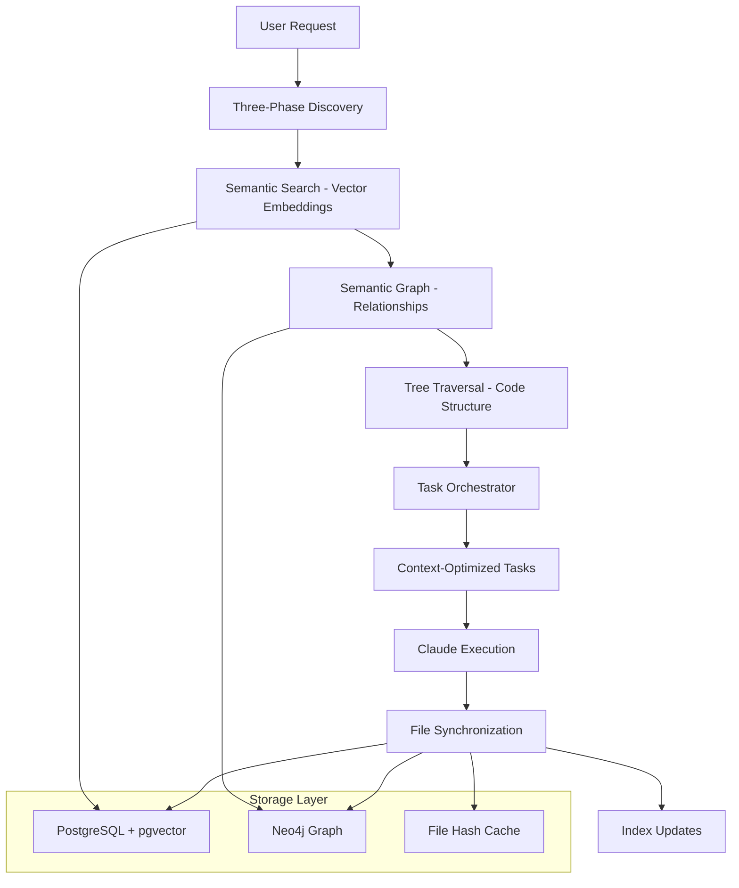

# CodeMind Intelligent Orchestration System

**Complete Architecture Guide: Three-Phase Discovery + Task Orchestration + File Synchronization**

## 🎯 Overview

CodeMind has evolved into a **comprehensive intelligent orchestration system** that transforms how developers interact with their codebase. Instead of Claude doing all the discovery work manually, CodeMind provides:

- **🧠 Three-Phase Discovery**: Semantic Search → Semantic Graph → Tree Traversal
- **📋 Task Orchestration**: Context-window-optimized task splitting
- **📁 File Synchronization**: Hash-based perfect index sync
- **🔗 Full Project Coverage**: Code + Tests + Schema + Deployment + Docs

## 🏗️ System Architecture



## 📊 Database Architecture

### PostgreSQL (Primary Storage)
- **Projects**: Core project metadata
- **File Index**: Complete file content with hash tracking
- **Code Embeddings**: Vector embeddings for semantic search
- **Tool Data**: Internal tool analysis results
- **System Logs**: Comprehensive logging

### Neo4j (Relationship Graph)
- **Code Nodes**: Files, classes, functions
- **Documentation Nodes**: README, docs, comments
- **UI Component Nodes**: Frontend elements
- **Test Case Nodes**: Test files and cases
- **Business Concept Nodes**: Domain concepts
- **Relationships**: IMPORTS, DEPENDS_ON, IMPLEMENTS, TESTS, etc.

### Local File System
- **Hash Cache**: `.codemind/file-hashes.json` for fast sync checks
- **Project Config**: `.codemind/project.json` with metadata

## 🔄 Three-Phase Discovery Process

### Phase 1: Semantic Search (Vector-Based Content Discovery)
```typescript
// Find files by content similarity using OpenAI embeddings
const semanticFiles = await fileDiscovery.performSemanticDiscovery({
  query: "authentication logic",
  projectId: "uuid",
  intent: "refactor"
});

// Results: Files with similar content patterns
// - auth/authentication.ts (95% similarity)
// - middleware/auth.ts (87% similarity)  
// - utils/crypto.ts (82% similarity)
```

**Purpose**: Discover files that are **conceptually similar** to the user's intent, regardless of naming or location.

### Phase 2: Semantic Graph (Relationship-Based Expansion)
```typescript
// Expand using graph relationships
const graphImpact = await performGraphImpactAnalysis(semanticFiles, {
  relationshipTypes: ['IMPORTS', 'DEPENDS_ON', 'USES', 'IMPLEMENTS'],
  maxDepth: 3
});

// Results: All related files through dependency chains
// - config/oauth-config.json (CONFIGURES auth.ts)
// - tests/auth.test.ts (TESTS auth.ts)
// - api/login-routes.ts (USES auth.ts)
// - db/user-schema.sql (DEPENDS_ON auth.ts)
```

**Purpose**: Ensure **complete impact coverage** - find ALL files that could be affected by changes.

### Phase 3: Tree Traversal (Code Structure Analysis)
```typescript
// Analyze code structure within discovered files
const treeStructure = await performTreeAnalysis(allDiscoveredFiles, {
  extractElements: ['classes', 'functions', 'interfaces', 'exports']
});

// Results: Code elements within each file
// - auth.ts: { class: AuthService, function: validateToken, interface: User }
// - auth.test.ts: { function: testValidation, function: testLogin }
```

**Purpose**: Understand **internal code structure** to enable precise modifications within files.

## 📋 Task Orchestration System

### Context Window Management
Instead of overwhelming Claude with everything at once, the orchestrator splits work into **context-optimized tasks**:

```typescript
interface OrchestrationTask {
  id: string;
  category: 'core-logic' | 'data-layer' | 'api-layer' | 'ui-layer' | 'test-layer';
  priority: number; // 1-10
  estimatedTokens: number; // Fits in context window
  dependencies: string[]; // Prerequisites
  targetFiles: Array<{
    filePath: string;
    action: 'create' | 'modify' | 'delete';
    currentContent: string; // From database cache
    requiredContext: string[]; // Related files needed
  }>;
}
```

### Task Categories & Dependencies
1. **Core Logic** (Priority 10) - Business logic changes
2. **Data Layer** (Priority 9) - Database schema, migrations  
3. **API Layer** (Priority 8) - Controllers, routes, endpoints
4. **UI Layer** (Priority 7) - Frontend components  
5. **Test Layer** (Priority 6) - Unit, integration tests
6. **Config Layer** (Priority 5) - Configuration files
7. **Deployment Layer** (Priority 4) - Docker, CI/CD
8. **Documentation** (Priority 3) - Docs, README updates

### Execution Planning
```typescript
// Parallel execution where possible
const executionPlan = {
  parallel: [
    ['core-logic-updates', 'config-updates'], // Can run together
    ['test-layer-updates', 'documentation-updates'] // Independent
  ],
  sequential: [
    'core-logic-updates',
    'data-layer-updates', // Depends on core logic
    'api-layer-updates',  // Depends on data layer
    'ui-layer-updates'    // Depends on API layer
  ]
};
```

## 📁 File Synchronization System

### Hash-Based Perfect Sync
Every file is tracked with SHA-256 hashes to ensure database indexes are **perfectly synchronized** with the filesystem:

```typescript
interface FileHashEntry {
  filePath: string;
  contentHash: string; // SHA-256 of file content
  lastModified: Date;
  fileSize: number;
  language: string;
  contentType: 'code' | 'config' | 'documentation' | 'test' | 'schema';
}
```

### Multi-Level Caching
1. **Local Hash Cache**: `.codemind/file-hashes.json` for instant sync checks
2. **Database Cache**: Full file content stored in PostgreSQL `file_index` table  
3. **Vector Cache**: Embeddings cached until content changes
4. **Graph Cache**: Relationships cached until structure changes

### Incremental Synchronization
```bash
# Fast sync check - only processes changed files
codemind sync --incremental

# Full resync - processes all files (for corruption recovery)  
codemind sync --full

# Watch mode - real-time sync as files change
codemind sync --watch
```

## 🚀 Complete User Flow

### 1. Project Initialization
```bash
# One-time setup populates all indexes
./scripts/init-project.sh /path/to/project

# Results:
# ✅ PostgreSQL + pgvector running
# ✅ Neo4j semantic graph built  
# ✅ All files indexed and hash-tracked
# ✅ Vector embeddings generated (if OPENAI_API_KEY set)
# ✅ API services running
```

### 2. User Makes Request
```bash
codemind "add OAuth authentication to user registration"
```

### 3. Intelligent Discovery (Automatic)
```
🔍 Phase 1: Semantic search finds auth-related files
🔗 Phase 2: Graph expands to all dependent files  
🌳 Phase 3: Tree analysis reveals code structure
📋 Task orchestration splits into 8 manageable tasks
```

### 4. Context-Optimized Execution
```
Task 1: Update core authentication logic (3 files, 2000 tokens)
Task 2: Update database schema (2 files, 1500 tokens)  
Task 3: Update API endpoints (4 files, 2500 tokens)
Task 4: Update UI components (3 files, 2000 tokens)
Task 5: Update tests (5 files, 3000 tokens)
Task 6: Update configuration (2 files, 1000 tokens)
Task 7: Update deployment (1 file, 800 tokens)
Task 8: Update documentation (1 file, 500 tokens)
```

### 5. Automatic Index Updates
```
🔄 File changes detected via hash comparison
📊 Vector embeddings updated for changed files
🔗 Graph relationships updated based on imports
📁 File index synchronized with current state
```

## 🎛️ Configuration

### Environment Variables
```bash
# Required for semantic search
OPENAI_API_KEY=sk-...

# Database connections
POSTGRES_HOST=localhost
POSTGRES_PORT=5432
NEO4J_HOST=localhost  
NEO4J_PORT=7687

# API endpoints
TOOL_API_URL=http://localhost:3003
ORCHESTRATOR_URL=http://localhost:3006
```

### Project Configuration (`.codemind/project.json`)
```json
{
  "projectId": "uuid-generated-id",
  "projectPath": "/absolute/path/to/project",
  "initialized": "2025-09-02T19:00:00Z",
  "databases": {
    "postgres": { "host": "localhost", "port": 5432 },
    "neo4j": { "host": "localhost", "port": 7687 }
  },
  "features": {
    "fileSync": true,
    "semanticSearch": true,
    "semanticGraph": true,
    "vectorEmbeddings": true
  }
}
```

## 🔧 Maintenance Commands

### System Status
```bash
codemind status
# Shows database connections, index health, sync status
```

### Manual Synchronization  
```bash
codemind sync                    # Incremental sync
codemind sync --full            # Full resync
codemind refresh path/to/file   # Refresh single file
```

### Index Management
```bash
codemind rebuild-embeddings     # Regenerate all vector embeddings
codemind rebuild-graph         # Rebuild semantic graph
codemind clean-indexes         # Remove orphaned index entries
```

## 🎯 Benefits

### For Users
- **Zero Discovery Overhead**: No more manual file hunting
- **Complete Impact Coverage**: Never miss related files again  
- **Context-Optimized**: Each task fits perfectly in Claude's context window
- **Transparent Experience**: Works like Claude Code, but smarter

### For Claude
- **Focused Context**: Gets only relevant files with perfect content
- **Clear Task Boundaries**: Each task has specific scope and dependencies
- **Rich Metadata**: Tool analysis data pre-computed and available
- **Efficient Iterations**: No need to re-read unchanged files

### For the System
- **Perfect Synchronization**: Database always matches filesystem
- **Incremental Updates**: Only processes changed files
- **Multi-Database Optimization**: Vector search + graph relationships + file caching
- **Scalable Architecture**: Handles small scripts to large enterprise codebases

## 🚀 Future Enhancements

### Planned Features
- **Real-time File Watching**: Automatic sync on file changes
- **Columnar Analytics**: Usage metrics and performance analytics
- **AI-Powered Task Splitting**: Use Claude to optimize task boundaries
- **Multi-Language Support**: Enhanced language detection and parsing
- **Distributed Execution**: Task execution across multiple Claude instances

This intelligent orchestration system transforms CodeMind from a tool into a **true AI development partner** that understands your entire codebase and can coordinate comprehensive changes across all project layers. 🧠✨