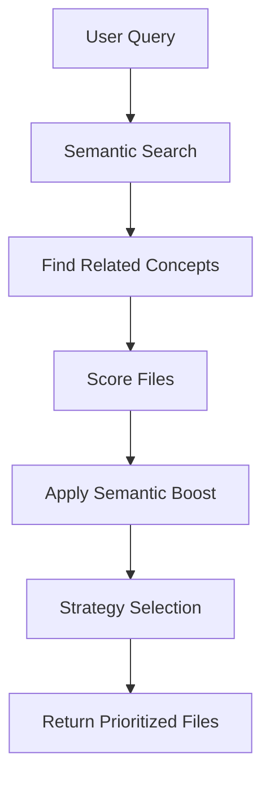

# Semantic Graph Integration with CLI and Tools

## 🎯 Overview

The semantic graph is now fully integrated throughout CodeMind's CLI and internal tools, providing intelligent context and search capabilities at every level. This guide explains how the graph is used and how to leverage its power.

## 🛠️ CLI Integration

### Enhanced Context Optimizer

The `ContextOptimizer` class now uses semantic intelligence to better prioritize files:

```typescript
// Semantic-enhanced file prioritization
const contextOptimizer = new ContextOptimizer();
const result = await contextOptimizer.optimizeContext({
  query: "authentication system",
  projectPath: "./",
  tokenBudget: 8000,
  strategy: "smart"
});
```

**How it works:**
1. **Semantic Search**: When a query is provided, the system searches the semantic graph for related concepts
2. **File Boost**: Files related to semantic matches get priority score boosts (up to 100% increase)
3. **Cross-Domain Insights**: Files spanning multiple domains are prioritized for comprehensive understanding
4. **Intent-Based Selection**: Different selection strategies based on the intended use

### New CLI Commands

#### Semantic Search Command
```bash
node dist/cli/codemind.js search "authentication" "." --intent coding --max-results 5
```

**Features:**
- **Natural language queries**: Search using business concepts, not just code terms
- **Intent-based results**: Different results for overview, coding, architecture, debugging
- **Related concepts**: Shows business concepts related to the query
- **Recommendations**: AI-generated suggestions based on search results

#### Context Optimization Command
```bash
node dist/cli/codemind.js context "user management" "." --tokens 4000 --strategy smart
```

**Features:**
- **Semantic file prioritization**: Files are scored based on semantic relevance
- **Token-aware selection**: Respects token budgets while maximizing relevance
- **Strategy selection**: Different optimization strategies for different needs

## 🎭 Orchestrator Integration

### Semantic API Endpoints

The orchestrator server now provides three semantic endpoints:

#### 1. Semantic Context for Claude Code
```http
GET /api/semantic/context/{projectPath}?intent=overview&maxTokens=800
```

**Purpose**: Primary endpoint for Claude Code context enhancement
**Returns**:
- Relevant business concepts
- Code insights
- Architecture insights  
- Recommendations
- Semantic diagram (Mermaid format)

**Usage in CLAUDE.md**:
```powershell
Invoke-WebRequest -Uri "http://localhost:3006/api/semantic/context/$env:PROJECT_PATH?intent=coding&maxTokens=800"
```

#### 2. Semantic Search
```http
GET /api/semantic/search/{projectPath}?query=authentication&intent=coding&maxResults=10
```

**Purpose**: Search the codebase using semantic understanding
**Returns**: Full semantic analysis with primary results, related concepts, and recommendations

#### 3. Impact Analysis
```http
GET /api/semantic/impact/{projectPath}/{nodeId}?maxDepth=3
```

**Purpose**: Analyze the impact of changing a specific node
**Returns**: Impact analysis showing affected files, tests, and risk level

## 🔄 How It Works in Practice

### 1. When You Use Claude Code

**Before** (traditional approach):
```
User query: "How does authentication work?"
→ File-based search
→ Limited context
```

**Now** (semantic approach):
```
User query: "How does authentication work?"
→ Semantic graph search for "authentication" 
→ Find related business concepts
→ Identify implementing code files
→ Include related documentation
→ Provide cross-domain insights
→ Return comprehensive context
```

### 2. Context Optimization Flow



### 3. Workflow Integration

**Traditional Workflow:**
1. User runs `codemind analyze ./`
2. Gets tool recommendations based on file patterns
3. Limited context about business logic

**Semantic-Enhanced Workflow:**
1. User runs `codemind analyze ./`
2. System searches semantic graph for project concepts
3. Gets tool recommendations enhanced with business context
4. Understands relationships between code, docs, and business logic
5. Provides impact analysis for suggested changes

## 📊 Benefits

### For Users
- **Better Context**: Claude Code gets more relevant context about your project
- **Faster Discovery**: Find related concepts and code faster
- **Impact Awareness**: Understand the effects of changes before making them
- **Business Alignment**: See how code relates to business concepts

### For Developers
- **Intelligent Search**: Search by business concepts, not just code terms
- **Cross-Domain Understanding**: See relationships across frontend, backend, docs
- **Architectural Insights**: Understand how concepts span multiple domains
- **Change Impact**: Analyze the ripple effects of modifications

## 🎯 Usage Examples

### Example 1: Understanding Authentication
```bash
# Search for authentication-related code
codemind search "user login" "." --intent coding

# Get semantic context for Claude Code
curl "http://localhost:3006/api/semantic/context/./project?intent=security&maxTokens=1000"
```

### Example 2: Architecture Review
```bash
# Find architecture-related concepts
codemind search "system architecture" "." --intent architecture

# Get comprehensive context
codemind context "microservices design" "." --strategy full --tokens 12000
```

### Example 3: Impact Analysis
```bash
# Search for a specific component
codemind search "UserService" "." --intent debugging

# Analyze impact (via API)
curl "http://localhost:3006/api/semantic/impact/./project/123?maxDepth=3"
```

## 🔧 Configuration

### Environment Variables
```bash
# Neo4j connection (automatic)
NEO4J_URI=bolt://localhost:7687
NEO4J_USER=neo4j
NEO4J_PASSWORD=codemind123

# Orchestrator URL for CLI
ORCHESTRATOR_URL=http://localhost:3006
```

### Service Dependencies
1. **Neo4j Database**: Must be running for semantic features
2. **Orchestrator Server**: Must be running for API endpoints
3. **Semantic Graph API**: Must be running for dashboard

### Initialization
The semantic graph is automatically initialized when:
- CLI commands are run with semantic features
- Orchestrator server starts
- Context optimizer is instantiated

## 🚨 Troubleshooting

### Common Issues

#### "Semantic graph not available"
```bash
# Check if Neo4j is running
docker ps | grep neo4j

# Start Neo4j if not running
docker-compose -f docker-compose.semantic-graph.yml up -d
```

#### "No semantic matches found"
- The graph might need more data populated
- Run the initialization script: `node scripts/init-semantic-graph.js`
- Check if documentation analysis has run

#### CLI timeouts
- Large projects may take time for initial semantic analysis
- Use smaller token budgets for faster results
- Consider using `--strategy minimal` for quick results

### Debugging
```bash
# Check graph statistics
curl http://localhost:3005/api/semantic-graph/statistics

# Check orchestrator health
curl http://localhost:3006/health

# Check semantic services
curl http://localhost:3006/api/semantic/context/./test?intent=overview
```

## 🚀 Future Enhancements

The semantic integration enables several future capabilities:

1. **AI-Powered Code Navigation**: Navigate by business concepts
2. **Automated Documentation**: Generate docs from semantic understanding  
3. **Smart Refactoring**: Suggest refactoring based on concept relationships
4. **Business-Code Alignment**: Track alignment between business needs and code
5. **Cross-Project Insights**: Share concepts across multiple projects

## 📚 API Reference

### CLI Commands
- `codemind search <query> <path> [options]` - Semantic search
- `codemind context <query> <path> [options]` - Context optimization
- `codemind analyze <path> [options]` - Analysis with semantic enhancement

### HTTP Endpoints
- `GET /api/semantic/context/{path}` - Get semantic context
- `GET /api/semantic/search/{path}` - Semantic search
- `GET /api/semantic/impact/{path}/{nodeId}` - Impact analysis

### Integration Points
- `ContextOptimizer` class - Enhanced file prioritization
- `SemanticOrchestrator` class - Core semantic analysis
- `OrchestratorServer` class - HTTP API endpoints

The semantic graph transforms CodeMind from a simple tool selector into an intelligent understanding system that bridges the gap between business concepts and code implementation.