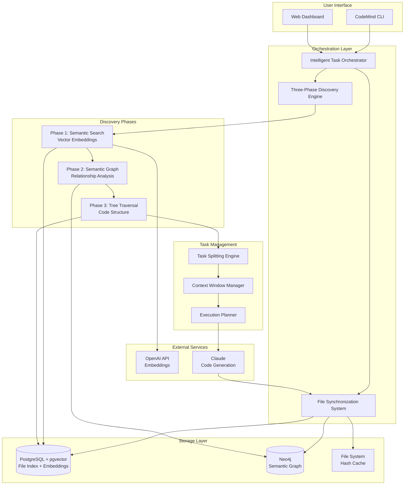
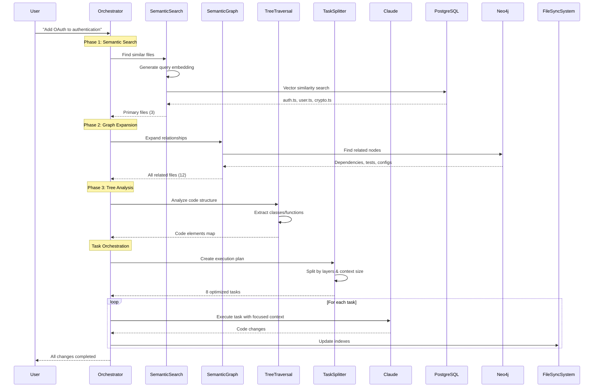
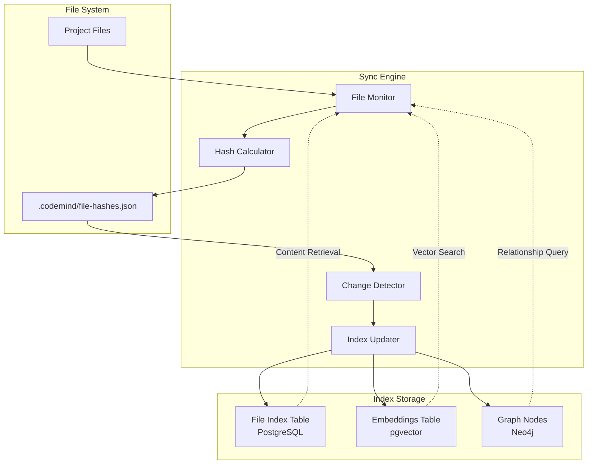
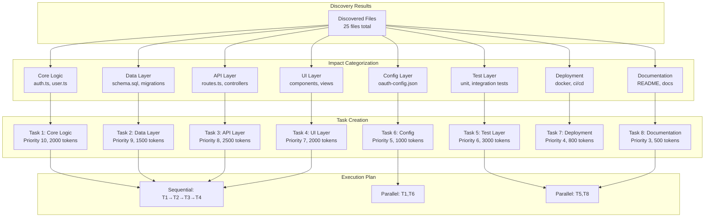
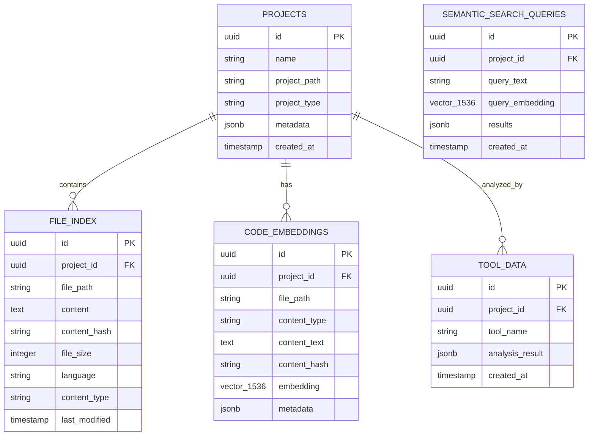
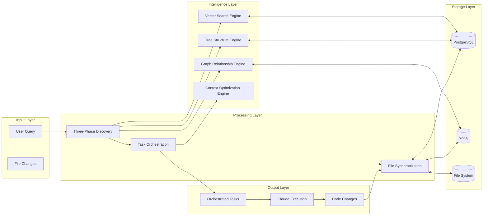
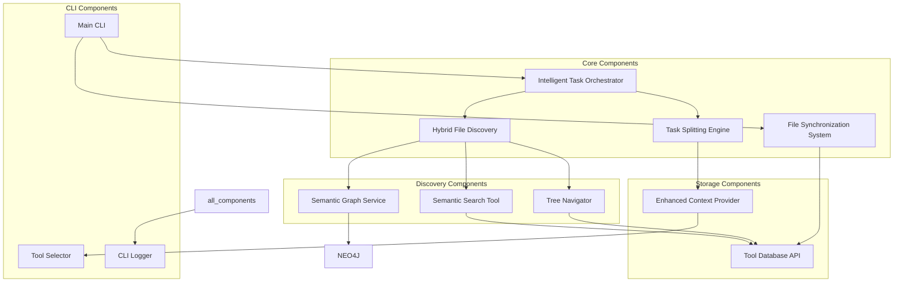

# CodeMind System Architecture Diagrams

## 🏗️ Complete System Architecture

## 🔄 Three-Phase Discovery Flow

## 📁 File Synchronization Architecture

## 🎯 Task Orchestration Model

## 🗄️ Database Schema Overview

## 🌊 Data Flow Architecture

## 🔧 Component Dependencies

This comprehensive architecture enables CodeMind to act as an intelligent development orchestrator, understanding entire codebases and coordinating changes across all layers of modern software projects. 🚀