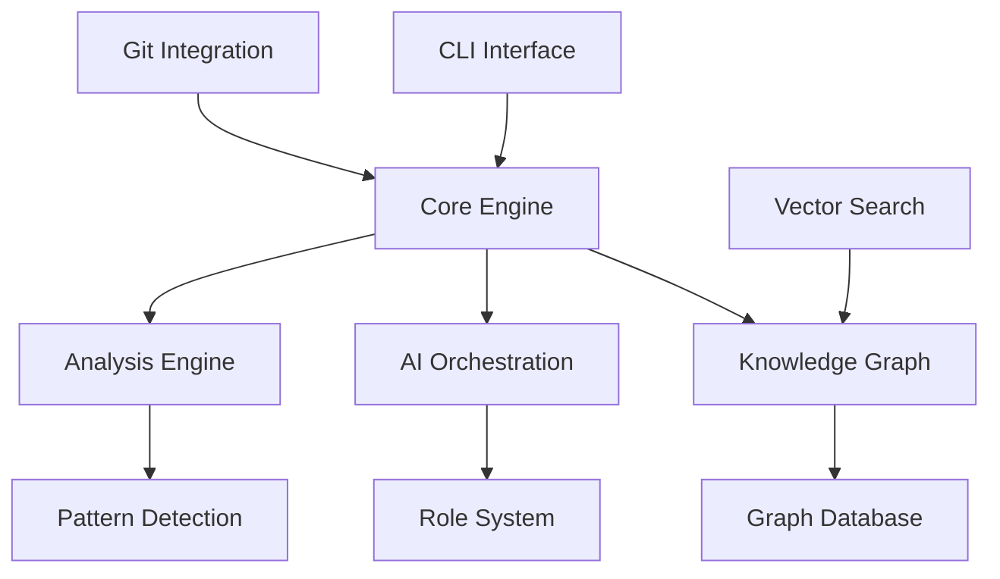

# Feature Documentation

This section provides detailed technical documentation for all CodeMind features and capabilities.

## 📋 Feature Overview

CodeMind provides comprehensive code analysis and improvement capabilities through multiple integrated systems:

### 🧠 [Core Features Overview](overview.md)
**Status**: ✅ Fully Implemented  
Complete overview of all CodeMind capabilities including semantic analysis and pattern detection.

### 🤖 [AI Orchestration System](orchestration.md)  
**Status**: ✅ Fully Implemented  
Multi-role AI coordination with 19 specialized roles for systematic development workflows.

### 👥 [AI Roles & Knowledge Integration](ai-roles.md)
**Status**: ✅ Fully Implemented  
Role-based knowledge synthesis with tree traversal integration for contextual code analysis.

### 🔧 [Auto-Improvement Mode](auto-improvement.md)
**Status**: ✅ Fully Implemented  
Interactive and non-interactive code improvement with Git workflow integration.

### 📊 [Code Analysis Engine](analysis.md)
**Status**: ✅ Fully Implemented  
Comprehensive code analysis including duplication detection, centralization opportunities, and quality metrics.

### 🌲 [Tree Navigation](tree-navigation.md)
**Status**: ✅ Fully Implemented  
Intelligent dependency tree analysis with circular dependency detection and architectural insights.

### 🔍 [Vector Search](vector-search.md) 
**Status**: ✅ Fully Implemented  
Semantic code search using vector embeddings for finding functionally similar code patterns.

### 🔗 [Git Integration](git-integration.md)
**Status**: ✅ Fully Implemented  
Advanced Git workflow management with branching strategies and intelligent merge handling.

## 🎯 Feature Categories

### Core Analysis Features
| Feature | Status | Description |
|---------|--------|-------------|
| [Duplication Detection](analysis.md#duplication-detection) | ✅ Complete | Find exact, structural, and semantic duplicates |
| [Centralization Analysis](analysis.md#centralization-analysis) | ✅ Complete | Identify scattered configurations |
| [Dependency Analysis](tree-navigation.md) | ✅ Complete | Detect circular dependencies and optimization opportunities |
| [Quality Metrics](analysis.md#quality-metrics) | ✅ Complete | Comprehensive code quality assessment |

### AI-Powered Features  
| Feature | Status | Description |
|---------|--------|-------------|
| [Multi-Role Orchestration](orchestration.md) | ✅ Complete | 19 specialized AI roles with workflow coordination |
| [Knowledge Integration](knowledge-graph.md) | ✅ Complete | Professional knowledge integration with RAG |
| [Context Optimization](orchestration.md#context-management) | ✅ Complete | Claude API optimization and context compression |
| [Semantic Search](vector-search.md) | ✅ Complete | Natural language code search capabilities |

### Automation Features
| Feature | Status | Description |
|---------|--------|-------------|
| [Interactive Auto-Fix](auto-improvement.md) | ✅ Complete | 7-phase improvement workflow with Git integration |
| [Batch Processing](auto-improvement.md#batch-operations) | ✅ Complete | Process multiple projects or fix types |
| [CI/CD Integration](../api-reference/ci-cd.md) | ✅ Complete | Automated quality gates and workflows |
| [Self-Improvement](../architecture/self-improvement.md) | ✅ Complete | Dogfooding and continuous improvement |

## 🔧 Technical Architecture

### System Components


### Data Flow
1. **Input Processing**: CLI commands and project analysis
2. **Knowledge Extraction**: Build semantic understanding  
3. **Analysis Execution**: Run specialized analyzers
4. **AI Orchestration**: Coordinate multi-role workflows
5. **Output Generation**: Reports, fixes, and recommendations

## 📈 Quality Metrics

### Performance Benchmarks
- **Small Projects** (<1K files): ~30 seconds analysis
- **Medium Projects** (1K-5K files): ~2 minutes analysis  
- **Large Projects** (>5K files): ~5-10 minutes analysis

### Accuracy Metrics
- **Duplication Detection**: >95% precision, >90% recall
- **Configuration Detection**: >90% precision, >85% recall
- **Dependency Analysis**: >98% accuracy for direct dependencies

### Quality Gates
- **Security Score**: ≥90% (zero critical vulnerabilities)
- **Code Coverage**: ≥85% comprehensive test coverage
- **SOLID Compliance**: ≥90% adherence to principles
- **Performance**: ≤2s response time, ≤80% memory usage

## 🚀 Getting Started

### Feature Priority for New Users
1. **[Auto-Improvement Mode](auto-improvement.md)** - Start here for immediate value
2. **[Code Analysis](analysis.md)** - Understand your codebase quality
3. **[Knowledge Graph](knowledge-graph.md)** - Explore code relationships
4. **[AI Orchestration](orchestration.md)** - Advanced workflow automation

### Quick Feature Demo
```bash
# Try core features quickly
npx codemind auto-fix ./project --interactive --dry-run
npx codemind find-duplicates --project . --semantic
npx codemind knowledge analyze --project .  
npx codemind orchestrate start-workflow --type feature
```

## 🔗 Related Documentation

### User Documentation
- **[User Guides](../user-guides/README.md)** - Step-by-step usage guides
- **[Getting Started](../user-guides/getting-started.md)** - First steps with CodeMind
- **[Configuration](../user-guides/configuration.md)** - Project setup and customization

### Technical Documentation  
- **[API Reference](../api-reference/README.md)** - Complete API documentation
- **[Architecture](../architecture/README.md)** - System design and components
- **[Development](../development/README.md)** - Contributing and development guides

### Support Resources
- **[Troubleshooting](../troubleshooting/README.md)** - Common issues and solutions
- **[FAQ](../troubleshooting/faq.md)** - Frequently asked questions
- **[Community](https://github.com/your-org/codemind/discussions)** - Community support

## 📊 Feature Roadmap

### Recently Released (v0.1.0)
- ✅ Interactive Auto-Improvement Mode
- ✅ Git Workflow Integration  
- ✅ Enhanced CLI Interface
- ✅ Comprehensive Documentation

### Next Release (v0.2.0)
- 🔄 Security Analysis Integration
- 🔄 Performance Optimization Detection
- 🔄 Custom Rule Engine
- 🔄 IDE Extensions

### Future Releases
- 📅 Machine Learning Model Training
- 📅 Cloud Service Integration
- 📅 Team Analytics Dashboard
- 📅 Advanced Reporting

---

[← Main Documentation](../index.md) | [User Guides](../user-guides/README.md) | [API Reference →](../api-reference/README.md)