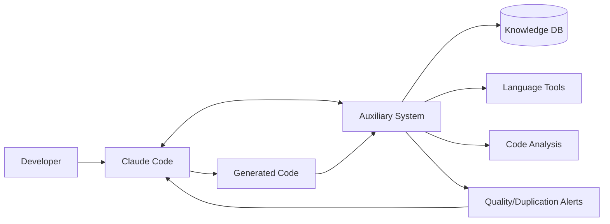

# MCP Integration Guide

> **Development Documentation** | [← Back to Development](README.md) | [Project Vision](#project-vision) | [MCP Tools](#mcp-tools-for-claude-code-integration)

## Project Vision

Build an **intelligent auxiliary data system** that serves as a **computational backend for coding LLMs**. The system handles heavy analysis, indexing, and knowledge management operations locally, providing coding assistants like Claude Code with rich, accurate context and preventing common issues like code duplication and architectural inconsistencies.

## Core Philosophy

### **LLM + Auxiliary System Partnership**

**🤖 LLM Strengths (Claude Code)**:
- Creative problem solving and code generation
- Natural language understanding and requirements interpretation  
- Pattern recognition and architectural design
- User interaction and explanation

**🧠 Auxiliary System Strengths (Our System)**:
- Comprehensive codebase knowledge and indexing
- Real-time compilation and validation
- Duplication detection and prevention
- Quality metrics and performance analysis
- Relationship mapping and dependency tracking
- Historical context and change patterns

### **Integration Strategy**



**The Flow**:
1. **Developer** gives Claude Code a coding task
2. **Claude Code** queries auxiliary system for relevant context
3. **Auxiliary System** provides existing implementations, patterns, quality metrics
4. **Claude Code** generates informed code using rich context
5. **Auxiliary System** validates generated code and provides feedback
6. **Claude Code** refines based on auxiliary system feedback
7. **Result**: Higher accuracy, no duplication, consistent architecture

## Intelligent Project Initialization System

### **Smart Initialization Strategy**

The auxiliary system must handle two critical scenarios:
1. **Greenfield Projects**: New projects needing architectural foundation
2. **Legacy Codebases**: Existing projects requiring comprehensive analysis and profiling

### **Initialization Architecture**

```typescript
interface InitializationSystem {
  // === PROJECT PROFILING ===
  projectProfiler: ProjectProfiler;           // Analyze existing code patterns
  smartQuestionnaire: SmartQuestionnaire;    // High-impact questions for setup
  claudeMdManager: ClaudeMdManager;           // Manage claude.md integration
  
  // === RESILIENT PROCESSING ===
  batchProcessor: BatchProcessor;             // Process large codebases in chunks
  progressTracker: ProgressTracker;          // Track initialization progress
  resumableAnalyzer: ResumableAnalyzer;      // Resume after LLM limits/interruptions
  
  // === INTELLIGENT ANALYSIS ===
  patternDetector: PatternDetector;          // Detect existing architectural patterns
  standardsInferencer: StandardsInferencer;  // Infer coding standards from existing code
  purposeAnalyzer: PurposeAnalyzer;          // Understand system purpose and domain
}
```

### **MCP Initialization Tools**

```typescript
// === SMART INITIALIZATION TOOLS ===
{
  name: "initialize_project_analysis",
  description: "Start intelligent project initialization with resilient processing",
  inputSchema: {
    type: "object",
    properties: {
      project_path: { type: "string", description: "Project root directory" },
      mode: { type: "string", enum: ["greenfield", "legacy", "auto"], default: "auto" },
      batch_size: { type: "number", default: 100, description: "Files per batch" },
      resume_token: { type: "string", description: "Resume from previous initialization" },
      claude_md_path: { type: "string", default: "claude.md", description: "Path to project description" }
    }
  }
}

{
  name: "ask_smart_setup_questions",
  description: "Generate high-impact questions for project configuration",
  inputSchema: {
    type: "object",
    properties: {
      project_description: { type: "string", description: "Content from claude.md or project description" },
      detected_patterns: { type: "array", items: { type: "string" }, description: "Already detected patterns" },
      question_categories: { 
        type: "array", 
        items: { type: "string", enum: ["architecture", "standards", "patterns", "purpose", "quality"] },
        default: ["architecture", "standards", "patterns", "purpose"]
      }
    }
  }
}

{
  name: "process_initialization_batch",
  description: "Process a batch of files with LLM limit awareness",
  inputSchema: {
    type: "object",
    properties: {
      batch_id: { type: "string", description: "Current batch identifier" },
      files: { type: "array", items: { type: "string" }, description: "Files to process" },
      analysis_depth: { type: "string", enum: ["surface", "standard", "deep"], default: "standard" }
    }
  }
}

{
  name: "resume_initialization",
  description: "Resume initialization after interruption or LLM limits",
  inputSchema: {
    type: "object",
    properties: {
      resume_token: { type: "string", description: "Token from previous session" },
      continue_strategy: { type: "string", enum: ["where_left_off", "intelligent_skip", "priority_first"] }
    }
  }
}

{
  name: "finalize_project_setup",
  description: "Complete initialization and generate project configuration",
  inputSchema: {
    type: "object",
    properties: {
      questionnaire_responses: { type: "object", description: "Responses to setup questions" },
      detected_patterns: { type: "object", description: "Automatically detected patterns" },
      update_claude_md: { type: "boolean", default: true, description: "Update claude.md with findings" }
    }
  }
}
```

### **Smart Questionnaire System**

#### **High-Impact Questions by Category**

```typescript
interface SmartQuestions {
  // === ARCHITECTURAL PATTERNS (Critical Impact) ===
  architecture: [
    {
      question: "What is the primary architectural pattern?",
      options: ["MVC", "Clean Architecture", "Hexagonal", "Microservices", "Monolithic", "Event-Driven"],
      impact: "critical",
      detected_hint: "Based on your codebase structure, it appears to follow {detected_pattern}. Is this correct?",
      purpose: "Guides code generation patterns and structure validation"
    },
    {
      question: "What is the preferred dependency injection approach?",
      options: ["Constructor", "Property", "Interface-based", "Service Locator", "None"],
      impact: "high",
      purpose: "Ensures consistent dependency management patterns"
    },
    {
      question: "How should new features be organized?",
      options: ["Feature folders", "Layer folders", "Domain-driven modules", "Component-based"],
      impact: "high", 
      purpose: "Guides file placement and organization"
    }
  ],

  // === CODING STANDARDS (High Impact) ===
  standards: [
    {
      question: "What is the preferred naming convention?",
      auto_detected: true, // Can be inferred from existing code
      fallback_question: "Prefer camelCase, PascalCase, or snake_case for variables?",
      impact: "high",
      purpose: "Ensures consistent naming across generated code"
    },
    {
      question: "What is the maximum acceptable function complexity?",
      options: ["5 (very strict)", "10 (standard)", "15 (relaxed)", "20+ (legacy)"],
      default: "10",
      impact: "medium",
      purpose: "Quality gates for generated code"
    },
    {
      question: "Are there specific linting rules or formatting preferences?",
      auto_detected: true, // Can read .eslintrc, prettier config, etc.
      impact: "high",
      purpose: "Apply consistent formatting to generated code"
    }
  ],

  // === SYSTEM PURPOSE & DOMAIN (Critical Impact) ===
  purpose: [
    {
      question: "What is the primary domain of this system?",
      options: ["E-commerce", "Healthcare", "Finance", "Education", "Gaming", "Enterprise", "API/Backend", "Frontend App"],
      impact: "critical",
      purpose: "Influences pattern suggestions and security considerations"
    },
    {
      question: "What are the key quality attributes?",
      options: ["Performance", "Security", "Scalability", "Maintainability", "User Experience", "Reliability"],
      multiple: true,
      impact: "high",
      purpose: "Prioritizes quality analysis and suggestions"
    },
    {
      question: "What is the expected team size and experience level?",
      options: ["Solo developer", "Small team (2-5)", "Medium team (6-15)", "Large team (15+)"],
      impact: "medium",
      purpose: "Adjusts complexity of suggested patterns and documentation level"
    }
  ],

  // === DESIGN PATTERNS (Medium Impact) ===
  patterns: [
    {
      question: "Preferred error handling approach?",
      options: ["Exceptions", "Result types", "Error objects", "Functional error handling"],
      auto_detected: true,
      impact: "high",
      purpose: "Consistent error handling in generated code"
    },
    {
      question: "Preferred async pattern?",
      options: ["async/await", "Promises", "Callbacks", "Reactive (RxJS)"],
      auto_detected: true,
      impact: "high",
      purpose: "Consistent async code generation"
    }
  ]
}
```

### **Resilient Batch Processing**

#### **Batch Processing Strategy**

```typescript
interface BatchProcessor {
  // === BATCH CONFIGURATION ===
  readonly batchSize: number;              // Files per batch (default: 100)
  readonly maxProcessingTime: number;      // Max time per batch (default: 5min)
  readonly llmRateLimit: LLMRateLimit;     // Track LLM usage

  // === PROCESSING METHODS ===
  async processBatch(files: string[], batchId: string): Promise<BatchResult>;
  async detectLLMLimit(): Promise<boolean>;
  async createResumeToken(progress: ProcessingProgress): Promise<string>;
  async resumeFromToken(token: string): Promise<ProcessingProgress>;
}

interface ProcessingProgress {
  totalFiles: number;
  processedFiles: number;
  completedBatches: string[];
  currentBatch: string;
  resumePoint: {
    lastProcessedFile: string;
    timestamp: number;
    analysisState: AnalysisState;
  };
  detectedPatterns: DetectedPattern[];
  inferredStandards: InferredStandards;
}

interface LLMRateLimit {
  requestsPerMinute: number;
  requestsUsed: number;
  resetTime: number;
  tokensPerHour: number;
  tokensUsed: number;
}
```

#### **Resumable Initialization Workflow**

```typescript
// === INITIALIZATION PHASES ===
enum InitPhase {
  PROJECT_DISCOVERY = "project_discovery",     // Scan files, detect languages
  PATTERN_ANALYSIS = "pattern_analysis",       // Analyze architectural patterns  
  STANDARDS_INFERENCE = "standards_inference", // Infer coding standards
  SMART_QUESTIONING = "smart_questioning",     // Ask targeted questions
  DEEP_ANALYSIS = "deep_analysis",             // Detailed code analysis
  CONFIGURATION_GENERATION = "config_generation", // Generate configs
  CLAUDE_MD_UPDATE = "claude_md_update"        // Update project documentation
}

interface InitializationState {
  phase: InitPhase;
  progress: ProcessingProgress;
  resumeToken: string;
  timeoutStrategy: 'pause' | 'continue_light' | 'reschedule';
  priorityQueue: string[];  // High-impact files to process first
}

// Example initialization flow with resilience
async function initializeProject(projectPath: string): Promise<InitResult> {
  const state = await loadOrCreateInitState(projectPath);
  
  try {
    // Phase 1: Quick project discovery (no LLM needed)
    if (state.phase === InitPhase.PROJECT_DISCOVERY) {
      await discoverProjectStructure(projectPath, state);
      state.phase = InitPhase.PATTERN_ANALYSIS;
    }
    
    // Phase 2: Pattern analysis (light LLM usage)
    if (state.phase === InitPhase.PATTERN_ANALYSIS) {
      await analyzeArchitecturalPatterns(state);
      state.phase = InitPhase.STANDARDS_INFERENCE;
    }
    
    // Phase 3: Standards inference (light LLM usage)
    if (state.phase === InitPhase.STANDARDS_INFERENCE) {
      await inferCodingStandards(state);
      state.phase = InitPhase.SMART_QUESTIONING;
    }
    
    // Phase 4: Smart questioning (Claude Code interaction)
    if (state.phase === InitPhase.SMART_QUESTIONING) {
      const questions = await generateSmartQuestions(state.detectedPatterns);
      const responses = await askQuestionsToUser(questions); // Via Claude Code
      state.questionnaireResponses = responses;
      state.phase = InitPhase.DEEP_ANALYSIS;
    }
    
    // Phase 5: Deep analysis (heavy LLM usage, most likely to hit limits)
    if (state.phase === InitPhase.DEEP_ANALYSIS) {
      await deepAnalysisWithResumption(state);
      state.phase = InitPhase.CONFIGURATION_GENERATION;
    }
    
    // Phase 6 & 7: Finalization (no LLM needed)
    if (state.phase === InitPhase.CONFIGURATION_GENERATION) {
      await generateProjectConfiguration(state);
      await updateClaudeMd(state);
      state.phase = InitPhase.CLAUDE_MD_UPDATE;
    }
    
    return { success: true, configuration: state.finalConfig };
    
  } catch (error) {
    if (error instanceof LLMRateLimitError) {
      // Save progress and create resume token
      const resumeToken = await createResumeToken(state);
      return { 
        success: false, 
        resumeToken,
        message: "Hit LLM limits. Resume with: mcp_tool('resume_initialization', { resume_token: '" + resumeToken + "' })"
      };
    }
    throw error;
  }
}
```

### **Claude.md Integration**

#### **Smart Claude.md Management**

```typescript
interface ClaudeMdManager {
  // === CLAUDE.MD OPERATIONS ===
  async readProjectDescription(path: string): Promise<ProjectDescription>;
  async updateClaudeMd(findings: InitializationFindings): Promise<void>;
  async generateClaudeMd(projectProfile: ProjectProfile): Promise<string>;
  
  // === INTEGRATION WITH INITIALIZATION ===
  async extractQuestionsContext(claudeMd: string): Promise<QuestionContext>;
  async appendInitializationResults(results: InitResults): Promise<void>;
}

interface ProjectDescription {
  purpose: string;
  domain: string;
  architecture: string;
  technologies: string[];
  constraints: string[];
  existingPatterns?: DetectedPattern[];
}

// Enhanced claude.md structure after initialization
const enhancedClaudeMd = `
# Project: ${projectName}

## Purpose & Domain
${purpose}
*Auto-detected domain: ${detectedDomain}*

## Architecture & Patterns  
${architecturalDescription}

### Detected Patterns
- **Primary Architecture**: ${detectedArchitecture} (confidence: ${confidence}%)
- **Dependency Injection**: ${diPattern}
- **Error Handling**: ${errorHandlingPattern}
- **Async Pattern**: ${asyncPattern}

## Coding Standards
### Automatically Detected
- **Naming Convention**: ${namingConvention}
- **Function Complexity**: Average ${avgComplexity}, Max recommended: ${maxComplexity}
- **File Organization**: ${organizationPattern}

### Configured Standards  
- **Quality Thresholds**: ${qualityThresholds}
- **Architectural Rules**: ${architecturalRules}

## Auxiliary System Configuration
*This section is managed by the code auxiliary system*

### Analysis Preferences
- **Duplication Threshold**: ${duplicationThreshold}
- **Quality Focus Areas**: ${qualityFocusAreas}
- **Pattern Enforcement**: ${patternEnforcement}

### Integration Points
- **Key Utilities**: ${keyUtilities}
- **Core Patterns**: ${corePatterns}  
- **Extension Points**: ${extensionPoints}

---
*Last updated by auxiliary system: ${timestamp}*
`;
```

### **Tech Stack & Documentation Management**

#### **Tech Stack Version Tracking**

```typescript
interface TechStackManager {
  // === VERSION MANAGEMENT ===
  versionDetector: VersionDetector;           // Auto-detect from package.json, requirements.txt, etc.
  versionValidator: VersionValidator;         // Check for conflicts and compatibility
  changeTracker: TechStackChangeTracker;     // Track version changes over time
  
  // === DOCUMENTATION RAG ===
  documentationRAG: DocumentationRAGSystem;  // Internal RAG for tech docs
  crawlerService: DocumentationCrawler;      // Crawl official documentation
  customDocsManager: CustomDocsManager;      // Manage project-specific docs
}

// Enhanced database schema for tech stack tracking
CREATE TABLE tech_stack (
  id INTEGER PRIMARY KEY,
  project_path TEXT NOT NULL,
  technology TEXT NOT NULL,           -- 'typescript', 'react', 'express', etc.
  version TEXT NOT NULL,             -- '5.3.2', '^18.0.0', etc.
  version_resolved TEXT,             -- Actual resolved version
  source TEXT NOT NULL,              -- 'package.json', 'requirements.txt', 'go.mod'
  category TEXT,                     -- 'runtime', 'framework', 'library', 'devDependency'
  confidence REAL DEFAULT 1.0,      -- Confidence in version detection
  compatibility_notes TEXT,         -- Known compatibility issues
  breaking_changes TEXT,            -- JSON array of breaking changes since last version
  last_updated TIMESTAMP DEFAULT CURRENT_TIMESTAMP,
  
  UNIQUE(project_path, technology, source)
);

-- Documentation RAG storage
CREATE TABLE documentation_rag (
  id INTEGER PRIMARY KEY,
  technology TEXT NOT NULL,           -- 'typescript', 'react-18', 'express-4'
  doc_type TEXT NOT NULL,            -- 'official_api', 'guide', 'migration', 'custom'
  title TEXT NOT NULL,
  content_chunk TEXT NOT NULL,       -- Chunked content for RAG
  embedding BLOB,                    -- Vector embedding for similarity search
  source_url TEXT,                   -- Original documentation URL
  version_range TEXT,                -- Which versions this applies to
  section_path TEXT,                 -- Path in original doc (API > Components > useState)
  relevance_score REAL DEFAULT 1.0, -- How relevant/current this chunk is
  crawled_at TIMESTAMP DEFAULT CURRENT_TIMESTAMP,
  updated_at TIMESTAMP DEFAULT CURRENT_TIMESTAMP
);

-- Track version conflicts and compatibility issues
CREATE TABLE version_conflicts (
  id INTEGER PRIMARY KEY,
  project_path TEXT NOT NULL,
  technology_a TEXT NOT NULL,
  version_a TEXT NOT NULL,
  technology_b TEXT NOT NULL,
  version_b TEXT NOT NULL,
  conflict_type TEXT NOT NULL,       -- 'breaking_change', 'deprecated_api', 'peer_dependency'
  description TEXT NOT NULL,
  severity TEXT DEFAULT 'medium',    -- 'low', 'medium', 'high', 'critical'
  resolution_suggestion TEXT,
  detected_at TIMESTAMP DEFAULT CURRENT_TIMESTAMP
);
```

#### **Enhanced MCP Tools for Tech Stack & Documentation**

```typescript
// === TECH STACK MANAGEMENT TOOLS ===
{
  name: "analyze_tech_stack",
  description: "Analyze and track project tech stack versions with conflict detection",
  inputSchema: {
    type: "object",
    properties: {
      project_path: { type: "string", description: "Project root directory" },
      include_dev_dependencies: { type: "boolean", default: true },
      check_conflicts: { type: "boolean", default: true },
      update_claude_md: { type: "boolean", default: true }
    }
  }
}

{
  name: "query_tech_documentation",
  description: "Query internal RAG system for technology-specific documentation",
  inputSchema: {
    type: "object",
    properties: {
      query: { type: "string", description: "Documentation query (e.g., 'React 18 useEffect cleanup')" },
      technologies: { type: "array", items: { type: "string" }, description: "Limit to specific technologies" },
      doc_types: { type: "array", items: { type: "string" }, description: "Filter by doc types" },
      version_context: { type: "string", description: "Version context from current project" }
    }
  }
}

{
  name: "crawl_documentation",
  description: "Crawl and index official documentation for technologies in project",
  inputSchema: {
    type: "object",
    properties: {
      technologies: { type: "array", items: { type: "string" }, description: "Technologies to crawl docs for" },
      doc_sources: { 
        type: "array", 
        items: { 
          type: "object",
          properties: {
            name: { type: "string" },
            base_url: { type: "string" },
            crawl_pattern: { type: "string" }
          }
        },
        description: "Custom documentation sources to crawl"
      },
      update_existing: { type: "boolean", default: false }
    }
  }
}

{
  name: "add_custom_documentation",
  description: "Add project-specific documentation to RAG system",
  inputSchema: {
    type: "object",
    properties: {
      title: { type: "string", description: "Document title" },
      content: { type: "string", description: "Document content" },
      doc_type: { type: "string", enum: ["architecture", "conventions", "setup", "troubleshooting"] },
      technologies: { type: "array", items: { type: "string" }, description: "Related technologies" },
      tags: { type: "array", items: { type: "string" }, description: "Additional tags for organization" }
    }
  }
}

{
  name: "check_version_compatibility",
  description: "Check compatibility between current tech stack versions",
  inputSchema: {
    type: "object",
    properties: {
      project_path: { type: "string", description: "Project to analyze" },
      proposed_changes: { 
        type: "array", 
        items: {
          type: "object",
          properties: {
            technology: { type: "string" },
            new_version: { type: "string" }
          }
        },
        description: "Proposed version changes to validate"
      }
    }
  }
}
```

#### **Enhanced Claude.md with Tech Stack Section**

```markdown
# Project: My E-commerce App

## Purpose & Domain
Modern e-commerce platform with real-time inventory management
*Auto-detected domain: E-commerce*

## Tech Stack & Versions
*This section is automatically maintained by the auxiliary system*

### Frontend Stack
- **React**: 18.2.0 (latest stable)
- **TypeScript**: 5.3.2 (project requirement: ^5.0.0)
- **Next.js**: 14.0.1 (using App Router)
- **TailwindCSS**: 3.4.0
- **React Hook Form**: 7.45.4

### Backend Stack  
- **Node.js**: 20.10.0 LTS (runtime)
- **Express**: 4.18.2 (API framework)
- **TypeScript**: 5.3.2 (matches frontend)
- **Prisma**: 5.6.0 (ORM)
- **PostgreSQL**: 16.1 (database)

### Development Tools
- **ESLint**: 8.57.0 + TypeScript rules
- **Prettier**: 3.1.0
- **Jest**: 29.7.0 + React Testing Library
- **Docker**: 24.0.7 (containerization)

### Version Conflicts & Notes
⚠️ **Compatibility Issue**: React Hook Form 7.45.4 has known issues with React 18.2.0 strict mode
📝 **Migration Path**: Next.js 13 → 14 App Router migration 85% complete
🔄 **Planned Updates**: Upgrade Prisma to 5.7.0 (includes performance improvements)

---

## Architecture & Patterns  
*[Rest of claude.md content...]*
```

#### **Documentation RAG System Architecture**

```typescript
interface DocumentationRAGSystem {
  // === CRAWLING & INDEXING ===
  crawlOfficialDocs(technology: string, version?: string): Promise<CrawlResult>;
  indexCustomDocuments(docs: CustomDocument[]): Promise<void>;
  updateDocumentationIndex(): Promise<void>;
  
  // === RAG QUERYING ===
  queryDocumentation(query: string, context: TechStackContext): Promise<DocumentationResult[]>;
  findRelevantAPIs(functionality: string, techStack: TechStack): Promise<APIReference[]>;
  getVersionSpecificGuidance(technology: string, version: string, topic: string): Promise<string>;
  
  // === SMART FEATURES ===
  detectDocumentationGaps(): Promise<GapAnalysis>;
  suggestDocumentationUpdates(): Promise<UpdateSuggestion[]>;
  validateCodeAgainstDocs(code: string, techStack: TechStack): Promise<ValidationResult>;
}

// Example documentation sources to crawl automatically
const OFFICIAL_DOC_SOURCES = {
  typescript: {
    base_url: "https://www.typescriptlang.org/docs/",
    api_reference: "https://www.typescriptlang.org/docs/handbook/",
    patterns: ["/handbook/**", "/docs/**"]
  },
  react: {
    base_url: "https://react.dev/",
    api_reference: "https://react.dev/reference/",
    patterns: ["/learn/**", "/reference/**", "/blog/**"]
  },
  nextjs: {
    base_url: "https://nextjs.org/docs",
    api_reference: "https://nextjs.org/docs/app/",
    patterns: ["/docs/app/**", "/docs/pages/**"]
  },
  express: {
    base_url: "https://expressjs.com/",
    api_reference: "https://expressjs.com/en/4x/api.html",
    patterns: ["/en/guide/**", "/en/advanced/**"]
  }
};
```

#### **Claude Code Integration Examples**

**Example 1: Version-Aware Code Generation**

```typescript
// User: "Add a React component with modern best practices"

// Step 1: Claude Code queries tech stack
const techStack = await mcp.callTool('analyze_tech_stack', {
  project_path: './my-app'
});

// Auxiliary system responds with current versions:
{
  react: "18.2.0",
  typescript: "5.3.2", 
  nextjs: "14.0.1"
}

// Step 2: Claude Code queries documentation RAG
const docContext = await mcp.callTool('query_tech_documentation', {
  query: "React 18 component best practices with TypeScript",
  technologies: ["react", "typescript"],
  version_context: "react@18.2.0"
});

// Auxiliary system provides version-specific guidance:
{
  recommendations: [
    "Use React.FC is deprecated in React 18, prefer function components",
    "React 18 automatic batching affects useEffect behavior", 
    "New React 18 concurrent features: useTransition, useDeferredValue"
  ],
  api_examples: [
    "Modern component pattern for React 18 + TypeScript 5",
    "Proper forwardRef usage with TypeScript inference"
  ]
}

// Result: Claude Code generates component using React 18 best practices
```

**Example 2: Version Conflict Detection**

```typescript
// User: "Add Redux Toolkit to the project"

// Step 1: Check compatibility
const compatibility = await mcp.callTool('check_version_compatibility', {
  project_path: './my-app',
  proposed_changes: [
    { technology: "@reduxjs/toolkit", new_version: "^2.0.0" }
  ]
});

// Auxiliary system detects potential issues:
{
  conflicts: [
    {
      type: "peer_dependency",
      description: "Redux Toolkit 2.0 requires React 18+, you have 18.2.0 ✅",
      severity: "info"
    },
    {
      type: "breaking_change", 
      description: "RTK 2.0 removes deprecated createSlice syntax used in 3 files",
      severity: "medium",
      affected_files: ["store/authSlice.ts", "store/cartSlice.ts"],
      migration_guide: "Use new RTK 2.0 createSlice syntax..."
    }
  ]
}

// Result: Claude Code provides migration guidance and updated patterns
```

#### **Custom Documentation Management**

```typescript
// Add project-specific documentation that Claude Code can reference
await mcp.callTool('add_custom_documentation', {
  title: "Authentication Flow Architecture",
  content: `
# Authentication Architecture

## Overview
Our auth system uses JWT + refresh token pattern with Redis session store.

## Key Components
- AuthService: Handles token validation and refresh
- AuthMiddleware: Protects routes, attached to Express app
- UserContext: React context for client-side auth state

## Common Patterns
\`\`\`typescript
// Protected route pattern
const ProtectedRoute = ({ children }: { children: ReactNode }) => {
  const { user, loading } = useAuth();
  if (loading) return <LoadingSpinner />;
  if (!user) return <Navigate to="/login" />;
  return <>{children}</>;
};
\`\`\`
  `,
  doc_type: "architecture",
  technologies: ["typescript", "react", "express", "redis"],
  tags: ["authentication", "security", "patterns"]
});
```

### **Benefits of Tech Stack + RAG Integration**

**🔍 Version-Accurate Code Generation**:
- Claude Code generates code compatible with exact versions in project
- Avoids deprecated APIs and patterns
- Uses version-specific best practices

**📚 Rich Contextual Documentation**:
- Query official docs contextually ("React 18 useEffect cleanup")
- Include project-specific patterns and conventions  
- Get examples relevant to current tech stack

**⚠️ Proactive Conflict Detection**:
- Detect version conflicts before they cause issues
- Migration guidance for breaking changes
- Compatibility validation for new dependencies

**🎯 Enhanced Claude.md**:
- Always up-to-date tech stack information
- Clear version conflicts and migration notes
- Integration with auxiliary system findings

### **Initialization Examples & Workflows**

#### **Example 1: Greenfield TypeScript Project**

```typescript
// User: "Initialize a new e-commerce TypeScript project"

// Step 1: Claude Code calls initialization  
const initResult = await mcp.callTool('initialize_project_analysis', {
  project_path: './my-ecommerce-app',
  mode: 'greenfield',
  claude_md_path: 'claude.md'
});

// Auxiliary system responds:
{
  phase: "smart_questioning",
  detected_patterns: {
    languages: ["typescript"],
    frameworks: [],
    architecture: "unknown"
  },
  tech_stack: {
    detected: {
      "typescript": "5.3.2",
      "node": "20.10.0"
    },
    missing: ["frontend_framework", "database", "testing_framework"]
  },
  smart_questions: [
    {
      category: "architecture",
      question: "For an e-commerce system, which architecture would you prefer?",
      options: ["Clean Architecture (recommended for e-commerce)", "MVC", "Hexagonal", "Domain-driven"],
      recommendation: "Clean Architecture",
      reasoning: "Best for complex business logic and testability in e-commerce"
    },
    {
      category: "tech_stack",
      question: "Which frontend framework for the e-commerce UI?",
      options: ["React 18", "Next.js 14", "Vue 3", "Angular 17"],
      recommendation: "Next.js 14",
      reasoning: "Built-in e-commerce features, SSR, and performance optimization"
    },
    {
      category: "purpose", 
      question: "What are your key quality priorities?",
      options: ["Security", "Performance", "Scalability", "Maintainability"],
      multiple: true,
      recommendation: ["Security", "Scalability"],
      reasoning: "Critical for e-commerce systems handling payments and growth"
    }
  ]
}

// Step 2: User answers questions via Claude Code interface
const responses = {
  architecture: "Clean Architecture",
  frontend_framework: "Next.js 14",
  quality_priorities: ["Security", "Performance", "Scalability"],
  typescript_strictness: "Strict",
  error_handling: "Result types",
  testing_strategy: "TDD"
};

// Step 3: Finalize setup with tech stack analysis
const config = await mcp.callTool('finalize_project_setup', {
  questionnaire_responses: responses,
  update_claude_md: true
});

// Step 4: Crawl documentation for selected tech stack
const docCrawl = await mcp.callTool('crawl_documentation', {
  technologies: ["typescript", "nextjs", "react"],
  update_existing: false
});

// Result: Project configured with e-commerce best practices, claude.md updated with tech stack
```

#### **Example 2: Legacy Codebase Analysis (Large Project)**

```typescript
// User: "Initialize analysis for existing 50,000-line React/Node.js project"

// Step 1: Start resilient batch processing with tech stack detection
const initResult = await mcp.callTool('initialize_project_analysis', {
  project_path: './legacy-project',
  mode: 'legacy',
  batch_size: 50  // Smaller batches for large codebase
});

// Auxiliary system starts processing...
{
  phase: "tech_stack_analysis",
  tech_stack_detected: {
    react: "17.0.2",        // Older version detected
    typescript: "4.9.5",    // Outdated TS version
    express: "4.17.1",      // Security vulnerability detected
    node: "16.14.0"         // LTS but not latest
  },
  version_conflicts: [
    {
      type: "security_vulnerability",
      technology: "express",
      version: "4.17.1",
      severity: "high",
      description: "Known security vulnerability in Express 4.17.1",
      resolution: "Upgrade to Express 4.18.2+"
    },
    {
      type: "breaking_change_available",
      technology: "react",
      version: "17.0.2", 
      severity: "medium",
      description: "React 18 available with new features and performance improvements",
      migration_effort: "medium"
    }
  ],
  progress: {
    totalFiles: 2847,
    processedFiles: 150,
    currentBatch: "batch_003",
    estimatedTimeRemaining: "45 minutes"
  }
}

// Step 2: Hit LLM rate limits during analysis
{
  success: false,
  resumeToken: "resume_8a9f7c2d_batch_015_patterns",
  message: "Analysis paused due to rate limits. Resume when ready.",
  progress: "Analyzed 750 files, detected tech stack conflicts, 2097 files remaining"
}

// Step 3: Resume with tech stack context
const resumeResult = await mcp.callTool('resume_initialization', {
  resume_token: "resume_8a9f7c2d_batch_015_patterns",
  continue_strategy: "priority_first"
});

// Step 4: Complete with tech-stack aware questions
const questions = await mcp.callTool('ask_smart_setup_questions', {
  project_description: "Legacy React/Node.js application with version conflicts",
  detected_patterns: [
    "Mixed state management (Redux + Context)",
    "Outdated React 17 patterns",
    "Express security vulnerabilities"
  ]
});

// Smart questions focus on migration strategy:
{
  questions: [
    {
      category: "tech_stack",
      question: "Express 4.17.1 has security vulnerabilities. Upgrade strategy?",
      options: ["Immediate upgrade to 4.18.2", "Gradual migration", "Security patches only"],
      recommendation: "Immediate upgrade to 4.18.2",
      impact: "critical",
      migration_complexity: "low"
    },
    {
      category: "architecture",
      question: "React 17 → 18 migration approach for large codebase?",
      options: ["Big bang migration", "Incremental component migration", "New features only"],
      recommendation: "Incremental component migration",
      impact: "high",
      estimated_effort: "4-6 weeks"
    }
  ]
}
```

#### **Example 3: Documentation RAG in Action**

```typescript
// User asks Claude Code: "How do I properly handle errors in our Next.js 14 app?"

// Step 1: Claude Code queries tech stack for context
const techStack = await mcp.callTool('analyze_tech_stack', {
  project_path: './current-project'
});

// Response: { nextjs: "14.0.1", react: "18.2.0", typescript: "5.3.2" }

// Step 2: Claude Code queries documentation RAG with version context
const docContext = await mcp.callTool('query_tech_documentation', {
  query: "Next.js 14 error handling patterns TypeScript",
  technologies: ["nextjs", "react", "typescript"],
  version_context: "nextjs@14.0.1"
});

// Auxiliary RAG system responds with version-specific information:
{
  relevant_docs: [
    {
      title: "Next.js 14 Error Handling - App Router",
      content: "In Next.js 14 App Router, use error.tsx files for error boundaries...",
      source_url: "https://nextjs.org/docs/app/building-your-application/routing/error-handling",
      version_range: "14.x",
      relevance_score: 0.95
    },
    {
      title: "TypeScript Error Handling Best Practices",
      content: "Use Result<T, E> pattern for type-safe error handling...",
      source_url: "Custom documentation",
      doc_type: "custom",
      relevance_score: 0.87
    }
  ],
  code_examples: [
    {
      title: "App Router Error Boundary (Next.js 14)",
      code: `
'use client'
 
import { useEffect } from 'react'
 
export default function Error({
  error,
  reset,
}: {
  error: Error & { digest?: string }
  reset: () => void
}) {
  useEffect(() => {
    console.error(error)
  }, [error])
 
  return (
    <div>
      <h2>Something went wrong!</h2>
      <button onClick={() => reset()}>Try again</button>
    </div>
  )
}
      `,
      version_specific: "14.x App Router"
    }
  ]
}

// Step 3: Claude Code provides comprehensive, version-accurate response
// "Based on your Next.js 14.0.1 setup with App Router, here's how to handle errors properly..."
```

#### **Example 4: Custom Documentation Integration**

```typescript
// Project team adds custom architectural documentation
await mcp.callTool('add_custom_documentation', {
  title: "Our API Response Patterns",
  content: `
# API Response Standardization

## Success Response Format
All API endpoints return responses in this format:

\`\`\`typescript
interface APIResponse<T> {
  success: true;
  data: T;
  timestamp: string;
  requestId: string;
}
\`\`\`

## Error Response Format
\`\`\`typescript
interface APIErrorResponse {
  success: false;
  error: {
    code: string;
    message: string;
    details?: unknown;
  };
  timestamp: string;
  requestId: string;
}
\`\`\`

## Usage in Express Controllers
\`\`\`typescript
export const createUser = async (req: Request, res: Response) => {
  try {
    const user = await userService.create(req.body);
    return res.json({
      success: true,
      data: user,
      timestamp: new Date().toISOString(),
      requestId: res.locals.requestId
    });
  } catch (error) {
    return res.status(400).json({
      success: false,
      error: {
        code: 'USER_CREATION_FAILED',
        message: error.message
      },
      timestamp: new Date().toISOString(),
      requestId: res.locals.requestId
    });
  }
};
\`\`\`
  `,
  doc_type: "architecture",
  technologies: ["typescript", "express"],
  tags: ["api", "responses", "standards", "error-handling"]
});

// Now when Claude Code generates API code, it can reference this pattern:
// "I'll create this endpoint following your established API response patterns..."
```

### **Database Schema for Tech Stack & Documentation**

```sql
-- Track initialization progress across sessions
CREATE TABLE initialization_progress (
  id INTEGER PRIMARY KEY,
  project_path TEXT UNIQUE NOT NULL,
  phase TEXT NOT NULL,
  resume_token TEXT UNIQUE,
  progress_data TEXT, -- JSON with detailed progress
  tech_stack_data TEXT, -- JSON with detected tech stack
  created_at TIMESTAMP DEFAULT CURRENT_TIMESTAMP,
  last_updated TIMESTAMP DEFAULT CURRENT_TIMESTAMP,
  completed BOOLEAN DEFAULT FALSE
);

-- Store detected patterns during initialization  
CREATE TABLE detected_patterns (
  id INTEGER PRIMARY KEY,
  project_path TEXT NOT NULL,
  pattern_type TEXT NOT NULL, -- 'architecture', 'design_pattern', 'standard'
  pattern_name TEXT NOT NULL,
  confidence_score REAL NOT NULL,
  evidence TEXT, -- JSON array of supporting evidence
  file_examples TEXT, -- JSON array of example files
  tech_stack_context TEXT, -- JSON with relevant tech stack versions
  detected_at TIMESTAMP DEFAULT CURRENT_TIMESTAMP
);

-- Store smart questionnaire responses
CREATE TABLE questionnaire_responses (
  id INTEGER PRIMARY KEY,
  project_path TEXT NOT NULL,
  category TEXT NOT NULL, -- 'architecture', 'standards', 'purpose', 'patterns', 'tech_stack'
  question_id TEXT NOT NULL,
  response TEXT NOT NULL,
  reasoning TEXT, -- Why this response was chosen
  impact_level TEXT, -- 'critical', 'high', 'medium', 'low'
  tech_stack_influence BOOLEAN DEFAULT FALSE, -- Whether this affects tech stack choices
  created_at TIMESTAMP DEFAULT CURRENT_TIMESTAMP
);

-- Cache analysis results to avoid reprocessing
CREATE TABLE analysis_cache (
  id INTEGER PRIMARY KEY,
  file_path TEXT NOT NULL,
  file_hash TEXT NOT NULL,
  analysis_type TEXT NOT NULL, -- 'pattern', 'quality', 'architecture', 'tech_stack'
  analysis_result TEXT, -- JSON with analysis results
  tech_stack_version TEXT, -- Tech stack version when analyzed
  created_at TIMESTAMP DEFAULT CURRENT_TIMESTAMP,
  
  UNIQUE(file_path, file_hash, analysis_type)
);
```

#### **Example 2: Legacy Codebase Analysis (Large Project)**

```typescript
// User: "Initialize analysis for existing 50,000-line React/Node.js project"

// Step 1: Start resilient batch processing
const initResult = await mcp.callTool('initialize_project_analysis', {
  project_path: './legacy-project',
  mode: 'legacy',
  batch_size: 50  // Smaller batches for large codebase
});

// Auxiliary system starts processing...
{
  phase: "pattern_analysis",
  progress: {
    totalFiles: 2847,
    processedFiles: 150,
    currentBatch: "batch_003",
    estimatedTimeRemaining: "45 minutes"
  },
  detectedPatterns: {
    architecture: "Mixed (MVC + Component-based)",
    confidence: 0.7,
    inconsistencies: [
      "State management: Both Redux and Context API found",
      "Styling: CSS modules, styled-components, and plain CSS mixed"
    ]
  }
}

// Step 2: Hit LLM rate limits during analysis
{
  success: false,
  resumeToken: "resume_8a9f7c2d_batch_015_patterns",
  message: "Analysis paused due to rate limits. Resume when ready.",
  progress: "Analyzed 750 files, detected 15 patterns, 2097 files remaining"
}

// Step 3: Resume after rate limit reset
const resumeResult = await mcp.callTool('resume_initialization', {
  resume_token: "resume_8a9f7c2d_batch_015_patterns",
  continue_strategy: "priority_first"  // Process high-impact files first
});

// Step 4: Complete with smart questions based on detected inconsistencies
const questions = await mcp.callTool('ask_smart_setup_questions', {
  project_description: "Legacy React/Node.js application with mixed patterns",
  detected_patterns: [
    "Mixed state management (Redux + Context)",
    "Inconsistent styling approaches",
    "Multiple API patterns (REST + GraphQL)"
  ]
});

// Smart questions focus on resolving inconsistencies:
{
  questions: [
    {
      category: "architecture",
      question: "Your codebase has both Redux and Context API. Which should be the standard going forward?",
      context: "Found Redux in 60% of components, Context API in 40%",
      recommendation: "Standardize on Redux for consistency",
      impact: "critical"
    },
    {
      category: "standards",
      question: "Multiple styling approaches detected. Which should be preferred for new components?",
      options: ["styled-components", "CSS modules", "Tailwind CSS"],
      current_usage: "styled-components: 45%, CSS modules: 35%, plain CSS: 20%",
      recommendation: "styled-components"
    }
  ]
}
```

#### **Example 3: Resuming After Interruption**

```typescript
// Session was interrupted during deep analysis
const resumeToken = "resume_8a9f7c2d_batch_015_patterns";

// Resume with intelligent prioritization
const resumeResult = await mcp.callTool('resume_initialization', {
  resume_token: resumeToken,
  continue_strategy: "intelligent_skip"  // Skip low-impact files, focus on patterns
});

// Auxiliary system continues from where it left off:
{
  resumed: true,
  phase: "deep_analysis", 
  progress: {
    totalFiles: 2847,
    processedFiles: 750,
    skippedFiles: 1200,  // Low-impact files skipped for efficiency
    highPriorityRemaining: 897,
    strategy: "Focusing on architectural components and core utilities"
  },
  timeEstimate: "15 minutes (reduced from 45 minutes via intelligent skipping)"
}
```

### **Database Schema for Initialization**

```sql
-- Track initialization progress across sessions
CREATE TABLE initialization_progress (
  id INTEGER PRIMARY KEY,
  project_path TEXT UNIQUE NOT NULL,
  phase TEXT NOT NULL,
  resume_token TEXT UNIQUE,
  progress_data TEXT, -- JSON with detailed progress
  created_at TIMESTAMP DEFAULT CURRENT_TIMESTAMP,
  last_updated TIMESTAMP DEFAULT CURRENT_TIMESTAMP,
  completed BOOLEAN DEFAULT FALSE
);

-- Store detected patterns during initialization  
CREATE TABLE detected_patterns (
  id INTEGER PRIMARY KEY,
  project_path TEXT NOT NULL,
  pattern_type TEXT NOT NULL, -- 'architecture', 'design_pattern', 'standard'
  pattern_name TEXT NOT NULL,
  confidence_score REAL NOT NULL,
  evidence TEXT, -- JSON array of supporting evidence
  file_examples TEXT, -- JSON array of example files
  detected_at TIMESTAMP DEFAULT CURRENT_TIMESTAMP
);

-- Store smart questionnaire responses
CREATE TABLE questionnaire_responses (
  id INTEGER PRIMARY KEY,
  project_path TEXT NOT NULL,
  category TEXT NOT NULL, -- 'architecture', 'standards', 'purpose', 'patterns'
  question_id TEXT NOT NULL,
  response TEXT NOT NULL,
  reasoning TEXT, -- Why this response was chosen
  impact_level TEXT, -- 'critical', 'high', 'medium', 'low'
  created_at TIMESTAMP DEFAULT CURRENT_TIMESTAMP
);

-- Cache analysis results to avoid reprocessing
CREATE TABLE analysis_cache (
  id INTEGER PRIMARY KEY,
  file_path TEXT NOT NULL,
  file_hash TEXT NOT NULL,
  analysis_type TEXT NOT NULL, -- 'pattern', 'quality', 'architecture'
  analysis_result TEXT, -- JSON with analysis results
  created_at TIMESTAMP DEFAULT CURRENT_TIMESTAMP,
  
  UNIQUE(file_path, file_hash, analysis_type)
);
```

### **Configuration Templates by Project Type**

```typescript
// Generated configurations based on initialization results
const projectTypeConfigs = {
  "ecommerce_typescript_clean": {
    architecture: {
      pattern: "Clean Architecture",
      layers: ["presentation", "application", "domain", "infrastructure"],
      dependency_direction: "inward"
    },
    quality_thresholds: {
      duplication_threshold: 0.9, // Very strict for financial code
      complexity_threshold: 8,    // Lower complexity for business logic
      test_coverage_required: 95  // High coverage for e-commerce
    },
    security_patterns: ["input_validation", "authentication", "authorization", "payment_security"],
    performance_priorities: ["database_queries", "api_response_times", "memory_usage"]
  },
  
  "legacy_react_mixed": {
    architecture: {
      pattern: "Gradual Migration",
      current_state: "Mixed patterns",
      target_state: "Consistent component architecture",
      migration_strategy: "Component-by-component"
    },
    quality_thresholds: {
      duplication_threshold: 0.8, // More lenient during migration
      complexity_threshold: 12,   // Higher tolerance for legacy code
      refactoring_priority: "high"
    },
    consistency_enforcement: {
      state_management: "Standardize on Redux",
      styling: "Migrate to styled-components", 
      api_calls: "Standardize on async/await with error boundaries"
    }
  }
};
```

### **Enhanced Development Workflow with Initialization**

#### **TDD + Initialization-First Development**

### Phase 1: Smart Initialization Foundation (Week 1-2)
**Focus**: Build robust initialization system that handles both greenfield and legacy projects

**Core Initialization Features**:
1. ✅ Resilient batch processing with resume capability
2. ✅ Smart questionnaire system with high-impact questions
3. ✅ Pattern detection and architectural analysis
4. ✅ Claude.md integration and management
5. ✅ LLM rate limit awareness and recovery

**MCP Tools for Initialization**:
1. ✅ `initialize_project_analysis` - Start intelligent project setup
2. ✅ `ask_smart_setup_questions` - Generate contextual questions
3. ✅ `process_initialization_batch` - Process files in resilient batches
4. ✅ `resume_initialization` - Resume after interruptions/limits
5. ✅ `finalize_project_setup` - Complete setup and generate configs

**Success Criteria**:
- Successfully initialize 1,000-file TypeScript project
- Resume initialization after simulated LLM rate limit
- Generate accurate project profile from existing codebase
- Integrate seamlessly with Claude Code via MCP

### Phase 2: Core Analysis + Multi-Language Support (Week 3-4)
**Focus**: Build upon initialization with comprehensive analysis capabilities

**Enhanced Analysis Features**:
1. ✅ Multi-language pattern detection (TypeScript, Python, JavaScript)
2. ✅ Architectural consistency enforcement based on initialization
3. ✅ Quality thresholds adapted to project type and responses
4. ✅ Standards inference and enforcement from questionnaire

**Integration with Initialization**:
- Use initialization results to configure analysis priorities
- Apply project-specific quality thresholds
- Enforce architectural patterns identified during setup
- Maintain consistency with established standards

### Phase 3: Advanced Intelligence + Learning (Week 5-6)
**Focus**: Make system learn from initialization patterns and improve recommendations

**Learning Capabilities**:
1. ✅ Track which architectural suggestions are accepted/rejected
2. ✅ Improve pattern detection based on initialization feedback
3. ✅ Adapt questionnaire based on project type success patterns
4. ✅ Cache and reuse initialization insights across similar projects

### Phase 4: Production + Ecosystem (Week 7-8)
**Focus**: Production-ready initialization for real-world projects

**Production Features**:
1. ✅ Handle very large codebases (50,000+ files) efficiently
2. ✅ Multiple project type templates and configurations
3. ✅ Integration with popular project structures (Create React App, Next.js, etc.)
4. ✅ Comprehensive error recovery and progress tracking

### **Initialization-Enhanced Use Cases**

#### **UC-INIT-001: Smart Greenfield Setup**
```gherkin
Given a developer starts a new e-commerce TypeScript project
When they run initialization with project description
Then the system should:
  - Detect it's an e-commerce domain from description
  - Ask targeted questions about payment handling, security, scalability
  - Recommend Clean Architecture for complex business logic
  - Configure strict quality thresholds for financial code
  - Generate appropriate claude.md with e-commerce best practices
  - Set up duplication prevention for critical business logic
```

#### **UC-INIT-002: Resilient Legacy Analysis**
```gherkin
Given a 50,000-file legacy React codebase
When initialization starts and hits LLM rate limits after 10,000 files
Then the system should:
  - Save progress with resume token
  - Provide clear instructions for resuming
  - Resume intelligently focusing on high-impact files
  - Complete analysis with detected inconsistencies
  - Generate questions to resolve architectural conflicts
  - Update claude.md with migration recommendations
```

#### **UC-INIT-003: Intelligent Pattern Detection**
```gherkin
Given a mixed-architecture codebase with inconsistent patterns
When initialization analyzes the code structure
Then the system should:
  - Detect multiple competing patterns (Redux vs Context, etc.)
  - Quantify usage of each pattern with confidence scores
  - Ask targeted questions about standardization preferences
  - Generate migration strategy recommendations
  - Configure analysis to enforce chosen standards going forward
```

### **Quality Gates (Initialization-Enhanced)**

**Phase 1 Gates**:
- ✅ Initialize 1,000-file project in under 5 minutes
- ✅ Successfully resume after simulated rate limit interruption
- ✅ Generate contextually appropriate questions based on project type
- ✅ Update claude.md with detected patterns and recommendations

**Phase 2 Gates**:
- ✅ Detect architectural patterns with 85%+ accuracy
- ✅ Infer coding standards from existing code with 90%+ accuracy
- ✅ Support TypeScript, Python, JavaScript initialization
- ✅ Handle mixed-language projects correctly

**Phase 3 Gates**:
- ✅ Improve question relevance by 30% based on project type learning
- ✅ Reduce false positive pattern detection by 50%
- ✅ Cache and reuse 80% of analysis results across similar projects
- ✅ Adapt to user preferences over multiple initializations

**Phase 4 Gates**:
- ✅ Handle 50,000+ file codebases within reasonable time limits
- ✅ Support 10+ different project type templates
- ✅ 99.9% successful resume rate after interruptions
- ✅ Integration with popular framework conventions (React, Next.js, etc.)

### **Success Metrics (Initialization Focus)**

**Initialization Effectiveness**:
- ✅ 95% accurate architectural pattern detection
- ✅ 90% user satisfaction with generated questions
- ✅ 80% reduction in manual configuration needed
- ✅ 70% improvement in Claude Code's contextual accuracy

**Resilience & Performance**:
- ✅ 100% successful resume after rate limit interruptions
- ✅ Handle projects up to 100,000 files
- ✅ Average initialization time: <30 seconds per 1,000 files
- ✅ Memory usage: <2GB for largest projects

**Integration Success**:
- ✅ Seamless Claude Code integration via MCP
- ✅ Claude.md generation enhances subsequent Claude Code interactions
- ✅ 60% fewer architectural inconsistencies in generated code
- ✅ 85% code generation alignment with detected project patterns

This initialization-first approach ensures that both new projects get the right foundation and existing projects receive comprehensive understanding, making Claude Code significantly more effective from the very first interaction.

### Use Case Categories

#### **🎯 Primary Use Cases (Core Features)**

**UC-001: Prevent Code Duplication**
```gherkin
Given Claude Code wants to create a new user validation function
When the MCP server checks for similar implementations
Then it should find existing UserValidator.validateCredentials()
And suggest reusing or extending instead of creating duplicate
```

**UC-002: Enforce Code Quality Standards**
```gherkin
Given a developer writes a function with 8 parameters and 75 lines
When the quality analyzer runs
Then it should flag "long parameter list" and "long method" issues
And provide specific refactoring suggestions
```

**UC-003: Centralize Scattered Configuration**
```gherkin
Given API_URL is defined in 5 different files
When the centralization analyzer runs
Then it should suggest moving all URLs to config/endpoints.ts
And provide automated refactoring steps
```

#### **🔧 Secondary Use Cases (Intelligence Features)**

**UC-004: Smart Code Search**
```gherkin
Given a developer searches for "authentication logic"
When semantic search is performed
Then it should find AuthService, validateToken(), checkPermissions()
Even if they use different naming conventions
```

**UC-005: Performance Optimization Guidance**
```gherkin
Given code contains nested loops and synchronous file operations
When performance analysis runs
Then it should flag potential bottlenecks
And suggest specific algorithmic improvements
```

**UC-006: Technical Debt Management**
```gherkin
Given TODO comments scattered across 20 files
When debt analysis runs
Then it should categorize by priority and effort
And create actionable development tasks
```

## MCP Tools for Claude Code Integration

### **Primary MCP Tools (Core LLM Assistance)**

```typescript
// === CONTEXT RETRIEVAL TOOLS ===
{
  name: "get_implementation_context",
  description: "Get comprehensive context for implementing a feature",
  inputSchema: {
    type: "object",
    properties: {
      requirement: { type: "string", description: "What needs to be implemented" },
      file_path: { type: "string", description: "Target file for implementation" },
      context_depth: { type: "string", enum: ["minimal", "standard", "comprehensive"] }
    }
  }
}

{
  name: "check_existing_implementations", 
  description: "Find existing similar implementations to avoid duplication",
  inputSchema: {
    type: "object", 
    properties: {
      functionality_description: { type: "string", description: "Description of functionality to implement" },
      similarity_threshold: { type: "number", default: 0.8 },
      include_suggestions: { type: "boolean", default: true }
    }
  }
}

{
  name: "validate_code_before_generation",
  description: "Pre-validate proposed code approach with existing architecture",
  inputSchema: {
    type: "object",
    properties: {
      proposed_approach: { type: "string", description: "Describe the planned implementation approach" },
      target_location: { type: "string", description: "Where the code will be placed" },
      integration_points: { type: "array", items: { type: "string" } }
    }
  }
}

// === REAL-TIME COMPILATION & FEEDBACK ===
{
  name: "compile_and_validate",
  description: "Compile generated code and provide immediate feedback",
  inputSchema: {
    type: "object",
    properties: {
      code: { type: "string", description: "Generated code to validate" },
      file_path: { type: "string", description: "Target file path" },
      language: { type: "string", description: "Programming language" },
      integration_test: { type: "boolean", default: true }
    }
  }
}

{
  name: "get_quality_feedback",
  description: "Get comprehensive quality analysis of generated code",
  inputSchema: {
    type: "object", 
    properties: {
      code: { type: "string", description: "Code to analyze" },
      context: { type: "string", description: "Implementation context" },
      standards: { type: "string", enum: ["project", "strict", "lenient"] }
    }
  }
}

// === ARCHITECTURAL GUIDANCE ===
{
  name: "get_architectural_guidance",
  description: "Get guidance on how new code fits into existing architecture",
  inputSchema: {
    type: "object",
    properties: {
      component_type: { type: "string", description: "Type of component being added" },
      functionality: { type: "string", description: "What the component does" },
      existing_patterns: { type: "boolean", default: true }
    }
  }
}

{
  name: "suggest_integration_points",
  description: "Suggest how new code should integrate with existing codebase",
  inputSchema: {
    type: "object",
    properties: {
      new_functionality: { type: "string", description: "Description of new functionality" },
      preferred_location: { type: "string", description: "Preferred implementation location" },
      dependency_analysis: { type: "boolean", default: true }
    }
  }
}

// === PATTERN RECOGNITION & SUGGESTIONS ===
{
  name: "identify_applicable_patterns",
  description: "Identify design patterns applicable to the current implementation",
  inputSchema: {
    type: "object",
    properties: {
      problem_description: { type: "string", description: "Problem being solved" },
      context: { type: "string", description: "Implementation context" },
      suggest_alternatives: { type: "boolean", default: true }
    }
  }
}

{
  name: "get_code_examples",
  description: "Get relevant code examples from existing codebase",
  inputSchema: {
    type: "object",
    properties: {
      pattern_type: { type: "string", description: "Type of pattern or functionality" },
      language: { type: "string", description: "Programming language" },
      complexity_level: { type: "string", enum: ["simple", "intermediate", "advanced"] }
    }
  }
}
```

### **Claude Code Integration Workflow**

#### **Scenario 1: Implementing New Feature**

```typescript
// User: "Add user authentication with JWT tokens"

// Step 1: Claude Code queries for context
const context = await mcp.callTool('get_implementation_context', {
  requirement: 'user authentication with JWT tokens',
  file_path: 'src/auth/',
  context_depth: 'comprehensive'
});

// Auxiliary system responds:
{
  existing_auth_patterns: [
    { file: 'src/auth/oauth.ts', pattern: 'OAuth implementation', reusable_parts: ['token validation', 'middleware'] },
    { file: 'src/middleware/auth.ts', pattern: 'Auth middleware', integration_point: true }
  ],
  architectural_guidance: {
    recommended_location: 'src/auth/jwt.ts',
    integration_points: ['src/middleware/auth.ts', 'src/routes/protected.ts'],
    existing_utilities: ['src/utils/crypto.ts', 'src/config/jwt.ts']
  },
  quality_requirements: {
    test_coverage_expected: 95,
    security_patterns_required: ['input_validation', 'secure_storage'],
    performance_considerations: ['token_caching', 'async_validation']
  }
}

// Step 2: Check for existing implementations
const duplicates = await mcp.callTool('check_existing_implementations', {
  functionality_description: 'JWT token authentication and validation'
});

// Auxiliary system responds:
{
  similar_implementations: [
    { 
      file: 'src/auth/oauth.ts', 
      similarity: 0.7,
      reusable_components: ['generateToken()', 'validateTokenStructure()'],
      suggestion: 'Extend existing token utilities rather than recreate'
    }
  ],
  recommendations: [
    'Reuse existing token validation patterns from OAuth implementation',
    'Extend AuthMiddleware class instead of creating new middleware',
    'Use existing crypto utilities for token signing'
  ]
}

// Step 3: Claude Code generates informed implementation
// Step 4: Validate generated code
const validation = await mcp.callTool('compile_and_validate', {
  code: generatedJWTCode,
  file_path: 'src/auth/jwt.ts',
  language: 'typescript'
});

// Auxiliary system responds:
{
  compilation: { success: true, warnings: [], errors: [] },
  quality_analysis: {
    score: 0.92,
    issues: [
      { type: 'minor', description: 'Consider adding rate limiting to token validation' }
    ]
  },
  integration_test: { 
    success: true, 
    compatible_with: ['existing auth middleware', 'route handlers'] 
  },
  suggestions: [
    'Add comprehensive error handling for malformed tokens',
    'Consider implementing token refresh mechanism',
    'Add logging for security audit trail'
  ]
}
```

#### **Scenario 2: Preventing Code Duplication**

```typescript
// User: "Create a function to validate email addresses"

// Step 1: Claude Code checks for existing implementations  
const existing = await mcp.callTool('check_existing_implementations', {
  functionality_description: 'email address validation using regex pattern'
});

// Auxiliary system responds:
{
  exact_matches: [
    {
      file: 'src/utils/validators.ts',
      function: 'validateEmail(email: string): boolean',
      implementation: 'Uses RFC 5322 compliant regex',
      usage_count: 23,
      last_used: '2024-01-15',
      suggestion: 'REUSE - This implementation is widely used and tested'
    }
  ],
  similar_implementations: [
    {
      file: 'src/auth/user-validator.ts', 
      function: 'isValidUserEmail(email: string)',
      similarity: 0.95,
      note: 'Same logic, different function name'
    }
  ],
  recommendation: 'USE_EXISTING',
  integration_guidance: {
    import_statement: "import { validateEmail } from '@/utils/validators';",
    usage_example: "const isValid = validateEmail(userInput);"
  }
}

// Result: Claude Code suggests using existing implementation instead of creating duplicate
```

### **Configuration for LLM Integration**

```json
{
  "auxiliary_system": {
    "mode": "llm_assistant",
    "primary_interface": "mcp", 
    "features": {
      "context_provision": {
        "enabled": true,
        "depth": "comprehensive",
        "cache_results": true
      },
      "duplication_prevention": {
        "enabled": true,
        "similarity_threshold": 0.8,
        "auto_suggest_reuse": true
      },
      "real_time_validation": {
        "enabled": true,
        "compilation_on_generation": true,
        "quality_analysis": true
      },
      "architectural_guidance": {
        "enabled": true,
        "pattern_recognition": true,
        "integration_suggestions": true
      }
    },
    "performance": {
      "context_cache_size": "1GB",
      "response_timeout": "5000ms",
      "parallel_analysis": true
    }
  }
}
```

**Vector Search**: SQLite-VSS (Vector Similarity Search)
- **Why**: Semantic similarity search for methods/classes, integrated with SQLite
- **Testing**: Deterministic embedding mocks for consistent test results
- **Use case**: Find similar implementations, detect potential duplicates

**Embedding Model**: sentence-transformers (local) or OpenAI embeddings
- **Why**: Generate semantic vectors for code symbols and descriptions
- **Testing**: Mock embeddings service to avoid API dependencies
- **Fallback**: Local model for offline usage

**Test Strategy**: TDD with Use Case Validation
- **Unit Tests**: Jest with >90% coverage requirement
- **Integration Tests**: Real MCP client interactions
- **E2E Tests**: Full Claude Code integration scenarios
- **Performance Tests**: Load testing for large codebases

**Duplication Detection**: AST-based similarity + semantic vectors
- **Why**: Catch both structural and semantic duplication patterns
- **Testing**: Known duplicate code fixtures for validation

**Code Quality Analysis**: Static analysis + heuristics
- **Why**: Real-time quality scoring and code smell detection
- **Testing**: Code quality test fixtures with known issues
- **Use case**: Guide Claude Code toward better implementation choices

**Performance Monitoring**: Simple pattern-based detection
- **Why**: Identify potential performance issues during development
- **Testing**: Performance anti-pattern fixtures
- **Use case**: Prevent common performance anti-patterns

**MCP Framework**: @modelcontextprotocol/sdk
- **Why**: Official SDK, TypeScript support, active development
- **Testing**: MCP test client for tool validation

**Process Management**: PM2
- **Why**: Production-ready process management, clustering, monitoring

**Containerization**: Docker + Docker Compose
- **Why**: Consistent environments, easy deployment, service orchestration

## Project Structure

```
mcp-code-knowledge/
├── src/
│   ├── server/
│   │   ├── index.ts              # MCP server entry point
│   │   ├── database.ts           # Database operations
│   │   ├── parsers/              # Code parsing logic
│   │   │   ├── base.ts
│   │   │   ├── typescript.ts
│   │   │   ├── python.ts
│   │   │   └── javascript.ts
│   │   ├── resources/            # MCP resource handlers
│   │   │   ├── symbols.ts
│   │   │   ├── files.ts
│   │   │   └── relationships.ts
│   │   ├── tools/                # MCP tool handlers
│   │   │   ├── search.ts
│   │   │   ├── dependencies.ts
│   │   │   └── usages.ts
│   │   └── git/
│   │       ├── watcher.ts        # Git change detection
│   │       └── differ.ts         # Git diff processing
│   ├── types/
│   │   ├── database.ts           # Database schema types
│   │   ├── symbols.ts            # Symbol definition types
│   │   └── mcp.ts                # MCP-specific types
│   └── utils/
│       ├── logger.ts
│       ├── config.ts
│       └── hash.ts
├── tests/
│   ├── unit/                     # Unit tests for individual components
│   │   ├── analysis/
│   │   │   ├── duplication.test.ts
│   │   │   ├── quality-scoring.test.ts
│   │   │   ├── naming-conventions.test.ts
│   │   │   └── code-smells.test.ts
│   │   ├── parsers/
│   │   │   ├── typescript.test.ts
│   │   │   └── semantic-analyzer.test.ts
│   │   ├── vectors/
│   │   │   ├── embeddings.test.ts
│   │   │   └── similarity.test.ts
│   │   └── database.test.ts
│   ├── integration/              # Integration tests for MCP tools
│   │   ├── mcp-tools/
│   │   │   ├── search-symbols.test.ts
│   │   │   ├── semantic-search.test.ts
│   │   │   ├── check-duplications.test.ts
│   │   │   └── check-code-quality.test.ts
│   │   ├── database-integration.test.ts
│   │   └── git-integration.test.ts
│   ├── e2e/                      # End-to-end use case tests
│   │   ├── use-cases/
│   │   │   ├── prevent-duplication.test.ts
│   │   │   ├── enforce-quality.test.ts
│   │   │   ├── centralize-config.test.ts
│   │   │   └── smart-search.test.ts
│   │   └── claude-code-integration.test.ts
│   ├── fixtures/                 # Test data and mock code
│   │   ├── code-samples/
│   │   │   ├── duplicate-functions.ts
│   │   │   ├── poor-quality-code.ts
│   │   │   ├── performance-issues.ts
│   │   │   └── naming-violations.ts
│   │   ├── expected-results/
│   │   │   ├── duplication-reports.json
│   │   │   ├── quality-scores.json
│   │   │   └── refactoring-suggestions.json
│   │   └── mock-embeddings/
│   │       ├── similar-functions.json
│   │       └── semantic-vectors.json
│   └── helpers/
│       ├── test-database.ts      # In-memory test database setup
│       ├── mock-embeddings.ts    # Mock embedding service
│       ├── ast-fixtures.ts       # AST test data generation
│       └── mcp-test-client.ts    # MCP client for testing
├── docs/
│   ├── api.md
│   ├── deployment.md
│   └── development.md
├── scripts/
│   ├── build.sh
│   ├── dev.sh
│   └── migrate.ts
├── docker/
│   ├── Dockerfile
│   ├── docker-compose.yml
│   ├── docker-compose.dev.yml
│   └── nginx.conf
├── package.json
├── tsconfig.json
├── .dockerignore
├── .gitignore
└── README.md
```

## Development Setup

### Prerequisites

- Node.js 20+
- Docker & Docker Compose
- Git
- VS Code (recommended)

### Initial Setup

```bash
# Clone and setup
git clone <your-repo> mcp-code-knowledge
cd mcp-code-knowledge
npm install

# Development environment
npm run dev

# Production build
npm run build

# Docker development
docker-compose -f docker/docker-compose.dev.yml up
```

## Core Implementation Files

### package.json

```json
{
  "name": "mcp-code-knowledge-server",
  "version": "1.0.0",
  "description": "MCP server for code knowledge management",
  "main": "dist/server/index.js",
  "main": "dist/mcp/server.js",
  "scripts": {
    "dev:mcp": "tsx watch src/mcp/server.ts",
    "dev:core": "tsx watch src/core/knowledge/indexer.ts",
    "dev:api": "tsx watch src/api/server.ts",
    "dev:cli": "tsx watch src/cli/main.ts",
    
    "build": "tsc && npm run build:schemas",
    "build:mcp": "tsc -p tsconfig.mcp.json",
    "build:schemas": "typescript-json-schema tsconfig.json '*' --out dist/schemas.json",
    
    "start:mcp": "node dist/mcp/server.js",
    "start:api": "node dist/api/server.js", 
    "start:cli": "node dist/cli/main.js",
    
    "test": "jest",
    "test:mcp": "jest tests/mcp",
    "test:claude-integration": "jest tests/mcp/claude-code-integration",
    "test:performance": "jest tests/performance",
    "test:e2e": "jest tests/e2e",
    
    "mcp:stdio": "npm run start:mcp -- --stdio",
    "mcp:debug": "npm run dev:mcp -- --stdio --debug",
    
    "analyze": "node dist/cli/main.js analyze",
    "validate": "node dist/cli/main.js validate",
    "debug": "node dist/cli/main.js debug"
  },
    "migrate": "tsx scripts/migrate.ts",
    "docker:build": "docker build -f docker/Dockerfile -t mcp-code-knowledge .",
    "docker:dev": "docker-compose -f docker/docker-compose.dev.yml up",
    "docker:prod": "docker-compose -f docker/docker-compose.yml up",
    "quality:check": "npm run test:coverage && npm run lint",
    "lint": "eslint src tests --ext .ts",
    "lint:fix": "eslint src tests --ext .ts --fix"
  },
  "dependencies": {
    "@modelcontextprotocol/sdk": "^0.1.0",
    "better-sqlite3": "^9.4.3",
    "sqlite-vss": "^0.1.2",
    "tree-sitter": "^0.20.4",
    "tree-sitter-typescript": "^0.20.3",
    "tree-sitter-python": "^0.20.4",
    "tree-sitter-javascript": "^0.20.1",
    "chokidar": "^3.5.3",
    "simple-git": "^3.20.0",
    "zod": "^3.22.4",
    "winston": "^3.11.0",
    "@huggingface/transformers": "^2.6.0",
    "openai": "^4.20.0",
    "similarity": "^1.2.1",
    "ast-types": "^0.16.1",
    "jscodeshift": "^0.15.1",
    "glob": "^10.3.10",
    "typescript-estree": "^6.15.0",
    "eslint-scope": "^7.2.2",
    "@babel/parser": "^7.23.6",
    "@babel/traverse": "^7.23.6"
  },
  "devDependencies": {
    "@types/node": "^20.0.0",
    "eslint-watch": "^8.0.0",
    "concurrently": "^8.2.2",
    "@types/better-sqlite3": "^7.6.8",
    "@types/jest": "^29.5.8",
    "@eslint/js": "^9.0.0",
    "@typescript-eslint/eslint-plugin": "^6.0.0",
    "@typescript-eslint/parser": "^6.0.0",
    "eslint": "^8.57.0",
    "typescript": "^5.3.0",
    "tsx": "^4.6.0",
    "jest": "^29.7.0",
    "ts-jest": "^29.1.1",
    "supertest": "^6.3.3",
    "@types/supertest": "^6.0.0"
  }
}
```

### jest.config.js

```javascript
module.exports = {
  preset: 'ts-jest',
  testEnvironment: 'node',
  roots: ['<rootDir>/src', '<rootDir>/tests'],
  testMatch: [
    '**/__tests__/**/*.+(ts|tsx|js)',
    '**/*.(test|spec).+(ts|tsx|js)'
  ],
  transform: {
    '^.+\\.(ts|tsx)

### tsconfig.json (Enhanced for Continuous Compilation)

```json
{
  "compilerOptions": {
    "target": "ES2022",
    "module": "commonjs",
    "lib": ["ES2022"],
    "outDir": "./dist",
    "rootDir": "./src",
    "strict": true,
    "esModuleInterop": true,
    "skipLibCheck": true,
    "forceConsistentCasingInFileNames": true,
    "resolveJsonModule": true,
    "declaration": true,
    "declarationMap": true,
    "sourceMap": true,
    "incremental": true,
    "tsBuildInfoFile": "./dist/.tsbuildinfo",
    "noEmitOnError": true,
    "exactOptionalPropertyTypes": true,
    "noImplicitReturns": true,
    "noImplicitOverride": true,
    "noUncheckedIndexedAccess": true,
    "noFallthroughCasesInSwitch": true
  },
  "include": ["src/**/*"],
  "exclude": ["node_modules", "dist", "tests"],
  "watchOptions": {
    "watchFile": "useFsEvents",
    "watchDirectory": "useFsEvents",
    "fallbackPolling": "dynamicPriority",
    "synchronousWatchDirectory": true
  }
}
```

### Setup for Claude Code Integration

### Prerequisites

- Node.js 20+
- TypeScript 5.3+
- Claude Code (Claude Desktop with MCP support)
- **Language-specific tools** (based on your projects):
  - TypeScript: Already included
  - Python: `pip install ast flake8` (optional for enhanced analysis)
  - Git (for change tracking)

### Installation & Setup

```bash
# Clone and setup auxiliary system
git clone <your-repo> intelligent-code-auxiliary-system
cd intelligent-code-auxiliary-system
npm install

# Build the system
npm run build

# Quick test - start MCP server in debug mode
npm run mcp:debug

# Should output MCP initialization messages
```

### **Claude Code Integration**

#### **1. Configure Claude Desktop**

Add to your Claude Desktop configuration (usually `~/.claude/claude_desktop_config.json`):

```json
{
  "mcpServers": {
    "code-auxiliary": {
      "command": "node", 
      "args": ["/path/to/intelligent-code-auxiliary-system/dist/mcp/server.js", "--stdio"],
      "env": {
        "NODE_ENV": "production",
        "LOG_LEVEL": "info"
      }
    }
  }
}
```

#### **2. Initialize Project**

```bash
# Navigate to your coding project
cd /path/to/your/project

# Initialize auxiliary system for this project
node /path/to/auxiliary-system/dist/cli/main.js init

# This creates .auxiliary-system/ directory with:
# - Project-specific database
# - Configuration file
# - Language detection and setup
```

#### **3. Initial Analysis** 

```bash
# Scan and index your codebase
node /path/to/auxiliary-system/dist/cli/main.js analyze .

# Start background monitoring (optional, for real-time updates)  
node /path/to/auxiliary-system/dist/cli/main.js watch . &
```

### **Claude Code Workflow Examples**

#### **Example 1: Implementing New Feature (No Duplication)**

**User prompt to Claude Code**: 
*"Add email validation to the user registration form"*

**Behind the scenes**:
1. Claude Code queries: `get_implementation_context` with "email validation"
2. Auxiliary system responds with existing `validateEmail()` function
3. Claude Code suggests using existing function instead of creating new one
4. User gets: Import statement + usage example + integration guidance

**Claude Code response**: 
*"I found an existing email validation function in your codebase. Instead of creating a new one, let's use the existing `validateEmail()` function from `utils/validators.ts`..."*

#### **Example 2: Architecture-Consistent Implementation**

**User prompt to Claude Code**:
*"Add JWT authentication middleware"*

**Behind the scenes**:
1. Claude Code queries: `get_architectural_guidance` with "JWT middleware"
2. Auxiliary system analyzes existing auth patterns
3. Provides: Integration points, similar patterns, recommended location
4. Claude Code generates code that fits existing architecture

**Result**: Generated code follows existing patterns, integrates properly, maintains consistency

#### **Example 3: Real-Time Code Validation**

**User prompt to Claude Code**:
*"Create a TypeScript interface for user data"*

**Behind the scenes**:
1. Claude Code generates TypeScript interface
2. Sends to auxiliary system via `compile_and_validate`
3. Auxiliary system compiles, checks quality, validates against existing types
4. Returns feedback: compilation status + quality analysis + suggestions

**Result**: Generated code compiles correctly and follows project standards

### **Development Setup Commands**

```bash
# === DEVELOPMENT MODE ===
# Start MCP server in development mode (auto-reload)
npm run dev:mcp

# Debug MCP communication with Claude Code
npm run mcp:debug

# === TESTING CLAUDE CODE INTEGRATION ===
# Run integration tests with Claude Code scenarios
npm run test:claude-integration

# Test performance with different codebase sizes
npm run test:performance

# === DEBUGGING ===
# Manual analysis (without Claude Code)
npm run analyze /path/to/your/project

# Debug specific issues
npm run debug -- --tool get_implementation_context --query "user authentication"

# Validate system status
node dist/cli/main.js status
```

### **Configuration for Claude Code**

Create `.auxiliary-system/config.json` in your project:

```json
{
  "mode": "claude_code_assistant",
  "features": {
    "duplication_prevention": {
      "enabled": true,
      "similarity_threshold": 0.8,
      "auto_suggest_existing": true
    },
    "real_time_validation": {
      "enabled": true,
      "compile_on_generation": true,
      "quality_feedback": true
    },
    "architectural_guidance": {
      "enabled": true,
      "pattern_consistency": true,
      "integration_suggestions": true
    },
    "context_enhancement": {
      "enabled": true,
      "max_context_depth": "comprehensive",
      "include_examples": true
    }
  },
  "performance": {
    "response_timeout": 3000,
    "context_cache_enabled": true,
    "parallel_analysis": true
  },
  "languages": {
    "typescript": {
      "compilation": true,
      "type_checking": true,
      "quality_analysis": true
    },
    "python": {
      "syntax_checking": true,
      "quality_analysis": true
    },
    "javascript": {
      "linting": true,
      "quality_analysis": true
    }
  }
}
```

#### **Configuration Schema**

```typescript
interface CodeKnowledgeConfig {
  // === CORE SYSTEM ===
  database: {
    location: 'global' | 'project' | 'custom';
    customPath?: string;
    enableWAL: boolean;
    enableVectorSearch: boolean;
  };
  
  // === LANGUAGE SUPPORT ===
  languages: {
    [language: string]: LanguageConfig;
  };
  
  // === FEATURE TOGGLES ===
  features: {
    // Analysis Features (balance control vs speed)
    duplicationDetection: FeatureConfig;
    qualityScoring: FeatureConfig;
    semanticSearch: FeatureConfig;
    performanceAnalysis: FeatureConfig;
    technicalDebtTracking: FeatureConfig;
    
    // Real-time Features (impact performance)
    fileWatching: FeatureConfig;
    continuousCompilation: FeatureConfig;
    incrementalAnalysis: FeatureConfig;
    
    // Integration Features
    gitIntegration: FeatureConfig;
    mcpExtension: FeatureConfig;
    httpApi: FeatureConfig;
  };
  
  // === PERFORMANCE SETTINGS ===
  performance: {
    maxFileSize: number;          // Skip files larger than this (MB)
    maxProjectSize: number;       // Skip projects larger than this (files)
    analysisTimeout: number;      // Max time per file analysis (ms)
    enableParallelProcessing: boolean;
    workerThreads: number;
  };
  
  // === QUALITY THRESHOLDS ===
  quality: {
    duplicationThreshold: number;     // 0-1 similarity threshold
    complexityThreshold: number;      // Max cyclomatic complexity
    functionLengthThreshold: number;  // Max lines per function
    parameterCountThreshold: number;  // Max parameters per function
  };
}

interface FeatureConfig {
  enabled: boolean;
  priority: 'low' | 'medium' | 'high';  // Resource allocation
  config?: Record<string, unknown>;     // Feature-specific settings
}

interface LanguageConfig {
  enabled: boolean;
  parser: 'tree-sitter' | 'native' | 'hybrid';
  features: {
    compilation: boolean;
    linting: boolean;
    typeChecking: boolean;
    testDetection: boolean;
  };
  tools: {
    compiler?: string;    // e.g., "tsc", "rustc"
    linter?: string;      // e.g., "eslint", "pylint"
    formatter?: string;   // e.g., "prettier", "black"
    testRunner?: string;  // e.g., "jest", "pytest"
  };
  extensions: string[];   // File extensions to process
  excludePatterns: string[];  // Glob patterns to skip
}
```

### **Configuration Examples**

#### **Default Configuration (config/defaults.json)**
```json
{
  "database": {
    "location": "project",
    "enableWAL": true,
    "enableVectorSearch": false
  },
  "languages": {
    "typescript": {
      "enabled": true,
      "parser": "hybrid",
      "features": {
        "compilation": true,
        "linting": true, 
        "typeChecking": true,
        "testDetection": true
      },
      "tools": {
        "compiler": "tsc",
        "linter": "eslint",
        "formatter": "prettier"
      },
      "extensions": [".ts", ".tsx"],
      "excludePatterns": ["node_modules/**", "dist/**"]
    },
    "python": {
      "enabled": true,
      "parser": "tree-sitter",
      "features": {
        "compilation": false,
        "linting": true,
        "typeChecking": false,
        "testDetection": true
      },
      "tools": {
        "linter": "flake8",
        "formatter": "black"
      },
      "extensions": [".py"],
      "excludePatterns": ["__pycache__/**", "*.pyc"]
    },
    "javascript": {
      "enabled": true,
      "parser": "tree-sitter", 
      "features": {
        "compilation": false,
        "linting": true,
        "typeChecking": false,
        "testDetection": true
      },
      "tools": {
        "linter": "eslint",
        "formatter": "prettier"
      },
      "extensions": [".js", ".jsx"],
      "excludePatterns": ["node_modules/**"]
    }
  },
  "features": {
    "duplicationDetection": {
      "enabled": true,
      "priority": "high"
    },
    "qualityScoring": {
      "enabled": true,
      "priority": "medium"
    },
    "semanticSearch": {
      "enabled": false,
      "priority": "low",
      "config": {
        "embeddingModel": "local",
        "enableCache": true
      }
    },
    "fileWatching": {
      "enabled": true,
      "priority": "medium"
    },
    "continuousCompilation": {
      "enabled": true,
      "priority": "high"
    },
    "mcpExtension": {
      "enabled": false,
      "priority": "low"
    }
  },
  "performance": {
    "maxFileSize": 1,
    "maxProjectSize": 10000,
    "analysisTimeout": 5000,
    "enableParallelProcessing": true,
    "workerThreads": 4
  },
  "quality": {
    "duplicationThreshold": 0.8,
    "complexityThreshold": 10,
    "functionLengthThreshold": 50,
    "parameterCountThreshold": 5
  }
}
```

#### **Speed-Optimized Configuration**
```json
{
  "extends": "default",
  "features": {
    "semanticSearch": { "enabled": false },
    "performanceAnalysis": { "enabled": false },
    "technicalDebtTracking": { "enabled": false },
    "continuousCompilation": { "enabled": false }
  },
  "performance": {
    "maxFileSize": 0.5,
    "analysisTimeout": 2000,
    "enableParallelProcessing": true,
    "workerThreads": 8
  }
}
```

#### **Full-Featured Configuration**
```json
{
  "extends": "default",
  "database": {
    "enableVectorSearch": true
  },
  "features": {
    "semanticSearch": { "enabled": true, "priority": "high" },
    "performanceAnalysis": { "enabled": true },
    "technicalDebtTracking": { "enabled": true },
    "mcpExtension": { "enabled": true }
  },
  "performance": {
    "maxFileSize": 5,
    "maxProjectSize": 50000,
    "analysisTimeout": 10000
  }
}
```

### CLI Interface Design

#### **Primary Commands**

```bash
# === INITIALIZATION ===
code-knowledge init [project-path]
# Initialize code knowledge system for project
# Options: --config-template, --languages, --features

code-knowledge scan [pattern]
# Scan and analyze code files
# Options: --languages, --incremental, --force-rescan

# === ANALYSIS COMMANDS ===
code-knowledge analyze [file|directory]
# Run comprehensive analysis
# Options: --feature, --output-format, --threshold

code-knowledge search <query>
# Search for symbols/patterns
# Options: --semantic, --type, --language, --limit

code-knowledge duplicates [file]
# Find duplicate code patterns  
# Options: --threshold, --type, --show-suggestions

code-knowledge quality [file|directory]
# Generate quality report
# Options: --format, --threshold, --fix-suggestions

# === CONFIGURATION ===
code-knowledge config list
code-knowledge config get <key>
code-knowledge config set <key> <value>
code-knowledge config reset [key]

# === DEVELOPMENT COMMANDS ===
code-knowledge watch [directory]
# Start file watching and continuous analysis
# Options: --features, --debounce, --verbose

code-knowledge serve
# Start HTTP API server
# Options: --port, --host, --cors

code-knowledge mcp
# Start MCP extension server
# Options: --stdio, --port, --debug

# === UTILITIES ===
code-knowledge status
# Show system status and statistics

code-knowledge clean
# Clean cached data and rebuild indices

code-knowledge export [format]
# Export analysis results
# Options: --format json|csv|html, --output
```

#### **CLI Configuration Examples**

```bash
# === QUICK SETUP ===
# TypeScript project with full features
code-knowledge init --template typescript-full

# Python project with basic analysis
code-knowledge init --template python-basic --features duplication,quality

# Multi-language project
code-knowledge init --languages typescript,python,javascript

# === DEVELOPMENT WORKFLOW ===
# Start watching with continuous compilation (TypeScript)
code-knowledge watch --features compilation,linting,duplication

# Start watching with basic analysis (Python)
code-knowledge watch --features linting,quality

# === ANALYSIS EXAMPLES ===
# Find duplications in specific file
code-knowledge duplicates src/auth/validator.ts --threshold 0.8

# Quality report for entire project
code-knowledge quality . --format html --output quality-report.html

# Semantic search for authentication logic
code-knowledge search "user authentication" --semantic --language typescript

# === INTEGRATION ===
# Start MCP server for Claude Code
code-knowledge mcp --stdio

# Start HTTP API for external tools
code-knowledge serve --port 3001 --cors
```

### **Language-Specific Compilation Integration**

```typescript
// src/languages/base/compiler.ts
export interface CompilerIntegration {
  readonly language: string;
  readonly hasCompiler: boolean;
  
  checkAvailability(): Promise<boolean>;
  compile(files: string[]): Promise<CompilationResult>;
  watch(directory: string, callback: (result: CompilationResult) => void): FileWatcher;
  lint(files: string[]): Promise<LintResult>;
}

// src/languages/typescript/compiler.ts
export class TypeScriptCompiler implements CompilerIntegration {
  async compile(files: string[]): Promise<CompilationResult> {
    if (!this.config.features.compilation) {
      return { skipped: true, reason: 'Compilation disabled' };
    }
    
    // Use TypeScript API for compilation
    const program = ts.createProgram(files, this.tsConfig);
    const diagnostics = ts.getPreEmitDiagnostics(program);
    
    return {
      success: diagnostics.length === 0,
      errors: diagnostics.map(d => this.formatDiagnostic(d)),
      warnings: [],
      duration: Date.now() - startTime
    };
  }
}

// src/languages/python/analyzer.ts  
export class PythonAnalyzer implements CompilerIntegration {
  async compile(files: string[]): Promise<CompilationResult> {
    // Python doesn't compile, but we can do syntax checking
    const results = await Promise.all(
      files.map(file => this.checkSyntax(file))
    );
    
    return {
      success: results.every(r => r.valid),
      errors: results.flatMap(r => r.errors),
      warnings: results.flatMap(r => r.warnings)
    };
  }
  
  private async checkSyntax(file: string): Promise<SyntaxResult> {
    // Use Python AST module via child process
    // Or Tree-sitter for basic syntax validation
  }
}
```

### Configurable Standards Override (.mcp-standards.json)

```json
{
  "$schema": "./schemas/mcp-standards.schema.json",
  "extends": ["default"],
  "rules": {
    "maxFunctionLength": 50,
    "maxParameters": 5,
    "maxComplexity": 10,
    "maxNestingDepth": 4,
    "enforceJSDoc": true,
    "namingConventions": {
      "functions": "camelCase",
      "classes": "PascalCase", 
      "constants": "UPPER_CASE",
      "variables": "camelCase"
    },
    "imports": {
      "sortImports": true,
      "noUnusedImports": true,
      "preferTypeImports": true
    },
    "performance": {
      "noAwaitInLoop": true,
      "requireAwait": true
    },
    "errorHandling": {
      "noFloatingPromises": true,
      "preferPromiseRejectErrors": true
    }
  },
  "overrides": {
    "tests/**/*.ts": {
      "maxFunctionLength": 100,
      "enforceJSDoc": false,
      "allowExplicitAny": true
    },
    "scripts/**/*.ts": {
      "allowConsoleLog": true
    }
  }
}
```

### Custom Standards Loader (src/utils/standards-loader.ts)

```typescript
/**
 * Loads and applies coding standards configuration
 */
import type { CodingStandards } from '../types/standards';
import { readFileSync, existsSync } from 'fs';
import { join } from 'path';

export class StandardsLoader {
  private static readonly DEFAULT_STANDARDS_FILE = '.mcp-standards.json';
  private static readonly SCHEMA_FILE = './schemas/mcp-standards.schema.json';
  
  /**
   * Load coding standards from configuration file or use defaults
   */
  public static loadStandards(projectRoot: string): CodingStandards {
    const standardsFile = join(projectRoot, this.DEFAULT_STANDARDS_FILE);
    
    if (existsSync(standardsFile)) {
      try {
        const userStandards = JSON.parse(readFileSync(standardsFile, 'utf-8'));
        return this.mergeWithDefaults(userStandards);
      } catch (error) {
        console.warn(`Failed to load standards from ${standardsFile}:`, error);
        return this.getDefaultStandards();
      }
    }
    
    return this.getDefaultStandards();
  }
  
  /**
   * Get default coding standards
   */
  private static getDefaultStandards(): CodingStandards {
    return {
      maxFunctionLength: 50,
      maxParameters: 5,
      maxComplexity: 10,
      maxNestingDepth: 4,
      enforceJSDoc: true,
      namingConventions: {
        functions: 'camelCase',
        classes: 'PascalCase',
        constants: 'UPPER_CASE',
        variables: 'camelCase'
      },
      imports: {
        sortImports: true,
        noUnusedImports: true,
        preferTypeImports: true
      },
      performance: {
        noAwaitInLoop: true,
        requireAwait: true
      },
      errorHandling: {
        noFloatingPromises: true,
        preferPromiseRejectErrors: true
      }
    };
  }
  
  /**
   * Merge user standards with defaults
   */
  private static mergeWithDefaults(userStandards: Partial<CodingStandards>): CodingStandards {
    const defaults = this.getDefaultStandards();
    return {
      ...defaults,
      ...userStandards,
      namingConventions: { ...defaults.namingConventions, ...userStandards.namingConventions },
      imports: { ...defaults.imports, ...userStandards.imports },
      performance: { ...defaults.performance, ...userStandards.performance },
      errorHandling: { ...defaults.errorHandling, ...userStandards.errorHandling }
    };
  }
}

## Database Schema

### SQL Schema (src/database/schema.sql)

```sql
-- Symbols table (enhanced with quality metrics)
CREATE TABLE IF NOT EXISTS symbols (
  id TEXT PRIMARY KEY,
  file_path TEXT NOT NULL,
  symbol_type TEXT NOT NULL,
  name TEXT NOT NULL,
  qualified_name TEXT,
  signature TEXT,
  description TEXT,
  language TEXT NOT NULL,
  start_line INTEGER,
  end_line INTEGER,
  complexity_score INTEGER DEFAULT 0,
  quality_score REAL DEFAULT 0.0, -- Overall quality score 0-1
  maintainability_score REAL DEFAULT 0.0,
  test_coverage REAL DEFAULT 0.0, -- Percentage of lines covered by tests
  documentation_score REAL DEFAULT 0.0, -- Percentage documented
  last_activity TIMESTAMP, -- When was this symbol last accessed/modified
  activity_frequency INTEGER DEFAULT 0, -- How often it's accessed
  metadata TEXT, -- JSON string
  file_hash TEXT NOT NULL,
  ast_hash TEXT, -- Hash of AST structure for duplication detection
  embedding BLOB, -- Vector embedding for semantic search
  created_at TIMESTAMP DEFAULT CURRENT_TIMESTAMP,
  updated_at TIMESTAMP DEFAULT CURRENT_TIMESTAMP
);

-- Activity log table
CREATE TABLE IF NOT EXISTS activity_log (
  id INTEGER PRIMARY KEY AUTOINCREMENT,
  symbol_id TEXT REFERENCES symbols(id),
  action TEXT NOT NULL, -- 'viewed', 'modified', 'created', 'deleted'
  context TEXT, -- 'claude_code', 'manual_edit', 'refactor'
  details TEXT, -- JSON with additional context
  timestamp TIMESTAMP DEFAULT CURRENT_TIMESTAMP
);

-- Code quality issues table
CREATE TABLE IF NOT EXISTS quality_issues (
  id INTEGER PRIMARY KEY AUTOINCREMENT,
  symbol_id TEXT REFERENCES symbols(id),
  issue_type TEXT NOT NULL, -- 'code_smell', 'performance', 'naming', 'comment_mismatch'
  severity TEXT NOT NULL, -- 'low', 'medium', 'high', 'critical'
  description TEXT NOT NULL,
  suggestion TEXT, -- How to fix it
  auto_fixable BOOLEAN DEFAULT FALSE,
  status TEXT DEFAULT 'open', -- 'open', 'acknowledged', 'fixed', 'wont_fix'
  metadata TEXT, -- JSON with issue-specific data
  detected_at TIMESTAMP DEFAULT CURRENT_TIMESTAMP,
  updated_at TIMESTAMP DEFAULT CURRENT_TIMESTAMP
);

-- Technical debt tracking
CREATE TABLE IF NOT EXISTS technical_debt (
  id INTEGER PRIMARY KEY AUTOINCREMENT,
  file_path TEXT NOT NULL,
  line_number INTEGER NOT NULL,
  debt_type TEXT NOT NULL, -- 'TODO', 'FIXME', 'HACK', 'XXX', 'DEBT'
  message TEXT NOT NULL,
  priority TEXT, -- 'low', 'medium', 'high' (extracted from comment)
  assigned_to TEXT, -- Extracted from comment if present
  estimated_effort TEXT, -- 'quick', 'medium', 'large'
  category TEXT, -- 'bug', 'feature', 'refactor', 'performance', 'security'
  status TEXT DEFAULT 'open',
  created_at TIMESTAMP DEFAULT CURRENT_TIMESTAMP,
  updated_at TIMESTAMP DEFAULT CURRENT_TIMESTAMP
);

-- Import and dependency analysis
CREATE TABLE IF NOT EXISTS import_analysis (
  id INTEGER PRIMARY KEY AUTOINCREMENT,
  file_path TEXT NOT NULL,
  import_path TEXT NOT NULL,
  import_type TEXT, -- 'named', 'default', 'namespace', 'side_effect'
  is_used BOOLEAN DEFAULT TRUE,
  usage_count INTEGER DEFAULT 0,
  import_size_kb REAL, -- Size of imported module
  is_circular BOOLEAN DEFAULT FALSE,
  circular_chain TEXT, -- JSON array of files in circular dependency
  last_checked TIMESTAMP DEFAULT CURRENT_TIMESTAMP
);

-- API usage patterns
CREATE TABLE IF NOT EXISTS api_usage (
  id INTEGER PRIMARY KEY AUTOINCREMENT,
  api_name TEXT NOT NULL,
  usage_pattern TEXT NOT NULL, -- The way API is used
  file_path TEXT NOT NULL,
  line_number INTEGER,
  frequency INTEGER DEFAULT 1,
  is_consistent BOOLEAN DEFAULT TRUE,
  pattern_hash TEXT, -- Hash of usage pattern for comparison
  created_at TIMESTAMP DEFAULT CURRENT_TIMESTAMP
);

-- File organization metrics
CREATE TABLE IF NOT EXISTS file_metrics (
  file_path TEXT PRIMARY KEY,
  size_bytes INTEGER,
  line_count INTEGER,
  function_count INTEGER,
  class_count INTEGER,
  complexity_total INTEGER,
  nesting_depth_max INTEGER,
  import_count INTEGER,
  export_count INTEGER,
  test_file_exists BOOLEAN DEFAULT FALSE,
  organization_score REAL DEFAULT 0.0, -- How well organized 0-1
  suggested_location TEXT, -- Better location for this file
  last_analyzed TIMESTAMP DEFAULT CURRENT_TIMESTAMP
);

-- Performance hotspots
CREATE TABLE IF NOT EXISTS performance_issues (
  id INTEGER PRIMARY KEY AUTOINCREMENT,
  symbol_id TEXT REFERENCES symbols(id),
  issue_type TEXT NOT NULL, -- 'nested_loops', 'sync_io', 'memory_leak', etc.
  severity TEXT NOT NULL,
  description TEXT NOT NULL,
  performance_impact TEXT, -- 'low', 'medium', 'high'
  suggestion TEXT,
  detected_pattern TEXT, -- The pattern that triggered detection
  estimated_improvement TEXT, -- Expected performance gain if fixed
  created_at TIMESTAMP DEFAULT CURRENT_TIMESTAMP
);

-- Naming convention violations
CREATE TABLE IF NOT EXISTS naming_issues (
  id INTEGER PRIMARY KEY AUTOINCREMENT,
  symbol_id TEXT REFERENCES symbols(id),
  expected_pattern TEXT NOT NULL, -- The expected naming pattern
  actual_name TEXT NOT NULL,
  suggested_name TEXT,
  convention_type TEXT, -- 'camelCase', 'PascalCase', 'snake_case', etc.
  confidence REAL DEFAULT 1.0, -- Confidence in the suggestion 0-1
  created_at TIMESTAMP DEFAULT CURRENT_TIMESTAMP
);

-- Relationships table (enhanced)
CREATE TABLE IF NOT EXISTS relationships (
  id INTEGER PRIMARY KEY AUTOINCREMENT,
  from_symbol TEXT NOT NULL REFERENCES symbols(id),
  to_symbol TEXT NOT NULL REFERENCES symbols(id),
  relationship_type TEXT NOT NULL,
  context TEXT,
  file_path TEXT NOT NULL,
  line_number INTEGER,
  strength REAL DEFAULT 1.0, -- Relationship strength (0-1)
  metadata TEXT, -- JSON for additional relationship data
  created_at TIMESTAMP DEFAULT CURRENT_TIMESTAMP
);

-- Duplication candidates table
CREATE TABLE IF NOT EXISTS duplications (
  id INTEGER PRIMARY KEY AUTOINCREMENT,
  symbol1_id TEXT NOT NULL REFERENCES symbols(id),
  symbol2_id TEXT NOT NULL REFERENCES symbols(id),
  similarity_score REAL NOT NULL, -- 0-1 similarity score
  duplication_type TEXT NOT NULL, -- 'structural', 'semantic', 'exact'
  analysis_data TEXT, -- JSON with detailed analysis
  status TEXT DEFAULT 'detected', -- 'detected', 'confirmed', 'false_positive'
  created_at TIMESTAMP DEFAULT CURRENT_TIMESTAMP
);

-- Centralized configuration table
CREATE TABLE IF NOT EXISTS centralized_config (
  id INTEGER PRIMARY KEY AUTOINCREMENT,
  config_type TEXT NOT NULL, -- 'enum', 'constant', 'global', 'aspect'
  name TEXT NOT NULL,
  current_location TEXT, -- Current file path
  recommended_location TEXT, -- Recommended centralized path
  usage_count INTEGER DEFAULT 0,
  last_used TIMESTAMP,
  metadata TEXT, -- JSON with additional config data
  created_at TIMESTAMP DEFAULT CURRENT_TIMESTAMP
);

-- Patterns table (for AOP and common patterns)
CREATE TABLE IF NOT EXISTS patterns (
  id INTEGER PRIMARY KEY AUTOINCREMENT,
  pattern_type TEXT NOT NULL, -- 'aspect', 'decorator', 'singleton', etc.
  name TEXT NOT NULL,
  description TEXT,
  symbols TEXT, -- JSON array of symbol IDs involved
  implementation_data TEXT, -- JSON with implementation details
  usage_examples TEXT, -- JSON array of usage examples
  created_at TIMESTAMP DEFAULT CURRENT_TIMESTAMP
);

-- Files tracking table (enhanced)
CREATE TABLE IF NOT EXISTS files (
  path TEXT PRIMARY KEY,
  hash TEXT NOT NULL,
  language TEXT,
  complexity_score INTEGER DEFAULT 0,
  duplication_risk REAL DEFAULT 0.0, -- 0-1 risk score
  last_parsed TIMESTAMP DEFAULT CURRENT_TIMESTAMP,
  metadata TEXT, -- JSON string
  created_at TIMESTAMP DEFAULT CURRENT_TIMESTAMP,
  updated_at TIMESTAMP DEFAULT CURRENT_TIMESTAMP
);

-- Project configuration tracking
CREATE TABLE IF NOT EXISTS project_config (
  key TEXT PRIMARY KEY,
  value TEXT NOT NULL,
  config_type TEXT NOT NULL, -- 'path', 'standard', 'rule'
  description TEXT,
  last_updated TIMESTAMP DEFAULT CURRENT_TIMESTAMP
);

-- Indexes for performance (enhanced)
CREATE INDEX IF NOT EXISTS idx_symbols_file_path ON symbols(file_path);
CREATE INDEX IF NOT EXISTS idx_symbols_name ON symbols(name);
CREATE INDEX IF NOT EXISTS idx_symbols_type ON symbols(symbol_type);
CREATE INDEX IF NOT EXISTS idx_symbols_language ON symbols(language);
CREATE INDEX IF NOT EXISTS idx_symbols_complexity ON symbols(complexity_score);
CREATE INDEX IF NOT EXISTS idx_symbols_quality ON symbols(quality_score);
CREATE INDEX IF NOT EXISTS idx_symbols_activity ON symbols(last_activity);
CREATE INDEX IF NOT EXISTS idx_relationships_from ON relationships(from_symbol);
CREATE INDEX IF NOT EXISTS idx_relationships_to ON relationships(to_symbol);
CREATE INDEX IF NOT EXISTS idx_relationships_type ON relationships(relationship_type);
CREATE INDEX IF NOT EXISTS idx_duplications_score ON duplications(similarity_score);
CREATE INDEX IF NOT EXISTS idx_centralized_config_type ON centralized_config(config_type);
CREATE INDEX IF NOT EXISTS idx_patterns_type ON patterns(pattern_type);
CREATE INDEX IF NOT EXISTS idx_activity_log_symbol ON activity_log(symbol_id);
CREATE INDEX IF NOT EXISTS idx_activity_log_timestamp ON activity_log(timestamp);
CREATE INDEX IF NOT EXISTS idx_quality_issues_type ON quality_issues(issue_type);
CREATE INDEX IF NOT EXISTS idx_quality_issues_severity ON quality_issues(severity);
CREATE INDEX IF NOT EXISTS idx_technical_debt_type ON technical_debt(debt_type);
CREATE INDEX IF NOT EXISTS idx_technical_debt_priority ON technical_debt(priority);
CREATE INDEX IF NOT EXISTS idx_import_analysis_file ON import_analysis(file_path);
CREATE INDEX IF NOT EXISTS idx_import_analysis_circular ON import_analysis(is_circular);
CREATE INDEX IF NOT EXISTS idx_api_usage_name ON api_usage(api_name);
CREATE INDEX IF NOT EXISTS idx_performance_issues_type ON performance_issues(issue_type);
CREATE INDEX IF NOT EXISTS idx_naming_issues_symbol ON naming_issues(symbol_id);

-- Full-text search virtual table
CREATE VIRTUAL TABLE IF NOT EXISTS symbols_fts USING fts5(
  name, 
  qualified_name, 
  description, 
  signature,
  content='symbols',
  content_rowid='rowid'
);

-- Vector similarity search setup (using sqlite-vss)
CREATE VIRTUAL TABLE IF NOT EXISTS symbols_vss USING vss0(
  embedding(384) -- Dimension of sentence-transformers embeddings
);

-- FTS triggers
CREATE TRIGGER IF NOT EXISTS symbols_fts_insert AFTER INSERT ON symbols BEGIN
  INSERT INTO symbols_fts(rowid, name, qualified_name, description, signature) 
  VALUES (new.rowid, new.name, new.qualified_name, new.description, new.signature);
END;

CREATE TRIGGER IF NOT EXISTS symbols_fts_delete AFTER DELETE ON symbols BEGIN
  DELETE FROM symbols_fts WHERE rowid = old.rowid;
END;

CREATE TRIGGER IF NOT EXISTS symbols_fts_update AFTER UPDATE ON symbols BEGIN
  DELETE FROM symbols_fts WHERE rowid = old.rowid;
  INSERT INTO symbols_fts(rowid, name, qualified_name, description, signature) 
  VALUES (new.rowid, new.name, new.qualified_name, new.description, new.signature);
END;

-- Vector similarity triggers
CREATE TRIGGER IF NOT EXISTS symbols_vss_insert AFTER INSERT ON symbols WHEN new.embedding IS NOT NULL BEGIN
  INSERT INTO symbols_vss(rowid, embedding) VALUES (new.rowid, new.embedding);
END;

CREATE TRIGGER IF NOT EXISTS symbols_vss_delete AFTER DELETE ON symbols BEGIN
  DELETE FROM symbols_vss WHERE rowid = old.rowid;
END;

CREATE TRIGGER IF NOT EXISTS symbols_vss_update AFTER UPDATE ON symbols WHEN new.embedding IS NOT NULL BEGIN
  DELETE FROM symbols_vss WHERE rowid = old.rowid;
  INSERT INTO symbols_vss(rowid, embedding) VALUES (new.rowid, new.embedding);
END;
```

## Docker Configuration

### Dockerfile

```dockerfile
FROM node:20-alpine

# Install system dependencies
RUN apk add --no-cache \
    git \
    build-base \
    python3 \
    make \
    g++

# Create app directory
WORKDIR /app

# Copy package files
COPY package*.json ./

# Install dependencies
RUN npm ci --only=production

# Copy source code
COPY . .

# Build the application
RUN npm run build

# Create non-root user
RUN addgroup -g 1001 -S nodejs && \
    adduser -S nodejs -u 1001

# Create data directory with proper permissions
RUN mkdir -p /app/data && \
    chown -R nodejs:nodejs /app

USER nodejs

# Expose port
EXPOSE 3000

# Health check
HEALTHCHECK --interval=30s --timeout=3s --start-period=5s --retries=3 \
  CMD node -e "console.log('Health check passed')" || exit 1

# Start the server
CMD ["npm", "start"]
```

### docker-compose.yml (Production)

```yaml
version: '3.8'

services:
  mcp-code-knowledge:
    build:
      context: .
      dockerfile: docker/Dockerfile
    container_name: mcp-code-knowledge-server
    restart: unless-stopped
    ports:
      - "3000:3000"
    volumes:
      - ./data:/app/data
      - ./workspace:/app/workspace:ro
    environment:
      - NODE_ENV=production
      - DATABASE_PATH=/app/data/code-knowledge.db
      - WORKSPACE_PATH=/app/workspace
      - LOG_LEVEL=info
      - MCP_SERVER_NAME=code-knowledge
    networks:
      - mcp-network
    healthcheck:
      test: ["CMD", "node", "-e", "console.log('Health check')"]
      interval: 30s
      timeout: 10s
      retries: 3
      start_period: 40s

  nginx:
    image: nginx:alpine
    container_name: mcp-nginx
    restart: unless-stopped
    ports:
      - "80:80"
      - "443:443"
    volumes:
      - ./docker/nginx.conf:/etc/nginx/nginx.conf:ro
      - ./certs:/etc/nginx/certs:ro
    depends_on:
      - mcp-code-knowledge
    networks:
      - mcp-network

volumes:
  data:
    driver: local

networks:
  mcp-network:
    driver: bridge
```

### docker-compose.dev.yml (Development)

```yaml
version: '3.8'

services:
  mcp-code-knowledge-dev:
    build:
      context: .
      dockerfile: docker/Dockerfile
      target: development
    container_name: mcp-code-knowledge-dev
    ports:
      - "3000:3000"
      - "9229:9229"  # Debug port
    volumes:
      - .:/app
      - /app/node_modules
      - ./workspace:/app/workspace:ro
    environment:
      - NODE_ENV=development
      - DATABASE_PATH=/app/data/code-knowledge-dev.db
      - WORKSPACE_PATH=/app/workspace
      - LOG_LEVEL=debug
    command: npm run dev
    networks:
      - mcp-network

networks:
  mcp-network:
    driver: bridge
```

## TDD Implementation Examples

### Enhanced TDD Example with Continuous Compilation

#### **Step 1: Use Case Definition + Interface Design**
```gherkin
Feature: Prevent Code Duplication
  As Claude Code
  I want to check for similar implementations before creating new code
  So that I don't duplicate existing functionality
```

#### **Step 2: Write Interface + Types (Compilation Check)**
```typescript
// src/types/duplication.ts - Write this first, save → compilation check
export interface DuplicationCandidate {
  readonly symbol: CodeSymbol;
  readonly similarity: number;
  readonly recommendation: string;
  readonly reuseStrategy: ReuseStrategy;
}

export interface DuplicationDetector {
  findSimilarImplementations(description: string): Promise<DuplicationCandidate[]>;
  calculateASTSimilarity(ast1: unknown, ast2: unknown): Promise<number>;
}

export type ReuseStrategy = 'extend' | 'refactor' | 'extract' | 'compose';
```

**Save → Compilation Result:**
```bash
✅ TypeScript compilation successful
✅ All naming conventions followed
✅ Interfaces properly documented
✅ No 'any' types used
```

#### **Step 3: Write Test Interface (Compilation Check)**
```typescript
// tests/unit/analysis/duplication.test.ts
import type { DuplicationDetector, DuplicationCandidate } from '../../../src/types/duplication';
import { TestDatabase } from '../../helpers/test-database';

describe('DuplicationDetector', () => {
  let detector: DuplicationDetector;
  let testDb: TestDatabase;

  // Test interfaces compile before implementation exists
  beforeEach(async (): Promise<void> => {
    testDb = new TestDatabase();
    await testDb.setup();
    detector = createMockDetector(); // Mock for compilation
  });
});
```

**Save → Compilation Result:**
```bash
✅ TypeScript compilation successful  
✅ Test structure compiles
✅ Import paths valid
✅ Type safety maintained
```

#### **Step 4: Write Implementation Incrementally**

**4a: Class Structure + Method Signatures**
```typescript
// src/analysis/duplication.ts
import type { DuplicationDetector, DuplicationCandidate, ReuseStrategy } from '../types/duplication';
import type { Database } from 'better-sqlite3';

/**
 * Detects code duplication using AST and semantic analysis
 */
export class DuplicationDetectorImpl implements DuplicationDetector {
  
  constructor(private readonly db: Database) {}
  
  /**
   * Find implementations similar to the given description
   */
  public async findSimilarImplementations(description: string): Promise<DuplicationCandidate[]> {
    // TODO: Implement
    return [];
  }
  
  /**
   * Calculate structural similarity between two ASTs
   */
  public async calculateASTSimilarity(ast1: unknown, ast2: unknown): Promise<number> {
    // TODO: Implement  
    return 0;
  }
}
```

**Save → Compilation Result:**
```bash
✅ TypeScript compilation successful
✅ Class implements interface correctly
✅ Method signatures match interface
✅ JSDoc documentation present
✅ Naming conventions followed
```

**4b: Implement Core Logic Piece by Piece**
```typescript
public async findSimilarImplementations(description: string): Promise<DuplicationCandidate[]> {
  // Validate input
  if (!description || description.trim().length === 0) {
    throw new Error('Description cannot be empty');
  }
  
  // Save → Compilation check ✅
  
  const candidates: DuplicationCandidate[] = [];
  
  // Get existing functions from database
  const existingFunctions = await this.queryExistingFunctions();
  
  // Save → Compilation check ✅
  
  // Process each candidate
  for (const existing of existingFunctions) {
    const similarity = await this.calculateSemanticSimilarity(description, existing);
    
    if (similarity > 0.8) {
      candidates.push(this.createCandidate(existing, similarity));
    }
  }
  
  // Save → Compilation check ✅
  
  return candidates.sort((a, b) => b.similarity - a.similarity);
}

// Save → Final compilation check ✅
```

#### **Step 5: Run Tests (After Complete Implementation)**
```bash
# Only run tests after implementation is complete and compiling
npm run test:unit

# Expected result: Tests pass for implemented functionality
```

### Continuous Compilation Benefits

**🔄 Immediate Feedback**: Catch errors as you type, not during test runs
**📏 Standards Enforcement**: Automatic code quality checks on every save  
**🎯 Type Safety**: Ensure type correctness before test execution
**⚡ Fast Development**: Fix compilation issues immediately, not after writing lots of code
**📊 Quality Assurance**: Built-in quality gates prevent bad code from being written

### Enhanced Development Commands

```bash
# Full TDD with continuous compilation (recommended)
npm run tdd:full
# Runs: TypeScript watch + ESLint watch + Jest watch

# Just compilation checking (when writing interfaces/types)
npm run dev:standards  
# Runs: TypeScript watch + ESLint watch

# Check current code without watching
npm run standards:check
# Runs: TypeScript no-emit check + ESLint check

# Fix all auto-fixable issues
npm run standards:fix
# Runs: ESLint --fix + TypeScript validation

# Pre-commit check (runs in CI/CD)
npm run build:check
# Runs: Full compilation + all standards + type checking
```

### Example 2: Code Quality Enforcement (UC-002)

#### **Step 1: Use Case Definition**
```gherkin
Feature: Enforce Code Quality Standards
  As a developer
  I want to receive quality feedback on my code
  So that I can maintain high standards and prevent technical debt

Scenario: Detect long method with many parameters
  Given a function with 8 parameters and 75 lines
  When the quality analyzer runs
  Then it should flag "long_parameter_list" and "long_method" issues
  And provide specific refactoring suggestions
  And assign appropriate severity levels
```

#### **Step 2: Write the Test (Red)**
```typescript
// tests/unit/analysis/quality-scoring.test.ts
import { QualityAnalyzer } from '../../../src/analysis/quality-scoring';
import { CodeFixtures } from '../../fixtures/code-samples';

describe('QualityAnalyzer', () => {
  let analyzer: QualityAnalyzer;

  beforeEach(() => {
    analyzer = new QualityAnalyzer();
  });

  describe('UC-002: Enforce Code Quality Standards', () => {
    it('should detect long method and parameter list issues', async () => {
      // Arrange: Load problematic code fixture
      const problematicCode = CodeFixtures.longMethodWithManyParameters;
      
      // Act: Analyze quality
      const qualityReport = await analyzer.analyzeCode(problematicCode);
      
      // Assert: Should detect multiple issues
      expect(qualityReport.issues).toHaveLength(2);
      
      const longMethodIssue = qualityReport.issues.find(i => i.type === 'long_method');
      expect(longMethodIssue).toBeDefined();
      expect(longMethodIssue.severity).toBe('high');
      expect(longMethodIssue.suggestion).toContain('breaking this method into smaller');
      
      const parameterIssue = qualityReport.issues.find(i => i.type === 'long_parameter_list');
      expect(parameterIssue).toBeDefined();
      expect(parameterIssue.severity).toBe('medium');
      expect(parameterIssue.suggestion).toContain('configuration object');
    });

    it('should calculate overall quality score', async () => {
      const goodCode = CodeFixtures.wellWrittenFunction;
      const report = await analyzer.analyzeCode(goodCode);
      
      expect(report.qualityScore.overall).toBeGreaterThan(0.8);
      expect(report.qualityScore.complexity).toBeGreaterThan(0.7);
      expect(report.qualityScore.maintainability).toBeGreaterThan(0.7);
    });
  });
});
```

### Example 3: E2E Use Case Test

```typescript
// tests/e2e/use-cases/prevent-duplication.test.ts
import { MCPTestClient } from '../../helpers/mcp-test-client';
import { TestWorkspace } from '../../helpers/test-workspace';

describe('E2E: Prevent Duplication Use Case', () => {
  let mcpClient: MCPTestClient;
  let workspace: TestWorkspace;

  beforeAll(async () => {
    workspace = new TestWorkspace();
    await workspace.createProject('test-project');
    await workspace.addFile('src/auth/UserValidator.ts', `
      export class UserValidator {
        static validateEmail(email: string): boolean {
          const emailRegex = /^[^\s@]+@[^\s@]+\.[^\s@]+$/;
          return emailRegex.test(email);
        }
      }
    `);
    
    mcpClient = new MCPTestClient();
    await mcpClient.connect();
    await mcpClient.initializeWorkspace(workspace.path);
  });

  it('should prevent Claude Code from creating duplicate email validation', async () => {
    // Simulate Claude Code wanting to create new email validation
    const searchResult = await mcpClient.callTool('semantic_search', {
      query: 'email validation function',
      threshold: 0.8
    });
    
    // Should find existing implementation
    expect(searchResult.symbols).toHaveLength(1);
    expect(searchResult.symbols[0].name).toBe('validateEmail');
    
    // Check for duplications
    const duplicationCheck = await mcpClient.callTool('check_duplications', {
      description: 'validate email address format using regex',
      threshold: 0.8
    });
    
    // Should suggest reusing existing code
    expect(duplicationCheck.suggestions).toHaveLength(1);
    expect(duplicationCheck.suggestions[0].recommendation).toContain('reusing');
    expect(duplicationCheck.suggestions[0].reuseStrategy).toBeDefined();
  });
});
```

### TDD Development Workflow

#### **Daily Development Cycle**

```bash
# 1. Start TDD mode (watch tests)
npm run tdd

# 2. Write use case test (Red)
# tests/unit/new-feature.test.ts

# 3. Implement minimum code (Green)
# src/new-feature.ts

# 4. Refactor while maintaining tests
# Improve code quality, add error handling

# 5. Add integration test
npm run test:integration

# 6. Add E2E use case validation
npm run test:e2e

# 7. Check coverage
npm run test:coverage
```

#### **Feature Development Process**

1. **Define Use Case** → Write Gherkin scenarios
2. **Write Unit Tests** → Test individual components  
3. **Implement Core Logic** → Make unit tests pass
4. **Add Integration Tests** → Test MCP tool interactions
5. **Create E2E Tests** → Validate complete user scenarios
6. **Refactor** → Improve code while maintaining tests
7. **Documentation** → Update with examples and usage

### 1. Semantic Vector Search Implementation

```typescript
// src/vectors/embeddings.ts
import { pipeline } from '@huggingface/transformers';

export class EmbeddingGenerator {
  private model: any;

  async initialize() {
    // Use local sentence-transformers model for offline capability
    this.model = await pipeline('feature-extraction', 
      'Xenova/all-MiniLM-L6-v2', 
      { device: 'cpu' }
    );
  }

  async generateEmbedding(text: string): Promise<Float32Array> {
    const result = await this.model(text, { pooling: 'mean', normalize: true });
    return new Float32Array(result.data);
  }

  // Generate embeddings for code symbols
  async embedSymbol(symbol: CodeSymbol): Promise<Float32Array> {
    const text = `${symbol.name} ${symbol.signature} ${symbol.description}`;
    return this.generateEmbedding(text);
  }
}

// src/tools/semantic-search.ts
export class SemanticSearchTool {
  async searchSimilar(query: string, threshold = 0.7): Promise<SimilarSymbol[]> {
    const queryEmbedding = await this.embeddings.generateEmbedding(query);
    
    // Use sqlite-vss for vector similarity search
    const results = await this.db.all(`
      SELECT s.*, vss.distance 
      FROM symbols s
      JOIN symbols_vss vss ON s.rowid = vss.rowid
      WHERE vss_search(vss.embedding, ?) 
      AND vss.distance < ?
      ORDER BY vss.distance ASC
      LIMIT 20
    `, [queryEmbedding, 1 - threshold]);
    
    return results;
  }
}
```

### 2. Duplication Detection System

```typescript
// src/analysis/duplication.ts
export class DuplicationDetector {
  
  // Structural duplication using AST comparison
  async detectStructuralDuplication(symbol1: CodeSymbol, symbol2: CodeSymbol): Promise<number> {
    const ast1 = await this.parseAST(symbol1.file_path, symbol1.start_line, symbol1.end_line);
    const ast2 = await this.parseAST(symbol2.file_path, symbol2.start_line, symbol2.end_line);
    
    return this.calculateASTSimilarity(ast1, ast2);
  }
  
  // Semantic duplication using vector similarity
  async detectSemanticDuplication(symbol1: CodeSymbol, symbol2: CodeSymbol): Promise<number> {
    if (!symbol1.embedding || !symbol2.embedding) return 0;
    
    return this.cosineSimilarity(symbol1.embedding, symbol2.embedding);
  }
  
  // Find potential duplicates before code creation
  async findSimilarImplementations(description: string): Promise<DuplicationCandidate[]> {
    // Semantic search for similar descriptions
    const semanticMatches = await this.semanticSearch.searchSimilar(description, 0.8);
    
    // Return with recommendations
    return semanticMatches.map(match => ({
      symbol: match,
      similarity: match.distance,
      recommendation: this.generateRecommendation(match),
      reuseStrategy: this.suggestReuseStrategy(match)
    }));
  }
  
  private generateRecommendation(symbol: CodeSymbol): string {
    return `Consider reusing or extending ${symbol.qualified_name} in ${symbol.file_path}`;
  }
}
```

### 3. Centralized Configuration Manager

```typescript
// src/analysis/configuration.ts
export class ConfigurationAnalyzer {
  
  async detectScatteredConfig(): Promise<CentralizationSuggestion[]> {
    // Find repeated constants across files
    const scatteredConstants = await this.db.all(`
      SELECT name, COUNT(*) as usage_count, GROUP_CONCAT(file_path) as files
      FROM symbols 
      WHERE symbol_type IN ('const', 'enum', 'variable')
      AND name LIKE '%_URL' OR name LIKE '%_KEY' OR name LIKE '%_CONFIG'
      GROUP BY name
      HAVING usage_count > 1
    `);
    
    return scatteredConstants.map(config => ({
      name: config.name,
      currentLocations: config.files.split(','),
      suggestedLocation: this.suggestCentralizedPath(config.name),
      impact: config.usage_count,
      refactoringSteps: this.generateRefactoringSteps(config)
    }));
  }
  
  private suggestCentralizedPath(name: string): string {
    if (name.includes('_URL') || name.includes('_ENDPOINT')) {
      return 'src/config/endpoints.ts';
    }
    if (name.includes('_KEY') || name.includes('_SECRET')) {
      return 'src/config/secrets.ts';
    }
    if (name.toUpperCase() === name) { // Likely constant
      return 'src/constants/index.ts';
    }
    return 'src/config/common.ts';
  }
}
```

### 4. Aspect-Oriented Programming Detection

```typescript
// src/analysis/aspects.ts
export class AspectDetector {
  
  async detectCrossCuttingConcerns(): Promise<AspectSuggestion[]> {
    const concerns = [];
    
    // Detect scattered logging
    const loggingPatterns = await this.findPattern(/console\.log|logger\.|log\./);
    if (loggingPatterns.length > 5) {
      concerns.push(this.createAspectSuggestion('logging', loggingPatterns));
    }
    
    // Detect repeated authentication checks
    const authPatterns = await this.findPattern(/auth|authenticate|authorize|permission/);
    if (authPatterns.length > 3) {
      concerns.push(this.createAspectSuggestion('authentication', authPatterns));
    }
    
    // Detect error handling patterns
    const errorPatterns = await this.findPattern(/try.*catch|\.catch\(|throw new/);
    if (errorPatterns.length > 10) {
      concerns.push(this.createAspectSuggestion('error-handling', errorPatterns));
    }
    
    return concerns;
  }
  
  private async findPattern(regex: RegExp): Promise<CodeOccurrence[]> {
    // Search through code content for patterns
    // Return locations where pattern occurs
  }
  
  private createAspectSuggestion(concernType: string, occurrences: CodeOccurrence[]): AspectSuggestion {
    return {
      type: concernType,
      occurrences: occurrences.length,
      files: [...new Set(occurrences.map(o => o.file_path))],
      suggestedAspect: `src/aspects/${concernType}.ts`,
      refactoringStrategy: this.generateAspectStrategy(concernType, occurrences)
    };
  }
}
```

### src/server/index.ts

```typescript
#!/usr/bin/env node
import { Server } from "@modelcontextprotocol/sdk/server/index.js";
import { StdioServerTransport } from "@modelcontextprotocol/sdk/server/stdio.js";
import {
  CallToolRequestSchema,
  ListResourcesRequestSchema,
  ListToolsRequestSchema,
  ReadResourceRequestSchema,
} from "@modelcontextprotocol/sdk/types.js";
import { CodeKnowledgeDatabase } from "./database.js";
import { logger } from "../utils/logger.js";
import { config } from "../utils/config.js";

class CodeKnowledgeServer {
  private server: Server;
  private database: CodeKnowledgeDatabase;

  constructor() {
    this.server = new Server(
      {
        name: "code-knowledge-server",
        version: "1.0.0",
      },
      {
        capabilities: {
          resources: {},
          tools: {},
        },
      }
    );

    this.database = new CodeKnowledgeDatabase(config.databasePath);
    this.setupHandlers();
  }

  private setupHandlers() {
    // Tool handlers
    this.server.setRequestHandler(ListToolsRequestSchema, async () => ({
      tools: [
        {
          name: "search_symbols",
          description: "Search for code symbols by name, type, or description",
          inputSchema: {
            type: "object",
            properties: {
              query: { type: "string", description: "Search query" },
              symbol_type: { type: "string", description: "Filter by symbol type" },
              file_pattern: { type: "string", description: "File pattern filter" },
            },
            required: ["query"],
          },
        },
        {
          name: "semantic_search",
          description: "Search for similar code using semantic similarity",
          inputSchema: {
            type: "object",
            properties: {
              query: { type: "string", description: "Description of what you're looking for" },
              limit: { type: "number", description: "Max results", default: 10 },
              threshold: { type: "number", description: "Similarity threshold 0-1", default: 0.7 },
            },
            required: ["query"],
          },
        },
        {
          name: "find_usages",
          description: "Find where a symbol is used",
          inputSchema: {
            type: "object",
            properties: {
              symbol_id: { type: "string", description: "Symbol identifier" },
            },
            required: ["symbol_id"],
          },
        },
        {
          name: "get_dependencies",
          description: "Get dependency graph for a symbol",
          inputSchema: {
            type: "object",
            properties: {
              symbol_id: { type: "string", description: "Symbol identifier" },
              depth: { type: "number", description: "Traversal depth", default: 1 },
            },
            required: ["symbol_id"],
          },
        },
        {
          name: "check_duplications",
          description: "Find potential code duplications",
          inputSchema: {
            type: "object",
            properties: {
              symbol_id: { type: "string", description: "Check duplications for specific symbol" },
              threshold: { type: "number", description: "Similarity threshold 0-1", default: 0.8 },
              duplication_type: { type: "string", enum: ["structural", "semantic", "exact"], description: "Type of duplication to check" },
            },
          },
        },
        {
          name: "suggest_centralization",
          description: "Suggest centralized locations for scattered resources",
          inputSchema: {
            type: "object",
            properties: {
              config_type: { type: "string", enum: ["enum", "constant", "global", "aspect"], description: "Type of config to centralize" },
              min_usage_count: { type: "number", description: "Minimum usage count", default: 2 },
            },
          },
        },
        {
          name: "find_patterns",
          description: "Find common patterns or aspects in the codebase",
          inputSchema: {
            type: "object",
            properties: {
              pattern_type: { type: "string", description: "Pattern type to search for" },
              files: { type: "array", items: { type: "string" }, description: "Specific files to analyze" },
            },
          },
        },
        {
          name: "analyze_complexity",
          description: "Analyze code complexity and suggest improvements",
          inputSchema: {
            type: "object",
            properties: {
              file_path: { type: "string", description: "File to analyze" },
              symbol_id: { type: "string", description: "Specific symbol to analyze" },
            },
          },
        },
        {
          name: "check_code_quality",
          description: "Comprehensive code quality analysis",
          inputSchema: {
            type: "object",
            properties: {
              file_path: { type: "string", description: "File to analyze" },
              include_suggestions: { type: "boolean", default: true },
              severity_filter: { type: "string", enum: ["low", "medium", "high", "critical"] },
            },
          },
        },
        {
          name: "track_activity",
          description: "Log code symbol activity for usage patterns",
          inputSchema: {
            type: "object",
            properties: {
              symbol_id: { type: "string", description: "Symbol being accessed" },
              action: { type: "string", enum: ["viewed", "modified", "created", "deleted"] },
              context: { type: "string", description: "Context of the action" },
            },
            required: ["symbol_id", "action"],
          },
        },
        {
          name: "check_naming_conventions",
          description: "Validate naming conventions across the codebase",
          inputSchema: {
            type: "object",
            properties: {
              file_pattern: { type: "string", description: "Glob pattern for files to check" },
              convention_type: { type: "string", enum: ["camelCase", "PascalCase", "snake_case", "kebab-case", "all"] },
              auto_suggest: { type: "boolean", default: true },
            },
          },
        },
        {
          name: "analyze_imports",
          description: "Analyze import usage and dependencies",
          inputSchema: {
            type: "object",
            properties: {
              file_path: { type: "string", description: "Specific file to analyze" },
              check_unused: { type: "boolean", default: true },
              check_circular: { type: "boolean", default: true },
              optimize_suggestions: { type: "boolean", default: true },
            },
          },
        },
        {
          name: "detect_code_smells",
          description: "Detect common code smells and anti-patterns",
          inputSchema: {
            type: "object",
            properties: {
              scope: { type: "string", enum: ["file", "function", "class", "project"], default: "file" },
              target: { type: "string", description: "Specific target to analyze" },
              smell_types: { 
                type: "array", 
                items: { 
                  type: "string", 
                  enum: ["long_method", "large_class", "duplicate_code", "long_parameter_list", "feature_envy"]
                }
              },
            },
          },
        },
        {
          name: "check_performance_issues",
          description: "Identify potential performance bottlenecks",
          inputSchema: {
            type: "object",
            properties: {
              file_path: { type: "string", description: "File to analyze for performance issues" },
              check_algorithms: { type: "boolean", default: true },
              check_io_operations: { type: "boolean", default: true },
              check_memory_usage: { type: "boolean", default: true },
            },
          },
        },
        {
          name: "analyze_technical_debt",
          description: "Extract and categorize technical debt markers",
          inputSchema: {
            type: "object",
            properties: {
              debt_types: { 
                type: "array", 
                items: { type: "string", enum: ["TODO", "FIXME", "HACK", "XXX", "DEBT"] },
                default: ["TODO", "FIXME", "HACK"]
              },
              priority_filter: { type: "string", enum: ["low", "medium", "high"] },
              include_estimates: { type: "boolean", default: true },
            },
          },
        },
        {
          name: "check_api_consistency",
          description: "Analyze API usage patterns for consistency",
          inputSchema: {
            type: "object",
            properties: {
              api_name: { type: "string", description: "Specific API to analyze" },
              check_error_handling: { type: "boolean", default: true },
              check_parameter_patterns: { type: "boolean", default: true },
            },
          },
        },
        {
          name: "analyze_file_organization",
          description: "Evaluate file structure and organization",
          inputSchema: {
            type: "object",
            properties: {
              directory: { type: "string", description: "Directory to analyze" },
              check_size_limits: { type: "boolean", default: true },
              check_naming_patterns: { type: "boolean", default: true },
              suggest_restructuring: { type: "boolean", default: true },
            },
          },
        },
      ],
    }));

    // Resource handlers
    this.server.setRequestHandler(ListResourcesRequestSchema, async () => ({
      resources: [
        {
          uri: "code://symbols/",
          name: "Code Symbols",
          description: "Browse code symbols in the knowledge base",
          mimeType: "application/json",
        },
      ],
    }));

    // Implementation continues...
  }

  async start() {
    await this.database.initialize();
    
    const transport = new StdioServerTransport();
    await this.server.connect(transport);
    
    logger.info("MCP Code Knowledge Server started");
  }
}

const server = new CodeKnowledgeServer();
server.start().catch((error) => {
  logger.error("Failed to start server:", error);
  process.exit(1);
});
```

## Complete Feature Set Overview

This MCP server now provides **15+ comprehensive tools** that transform Claude Code from a basic coding assistant into an intelligent development partner:

### 🎯 **Core Intelligence**
- **Semantic search**: Find conceptually similar code using vector embeddings
- **Symbol tracking**: Comprehensive database of all code symbols with relationships
- **Activity monitoring**: Track what code is being worked on and when

### 🚫 **Duplication Prevention** 
- **Structural detection**: AST-based duplicate detection
- **Semantic detection**: Vector similarity for conceptually identical code
- **Pre-creation checks**: Query before generating new code

### 📊 **Quality Assurance**
- **Quality scoring**: Real-time quality metrics (complexity, documentation, maintainability)
- **Code smell detection**: Long methods, deep nesting, magic numbers, etc.
- **Naming conventions**: Enforce consistent naming patterns
- **Performance analysis**: Detect bottlenecks and inefficient patterns

### 🎯 **Organization Intelligence**
- **Centralized configuration**: Detect scattered constants/enums, suggest centralization
- **Import optimization**: Find unused imports, circular dependencies, heavy imports
- **File organization**: Analyze file structure health and suggest improvements
- **Technical debt tracking**: Extract and categorize TODO/FIXME/HACK comments

### 🔄 **Pattern Recognition**
- **Aspect detection**: Find cross-cutting concerns (logging, auth, error handling)
- **API consistency**: Ensure consistent API usage patterns
- **Dependency analysis**: Advanced relationship mapping and traversal

### 📈 **Developer Experience**
- **Recent activity prioritization**: Focus suggestions on actively developed code
- **Comment-code alignment**: Detect when comments don't match implementation
- **Auto-suggestions**: Actionable recommendations for every detected issue

### 1. Semantic Vector Search
**Problem Solved**: Finding conceptually similar code even when variable/function names differ
```typescript
// Example: Search for "user authentication logic" 
// Finds: loginUser(), authenticateCredentials(), validateUserSession()
// Even with different naming conventions
```

### 2. Duplication Detection & Prevention
**Problem Solved**: Claude Code creating duplicate implementations
- **Structural Duplication**: AST-based detection of similar code structures
- **Semantic Duplication**: Vector similarity for conceptually identical functions
- **Exact Duplication**: Hash-based detection of copy-paste code

**MCP Tool**: `check_duplications` - Before creating new code, check for existing similar implementations

### 3. Centralized Configuration Management
**Problem Solved**: Scattered enums, constants, globals across codebase
```typescript
// Detects scattered patterns:
const API_URL = "https://api.example.com"; // In 5 different files
enum UserRole { ADMIN, USER } // In 3 different files

// Suggests centralization:
// config/constants.ts - for API URLs
// types/user.ts - for UserRole enum
```

### 4. Aspect-Oriented Programming Detection
**Problem Solved**: Cross-cutting concerns scattered throughout code
```typescript
// Detects patterns like:
// - Logging scattered across methods
// - Authentication checks repeated
// - Error handling patterns duplicated

// Suggests centralized aspects:
// aspects/logging.ts
// middleware/auth.ts
// utils/error-handling.ts
```

### 5. Advanced Relationship Mapping
**Beyond basic imports/calls**:
- **Data flow relationships**: Variable usage patterns
- **Control flow relationships**: Conditional dependencies  
- **Architectural relationships**: Layer violations, circular dependencies
- **Pattern relationships**: Observer patterns, factory usage, etc.

### 6. Intelligent Code Organization
**Centralized Path Suggestions**:
```json
{
  "enums": "src/types/enums/",
  "constants": "src/config/constants/",
  "utilities": "src/utils/",
  "global_state": "src/store/",
  "aspects": "src/aspects/",
  "middleware": "src/middleware/"
}
```

## Development Workflow

### Enhanced Phase Plan

### Phase 1: Foundation + Vector Search (Week 1-2)
1. Set up project structure and dependencies
2. Implement enhanced database schema with vector support
3. Create MCP server skeleton with all tool handlers
4. Add TypeScript parser with semantic analysis
5. **NEW**: Implement vector embedding generation and similarity search

### Phase 2: Core Features + Duplication Detection (Week 3-4)
1. Implement symbol extraction with complexity scoring
2. Add relationship detection with strength scoring
3. Build search and semantic search capabilities
4. **NEW**: Implement AST-based and semantic duplication detection
5. Create git diff integration for incremental updates

### Phase 3: Advanced Analysis + Centralization (Week 5-6)
1. Add multi-language support (Python, JavaScript)
2. Implement dependency graph traversal
3. **NEW**: Build centralized configuration suggestions
4. **NEW**: Add aspect-oriented programming detection
5. Add file watching and real-time updates

### Phase 4: Production + Integration (Week 7-8)
1. Docker containerization and deployment
2. Comprehensive testing suite with duplication scenarios
3. **NEW**: Claude Code integration with duplication prevention
4. Documentation and examples
5. Performance optimization for vector operations

## Deployment Instructions

### Local Development
```bash
# Start development environment
npm run dev

# Or with Docker
docker-compose -f docker/docker-compose.dev.yml up
```

### Production Deployment
```bash
# Build and start production containers
docker-compose -f docker/docker-compose.yml up -d

# View logs
docker-compose logs -f mcp-code-knowledge

# Update deployment
docker-compose pull && docker-compose up -d
```

## Integration with Claude Code - Solving Duplication

### How This Prevents Claude Code Duplication

**Before Code Generation**, Claude Code queries the MCP server:

1. **Semantic Search Check**:
   ```typescript
   // Claude Code asks: "I need to create user validation logic"
   const similarCode = await mcpClient.semanticSearch("user validation logic");
   // Returns existing UserValidator class, validateUser() method
   ```

2. **Duplication Prevention**:
   ```typescript
   // Instead of creating new code, Claude suggests:
   "I found existing validation logic in src/auth/UserValidator.ts. 
   Should I extend this class or modify the existing validateUser method?"
   ```

3. **Centralization Guidance**:
   ```typescript
   // When Claude detects scattered constants:
   "I notice API_URL is defined in 3 files. Should I centralize this in 
   src/config/constants.ts and update all references?"
   ```

4. **Pattern Recognition**:
   ```typescript
   // Claude detects repeated error handling:
   "I see similar try-catch patterns in 8 files. Should I create a 
   centralized error handling aspect in src/aspects/error-handling.ts?"
   ```

### MCP Configuration for Claude Code

```json
{
  "mcpServers": {
    "code-knowledge": {
      "command": "node",
      "args": ["dist/server/index.js"],
      "env": {
        "WORKSPACE_PATH": "${workspaceFolder}",
        "DATABASE_PATH": "${workspaceFolder}/.mcp/code-knowledge.db",
        "ENABLE_VECTORS": "true",
        "ENABLE_DUPLICATION_CHECK": "true",
        "ENABLE_CENTRALIZATION": "true"
      }
    }
  }
}

## Monitoring and Maintenance

### Health Checks
- Database connectivity
- File system permissions  
- Git repository access
- Memory usage tracking

### Backup Strategy
- Automated SQLite database backups
- Git repository state snapshots
- Configuration backup

### Performance Monitoring
- Query response times
- Database size growth
- Memory consumption
- CPU usage patterns

This comprehensive guide provides everything needed to start development of the MCP Code Knowledge Server with a production-ready deployment strategy.: 'ts-jest'
  },
  collectCoverageFrom: [
    'src/**/*.{ts,tsx}',
    '!src/**/*.d.ts',
    '!src/**/*.test.{ts,tsx}',
  ],
  coverageThreshold: {
    global: {
      branches: 80,
      functions: 85,
      lines: 85,
      statements: 85
    }
  },
  setupFilesAfterEnv: ['<rootDir>/tests/helpers/setup.ts'],
  testTimeout: 30000,
  // Test categories
  projects: [
    {
      displayName: 'unit',
      testMatch: ['<rootDir>/tests/unit/**/*.test.ts']
    },
    {
      displayName: 'integration', 
      testMatch: ['<rootDir>/tests/integration/**/*.test.ts']
    },
    {
      displayName: 'e2e',
      testMatch: ['<rootDir>/tests/e2e/**/*.test.ts']
    }
  ]
};
```

### eslint.config.js

```javascript
module.exports = [
  {
    files: ['**/*.ts'],
    languageOptions: {
      parser: require('@typescript-eslint/parser'),
      parserOptions: {
        ecmaVersion: 2022,
        sourceType: 'module',
      },
    },
    plugins: {
      '@typescript-eslint': require('@typescript-eslint/eslint-plugin'),
    },
    rules: {
      '@typescript-eslint/no-unused-vars': 'error',
      '@typescript-eslint/explicit-function-return-type': 'warn',
      '@typescript-eslint/no-explicit-any': 'warn',
      'prefer-const': 'error',
      'no-var': 'error',
    },
  },
];
```

```json
{
  "compilerOptions": {
    "target": "ES2022",
    "module": "commonjs",
    "lib": ["ES2022"],
    "outDir": "./dist",
    "rootDir": "./src",
    "strict": true,
    "esModuleInterop": true,
    "skipLibCheck": true,
    "forceConsistentCasingInFileNames": true,
    "resolveJsonModule": true,
    "declaration": true,
    "declarationMap": true,
    "sourceMap": true
  },
  "include": ["src/**/*"],
  "exclude": ["node_modules", "dist", "tests"]
}
```

## Database Schema

### SQL Schema (src/database/schema.sql)

```sql
-- Symbols table (enhanced with quality metrics)
CREATE TABLE IF NOT EXISTS symbols (
  id TEXT PRIMARY KEY,
  file_path TEXT NOT NULL,
  symbol_type TEXT NOT NULL,
  name TEXT NOT NULL,
  qualified_name TEXT,
  signature TEXT,
  description TEXT,
  language TEXT NOT NULL,
  start_line INTEGER,
  end_line INTEGER,
  complexity_score INTEGER DEFAULT 0,
  quality_score REAL DEFAULT 0.0, -- Overall quality score 0-1
  maintainability_score REAL DEFAULT 0.0,
  test_coverage REAL DEFAULT 0.0, -- Percentage of lines covered by tests
  documentation_score REAL DEFAULT 0.0, -- Percentage documented
  last_activity TIMESTAMP, -- When was this symbol last accessed/modified
  activity_frequency INTEGER DEFAULT 0, -- How often it's accessed
  metadata TEXT, -- JSON string
  file_hash TEXT NOT NULL,
  ast_hash TEXT, -- Hash of AST structure for duplication detection
  embedding BLOB, -- Vector embedding for semantic search
  created_at TIMESTAMP DEFAULT CURRENT_TIMESTAMP,
  updated_at TIMESTAMP DEFAULT CURRENT_TIMESTAMP
);

-- Activity log table
CREATE TABLE IF NOT EXISTS activity_log (
  id INTEGER PRIMARY KEY AUTOINCREMENT,
  symbol_id TEXT REFERENCES symbols(id),
  action TEXT NOT NULL, -- 'viewed', 'modified', 'created', 'deleted'
  context TEXT, -- 'claude_code', 'manual_edit', 'refactor'
  details TEXT, -- JSON with additional context
  timestamp TIMESTAMP DEFAULT CURRENT_TIMESTAMP
);

-- Code quality issues table
CREATE TABLE IF NOT EXISTS quality_issues (
  id INTEGER PRIMARY KEY AUTOINCREMENT,
  symbol_id TEXT REFERENCES symbols(id),
  issue_type TEXT NOT NULL, -- 'code_smell', 'performance', 'naming', 'comment_mismatch'
  severity TEXT NOT NULL, -- 'low', 'medium', 'high', 'critical'
  description TEXT NOT NULL,
  suggestion TEXT, -- How to fix it
  auto_fixable BOOLEAN DEFAULT FALSE,
  status TEXT DEFAULT 'open', -- 'open', 'acknowledged', 'fixed', 'wont_fix'
  metadata TEXT, -- JSON with issue-specific data
  detected_at TIMESTAMP DEFAULT CURRENT_TIMESTAMP,
  updated_at TIMESTAMP DEFAULT CURRENT_TIMESTAMP
);

-- Technical debt tracking
CREATE TABLE IF NOT EXISTS technical_debt (
  id INTEGER PRIMARY KEY AUTOINCREMENT,
  file_path TEXT NOT NULL,
  line_number INTEGER NOT NULL,
  debt_type TEXT NOT NULL, -- 'TODO', 'FIXME', 'HACK', 'XXX', 'DEBT'
  message TEXT NOT NULL,
  priority TEXT, -- 'low', 'medium', 'high' (extracted from comment)
  assigned_to TEXT, -- Extracted from comment if present
  estimated_effort TEXT, -- 'quick', 'medium', 'large'
  category TEXT, -- 'bug', 'feature', 'refactor', 'performance', 'security'
  status TEXT DEFAULT 'open',
  created_at TIMESTAMP DEFAULT CURRENT_TIMESTAMP,
  updated_at TIMESTAMP DEFAULT CURRENT_TIMESTAMP
);

-- Import and dependency analysis
CREATE TABLE IF NOT EXISTS import_analysis (
  id INTEGER PRIMARY KEY AUTOINCREMENT,
  file_path TEXT NOT NULL,
  import_path TEXT NOT NULL,
  import_type TEXT, -- 'named', 'default', 'namespace', 'side_effect'
  is_used BOOLEAN DEFAULT TRUE,
  usage_count INTEGER DEFAULT 0,
  import_size_kb REAL, -- Size of imported module
  is_circular BOOLEAN DEFAULT FALSE,
  circular_chain TEXT, -- JSON array of files in circular dependency
  last_checked TIMESTAMP DEFAULT CURRENT_TIMESTAMP
);

-- API usage patterns
CREATE TABLE IF NOT EXISTS api_usage (
  id INTEGER PRIMARY KEY AUTOINCREMENT,
  api_name TEXT NOT NULL,
  usage_pattern TEXT NOT NULL, -- The way API is used
  file_path TEXT NOT NULL,
  line_number INTEGER,
  frequency INTEGER DEFAULT 1,
  is_consistent BOOLEAN DEFAULT TRUE,
  pattern_hash TEXT, -- Hash of usage pattern for comparison
  created_at TIMESTAMP DEFAULT CURRENT_TIMESTAMP
);

-- File organization metrics
CREATE TABLE IF NOT EXISTS file_metrics (
  file_path TEXT PRIMARY KEY,
  size_bytes INTEGER,
  line_count INTEGER,
  function_count INTEGER,
  class_count INTEGER,
  complexity_total INTEGER,
  nesting_depth_max INTEGER,
  import_count INTEGER,
  export_count INTEGER,
  test_file_exists BOOLEAN DEFAULT FALSE,
  organization_score REAL DEFAULT 0.0, -- How well organized 0-1
  suggested_location TEXT, -- Better location for this file
  last_analyzed TIMESTAMP DEFAULT CURRENT_TIMESTAMP
);

-- Performance hotspots
CREATE TABLE IF NOT EXISTS performance_issues (
  id INTEGER PRIMARY KEY AUTOINCREMENT,
  symbol_id TEXT REFERENCES symbols(id),
  issue_type TEXT NOT NULL, -- 'nested_loops', 'sync_io', 'memory_leak', etc.
  severity TEXT NOT NULL,
  description TEXT NOT NULL,
  performance_impact TEXT, -- 'low', 'medium', 'high'
  suggestion TEXT,
  detected_pattern TEXT, -- The pattern that triggered detection
  estimated_improvement TEXT, -- Expected performance gain if fixed
  created_at TIMESTAMP DEFAULT CURRENT_TIMESTAMP
);

-- Naming convention violations
CREATE TABLE IF NOT EXISTS naming_issues (
  id INTEGER PRIMARY KEY AUTOINCREMENT,
  symbol_id TEXT REFERENCES symbols(id),
  expected_pattern TEXT NOT NULL, -- The expected naming pattern
  actual_name TEXT NOT NULL,
  suggested_name TEXT,
  convention_type TEXT, -- 'camelCase', 'PascalCase', 'snake_case', etc.
  confidence REAL DEFAULT 1.0, -- Confidence in the suggestion 0-1
  created_at TIMESTAMP DEFAULT CURRENT_TIMESTAMP
);

-- Relationships table (enhanced)
CREATE TABLE IF NOT EXISTS relationships (
  id INTEGER PRIMARY KEY AUTOINCREMENT,
  from_symbol TEXT NOT NULL REFERENCES symbols(id),
  to_symbol TEXT NOT NULL REFERENCES symbols(id),
  relationship_type TEXT NOT NULL,
  context TEXT,
  file_path TEXT NOT NULL,
  line_number INTEGER,
  strength REAL DEFAULT 1.0, -- Relationship strength (0-1)
  metadata TEXT, -- JSON for additional relationship data
  created_at TIMESTAMP DEFAULT CURRENT_TIMESTAMP
);

-- Duplication candidates table
CREATE TABLE IF NOT EXISTS duplications (
  id INTEGER PRIMARY KEY AUTOINCREMENT,
  symbol1_id TEXT NOT NULL REFERENCES symbols(id),
  symbol2_id TEXT NOT NULL REFERENCES symbols(id),
  similarity_score REAL NOT NULL, -- 0-1 similarity score
  duplication_type TEXT NOT NULL, -- 'structural', 'semantic', 'exact'
  analysis_data TEXT, -- JSON with detailed analysis
  status TEXT DEFAULT 'detected', -- 'detected', 'confirmed', 'false_positive'
  created_at TIMESTAMP DEFAULT CURRENT_TIMESTAMP
);

-- Centralized configuration table
CREATE TABLE IF NOT EXISTS centralized_config (
  id INTEGER PRIMARY KEY AUTOINCREMENT,
  config_type TEXT NOT NULL, -- 'enum', 'constant', 'global', 'aspect'
  name TEXT NOT NULL,
  current_location TEXT, -- Current file path
  recommended_location TEXT, -- Recommended centralized path
  usage_count INTEGER DEFAULT 0,
  last_used TIMESTAMP,
  metadata TEXT, -- JSON with additional config data
  created_at TIMESTAMP DEFAULT CURRENT_TIMESTAMP
);

-- Patterns table (for AOP and common patterns)
CREATE TABLE IF NOT EXISTS patterns (
  id INTEGER PRIMARY KEY AUTOINCREMENT,
  pattern_type TEXT NOT NULL, -- 'aspect', 'decorator', 'singleton', etc.
  name TEXT NOT NULL,
  description TEXT,
  symbols TEXT, -- JSON array of symbol IDs involved
  implementation_data TEXT, -- JSON with implementation details
  usage_examples TEXT, -- JSON array of usage examples
  created_at TIMESTAMP DEFAULT CURRENT_TIMESTAMP
);

-- Files tracking table (enhanced)
CREATE TABLE IF NOT EXISTS files (
  path TEXT PRIMARY KEY,
  hash TEXT NOT NULL,
  language TEXT,
  complexity_score INTEGER DEFAULT 0,
  duplication_risk REAL DEFAULT 0.0, -- 0-1 risk score
  last_parsed TIMESTAMP DEFAULT CURRENT_TIMESTAMP,
  metadata TEXT, -- JSON string
  created_at TIMESTAMP DEFAULT CURRENT_TIMESTAMP,
  updated_at TIMESTAMP DEFAULT CURRENT_TIMESTAMP
);

-- Project configuration tracking
CREATE TABLE IF NOT EXISTS project_config (
  key TEXT PRIMARY KEY,
  value TEXT NOT NULL,
  config_type TEXT NOT NULL, -- 'path', 'standard', 'rule'
  description TEXT,
  last_updated TIMESTAMP DEFAULT CURRENT_TIMESTAMP
);

-- Indexes for performance (enhanced)
CREATE INDEX IF NOT EXISTS idx_symbols_file_path ON symbols(file_path);
CREATE INDEX IF NOT EXISTS idx_symbols_name ON symbols(name);
CREATE INDEX IF NOT EXISTS idx_symbols_type ON symbols(symbol_type);
CREATE INDEX IF NOT EXISTS idx_symbols_language ON symbols(language);
CREATE INDEX IF NOT EXISTS idx_symbols_complexity ON symbols(complexity_score);
CREATE INDEX IF NOT EXISTS idx_symbols_quality ON symbols(quality_score);
CREATE INDEX IF NOT EXISTS idx_symbols_activity ON symbols(last_activity);
CREATE INDEX IF NOT EXISTS idx_relationships_from ON relationships(from_symbol);
CREATE INDEX IF NOT EXISTS idx_relationships_to ON relationships(to_symbol);
CREATE INDEX IF NOT EXISTS idx_relationships_type ON relationships(relationship_type);
CREATE INDEX IF NOT EXISTS idx_duplications_score ON duplications(similarity_score);
CREATE INDEX IF NOT EXISTS idx_centralized_config_type ON centralized_config(config_type);
CREATE INDEX IF NOT EXISTS idx_patterns_type ON patterns(pattern_type);
CREATE INDEX IF NOT EXISTS idx_activity_log_symbol ON activity_log(symbol_id);
CREATE INDEX IF NOT EXISTS idx_activity_log_timestamp ON activity_log(timestamp);
CREATE INDEX IF NOT EXISTS idx_quality_issues_type ON quality_issues(issue_type);
CREATE INDEX IF NOT EXISTS idx_quality_issues_severity ON quality_issues(severity);
CREATE INDEX IF NOT EXISTS idx_technical_debt_type ON technical_debt(debt_type);
CREATE INDEX IF NOT EXISTS idx_technical_debt_priority ON technical_debt(priority);
CREATE INDEX IF NOT EXISTS idx_import_analysis_file ON import_analysis(file_path);
CREATE INDEX IF NOT EXISTS idx_import_analysis_circular ON import_analysis(is_circular);
CREATE INDEX IF NOT EXISTS idx_api_usage_name ON api_usage(api_name);
CREATE INDEX IF NOT EXISTS idx_performance_issues_type ON performance_issues(issue_type);
CREATE INDEX IF NOT EXISTS idx_naming_issues_symbol ON naming_issues(symbol_id);

-- Full-text search virtual table
CREATE VIRTUAL TABLE IF NOT EXISTS symbols_fts USING fts5(
  name, 
  qualified_name, 
  description, 
  signature,
  content='symbols',
  content_rowid='rowid'
);

-- Vector similarity search setup (using sqlite-vss)
CREATE VIRTUAL TABLE IF NOT EXISTS symbols_vss USING vss0(
  embedding(384) -- Dimension of sentence-transformers embeddings
);

-- FTS triggers
CREATE TRIGGER IF NOT EXISTS symbols_fts_insert AFTER INSERT ON symbols BEGIN
  INSERT INTO symbols_fts(rowid, name, qualified_name, description, signature) 
  VALUES (new.rowid, new.name, new.qualified_name, new.description, new.signature);
END;

CREATE TRIGGER IF NOT EXISTS symbols_fts_delete AFTER DELETE ON symbols BEGIN
  DELETE FROM symbols_fts WHERE rowid = old.rowid;
END;

CREATE TRIGGER IF NOT EXISTS symbols_fts_update AFTER UPDATE ON symbols BEGIN
  DELETE FROM symbols_fts WHERE rowid = old.rowid;
  INSERT INTO symbols_fts(rowid, name, qualified_name, description, signature) 
  VALUES (new.rowid, new.name, new.qualified_name, new.description, new.signature);
END;

-- Vector similarity triggers
CREATE TRIGGER IF NOT EXISTS symbols_vss_insert AFTER INSERT ON symbols WHEN new.embedding IS NOT NULL BEGIN
  INSERT INTO symbols_vss(rowid, embedding) VALUES (new.rowid, new.embedding);
END;

CREATE TRIGGER IF NOT EXISTS symbols_vss_delete AFTER DELETE ON symbols BEGIN
  DELETE FROM symbols_vss WHERE rowid = old.rowid;
END;

CREATE TRIGGER IF NOT EXISTS symbols_vss_update AFTER UPDATE ON symbols WHEN new.embedding IS NOT NULL BEGIN
  DELETE FROM symbols_vss WHERE rowid = old.rowid;
  INSERT INTO symbols_vss(rowid, embedding) VALUES (new.rowid, new.embedding);
END;
```

## Docker Configuration

### Dockerfile

```dockerfile
FROM node:20-alpine

# Install system dependencies
RUN apk add --no-cache \
    git \
    build-base \
    python3 \
    make \
    g++

# Create app directory
WORKDIR /app

# Copy package files
COPY package*.json ./

# Install dependencies
RUN npm ci --only=production

# Copy source code
COPY . .

# Build the application
RUN npm run build

# Create non-root user
RUN addgroup -g 1001 -S nodejs && \
    adduser -S nodejs -u 1001

# Create data directory with proper permissions
RUN mkdir -p /app/data && \
    chown -R nodejs:nodejs /app

USER nodejs

# Expose port
EXPOSE 3000

# Health check
HEALTHCHECK --interval=30s --timeout=3s --start-period=5s --retries=3 \
  CMD node -e "console.log('Health check passed')" || exit 1

# Start the server
CMD ["npm", "start"]
```

### docker-compose.yml (Production)

```yaml
version: '3.8'

services:
  mcp-code-knowledge:
    build:
      context: .
      dockerfile: docker/Dockerfile
    container_name: mcp-code-knowledge-server
    restart: unless-stopped
    ports:
      - "3000:3000"
    volumes:
      - ./data:/app/data
      - ./workspace:/app/workspace:ro
    environment:
      - NODE_ENV=production
      - DATABASE_PATH=/app/data/code-knowledge.db
      - WORKSPACE_PATH=/app/workspace
      - LOG_LEVEL=info
      - MCP_SERVER_NAME=code-knowledge
    networks:
      - mcp-network
    healthcheck:
      test: ["CMD", "node", "-e", "console.log('Health check')"]
      interval: 30s
      timeout: 10s
      retries: 3
      start_period: 40s

  nginx:
    image: nginx:alpine
    container_name: mcp-nginx
    restart: unless-stopped
    ports:
      - "80:80"
      - "443:443"
    volumes:
      - ./docker/nginx.conf:/etc/nginx/nginx.conf:ro
      - ./certs:/etc/nginx/certs:ro
    depends_on:
      - mcp-code-knowledge
    networks:
      - mcp-network

volumes:
  data:
    driver: local

networks:
  mcp-network:
    driver: bridge
```

### docker-compose.dev.yml (Development)

```yaml
version: '3.8'

services:
  mcp-code-knowledge-dev:
    build:
      context: .
      dockerfile: docker/Dockerfile
      target: development
    container_name: mcp-code-knowledge-dev
    ports:
      - "3000:3000"
      - "9229:9229"  # Debug port
    volumes:
      - .:/app
      - /app/node_modules
      - ./workspace:/app/workspace:ro
    environment:
      - NODE_ENV=development
      - DATABASE_PATH=/app/data/code-knowledge-dev.db
      - WORKSPACE_PATH=/app/workspace
      - LOG_LEVEL=debug
    command: npm run dev
    networks:
      - mcp-network

networks:
  mcp-network:
    driver: bridge
```

## Key Implementation Examples

### 1. Semantic Vector Search Implementation

```typescript
// src/vectors/embeddings.ts
import { pipeline } from '@huggingface/transformers';

export class EmbeddingGenerator {
  private model: any;

  async initialize() {
    // Use local sentence-transformers model for offline capability
    this.model = await pipeline('feature-extraction', 
      'Xenova/all-MiniLM-L6-v2', 
      { device: 'cpu' }
    );
  }

  async generateEmbedding(text: string): Promise<Float32Array> {
    const result = await this.model(text, { pooling: 'mean', normalize: true });
    return new Float32Array(result.data);
  }

  // Generate embeddings for code symbols
  async embedSymbol(symbol: CodeSymbol): Promise<Float32Array> {
    const text = `${symbol.name} ${symbol.signature} ${symbol.description}`;
    return this.generateEmbedding(text);
  }
}

// src/tools/semantic-search.ts
export class SemanticSearchTool {
  async searchSimilar(query: string, threshold = 0.7): Promise<SimilarSymbol[]> {
    const queryEmbedding = await this.embeddings.generateEmbedding(query);
    
    // Use sqlite-vss for vector similarity search
    const results = await this.db.all(`
      SELECT s.*, vss.distance 
      FROM symbols s
      JOIN symbols_vss vss ON s.rowid = vss.rowid
      WHERE vss_search(vss.embedding, ?) 
      AND vss.distance < ?
      ORDER BY vss.distance ASC
      LIMIT 20
    `, [queryEmbedding, 1 - threshold]);
    
    return results;
  }
}
```

### 2. Duplication Detection System

```typescript
// src/analysis/duplication.ts
export class DuplicationDetector {
  
  // Structural duplication using AST comparison
  async detectStructuralDuplication(symbol1: CodeSymbol, symbol2: CodeSymbol): Promise<number> {
    const ast1 = await this.parseAST(symbol1.file_path, symbol1.start_line, symbol1.end_line);
    const ast2 = await this.parseAST(symbol2.file_path, symbol2.start_line, symbol2.end_line);
    
    return this.calculateASTSimilarity(ast1, ast2);
  }
  
  // Semantic duplication using vector similarity
  async detectSemanticDuplication(symbol1: CodeSymbol, symbol2: CodeSymbol): Promise<number> {
    if (!symbol1.embedding || !symbol2.embedding) return 0;
    
    return this.cosineSimilarity(symbol1.embedding, symbol2.embedding);
  }
  
  // Find potential duplicates before code creation
  async findSimilarImplementations(description: string): Promise<DuplicationCandidate[]> {
    // Semantic search for similar descriptions
    const semanticMatches = await this.semanticSearch.searchSimilar(description, 0.8);
    
    // Return with recommendations
    return semanticMatches.map(match => ({
      symbol: match,
      similarity: match.distance,
      recommendation: this.generateRecommendation(match),
      reuseStrategy: this.suggestReuseStrategy(match)
    }));
  }
  
  private generateRecommendation(symbol: CodeSymbol): string {
    return `Consider reusing or extending ${symbol.qualified_name} in ${symbol.file_path}`;
  }
}
```

### 3. Centralized Configuration Manager

```typescript
// src/analysis/configuration.ts
export class ConfigurationAnalyzer {
  
  async detectScatteredConfig(): Promise<CentralizationSuggestion[]> {
    // Find repeated constants across files
    const scatteredConstants = await this.db.all(`
      SELECT name, COUNT(*) as usage_count, GROUP_CONCAT(file_path) as files
      FROM symbols 
      WHERE symbol_type IN ('const', 'enum', 'variable')
      AND name LIKE '%_URL' OR name LIKE '%_KEY' OR name LIKE '%_CONFIG'
      GROUP BY name
      HAVING usage_count > 1
    `);
    
    return scatteredConstants.map(config => ({
      name: config.name,
      currentLocations: config.files.split(','),
      suggestedLocation: this.suggestCentralizedPath(config.name),
      impact: config.usage_count,
      refactoringSteps: this.generateRefactoringSteps(config)
    }));
  }
  
  private suggestCentralizedPath(name: string): string {
    if (name.includes('_URL') || name.includes('_ENDPOINT')) {
      return 'src/config/endpoints.ts';
    }
    if (name.includes('_KEY') || name.includes('_SECRET')) {
      return 'src/config/secrets.ts';
    }
    if (name.toUpperCase() === name) { // Likely constant
      return 'src/constants/index.ts';
    }
    return 'src/config/common.ts';
  }
}
```

### 4. Aspect-Oriented Programming Detection

```typescript
// src/analysis/aspects.ts
export class AspectDetector {
  
  async detectCrossCuttingConcerns(): Promise<AspectSuggestion[]> {
    const concerns = [];
    
    // Detect scattered logging
    const loggingPatterns = await this.findPattern(/console\.log|logger\.|log\./);
    if (loggingPatterns.length > 5) {
      concerns.push(this.createAspectSuggestion('logging', loggingPatterns));
    }
    
    // Detect repeated authentication checks
    const authPatterns = await this.findPattern(/auth|authenticate|authorize|permission/);
    if (authPatterns.length > 3) {
      concerns.push(this.createAspectSuggestion('authentication', authPatterns));
    }
    
    // Detect error handling patterns
    const errorPatterns = await this.findPattern(/try.*catch|\.catch\(|throw new/);
    if (errorPatterns.length > 10) {
      concerns.push(this.createAspectSuggestion('error-handling', errorPatterns));
    }
    
    return concerns;
  }
  
  private async findPattern(regex: RegExp): Promise<CodeOccurrence[]> {
    // Search through code content for patterns
    // Return locations where pattern occurs
  }
  
  private createAspectSuggestion(concernType: string, occurrences: CodeOccurrence[]): AspectSuggestion {
    return {
      type: concernType,
      occurrences: occurrences.length,
      files: [...new Set(occurrences.map(o => o.file_path))],
      suggestedAspect: `src/aspects/${concernType}.ts`,
      refactoringStrategy: this.generateAspectStrategy(concernType, occurrences)
    };
  }
}
```

### src/server/index.ts

```typescript
#!/usr/bin/env node
import { Server } from "@modelcontextprotocol/sdk/server/index.js";
import { StdioServerTransport } from "@modelcontextprotocol/sdk/server/stdio.js";
import {
  CallToolRequestSchema,
  ListResourcesRequestSchema,
  ListToolsRequestSchema,
  ReadResourceRequestSchema,
} from "@modelcontextprotocol/sdk/types.js";
import { CodeKnowledgeDatabase } from "./database.js";
import { logger } from "../utils/logger.js";
import { config } from "../utils/config.js";

class CodeKnowledgeServer {
  private server: Server;
  private database: CodeKnowledgeDatabase;

  constructor() {
    this.server = new Server(
      {
        name: "code-knowledge-server",
        version: "1.0.0",
      },
      {
        capabilities: {
          resources: {},
          tools: {},
        },
      }
    );

    this.database = new CodeKnowledgeDatabase(config.databasePath);
    this.setupHandlers();
  }

  private setupHandlers() {
    // Tool handlers
    this.server.setRequestHandler(ListToolsRequestSchema, async () => ({
      tools: [
        {
          name: "search_symbols",
          description: "Search for code symbols by name, type, or description",
          inputSchema: {
            type: "object",
            properties: {
              query: { type: "string", description: "Search query" },
              symbol_type: { type: "string", description: "Filter by symbol type" },
              file_pattern: { type: "string", description: "File pattern filter" },
            },
            required: ["query"],
          },
        },
        {
          name: "semantic_search",
          description: "Search for similar code using semantic similarity",
          inputSchema: {
            type: "object",
            properties: {
              query: { type: "string", description: "Description of what you're looking for" },
              limit: { type: "number", description: "Max results", default: 10 },
              threshold: { type: "number", description: "Similarity threshold 0-1", default: 0.7 },
            },
            required: ["query"],
          },
        },
        {
          name: "find_usages",
          description: "Find where a symbol is used",
          inputSchema: {
            type: "object",
            properties: {
              symbol_id: { type: "string", description: "Symbol identifier" },
            },
            required: ["symbol_id"],
          },
        },
        {
          name: "get_dependencies",
          description: "Get dependency graph for a symbol",
          inputSchema: {
            type: "object",
            properties: {
              symbol_id: { type: "string", description: "Symbol identifier" },
              depth: { type: "number", description: "Traversal depth", default: 1 },
            },
            required: ["symbol_id"],
          },
        },
        {
          name: "check_duplications",
          description: "Find potential code duplications",
          inputSchema: {
            type: "object",
            properties: {
              symbol_id: { type: "string", description: "Check duplications for specific symbol" },
              threshold: { type: "number", description: "Similarity threshold 0-1", default: 0.8 },
              duplication_type: { type: "string", enum: ["structural", "semantic", "exact"], description: "Type of duplication to check" },
            },
          },
        },
        {
          name: "suggest_centralization",
          description: "Suggest centralized locations for scattered resources",
          inputSchema: {
            type: "object",
            properties: {
              config_type: { type: "string", enum: ["enum", "constant", "global", "aspect"], description: "Type of config to centralize" },
              min_usage_count: { type: "number", description: "Minimum usage count", default: 2 },
            },
          },
        },
        {
          name: "find_patterns",
          description: "Find common patterns or aspects in the codebase",
          inputSchema: {
            type: "object",
            properties: {
              pattern_type: { type: "string", description: "Pattern type to search for" },
              files: { type: "array", items: { type: "string" }, description: "Specific files to analyze" },
            },
          },
        },
        {
          name: "analyze_complexity",
          description: "Analyze code complexity and suggest improvements",
          inputSchema: {
            type: "object",
            properties: {
              file_path: { type: "string", description: "File to analyze" },
              symbol_id: { type: "string", description: "Specific symbol to analyze" },
            },
          },
        },
        {
          name: "check_code_quality",
          description: "Comprehensive code quality analysis",
          inputSchema: {
            type: "object",
            properties: {
              file_path: { type: "string", description: "File to analyze" },
              include_suggestions: { type: "boolean", default: true },
              severity_filter: { type: "string", enum: ["low", "medium", "high", "critical"] },
            },
          },
        },
        {
          name: "track_activity",
          description: "Log code symbol activity for usage patterns",
          inputSchema: {
            type: "object",
            properties: {
              symbol_id: { type: "string", description: "Symbol being accessed" },
              action: { type: "string", enum: ["viewed", "modified", "created", "deleted"] },
              context: { type: "string", description: "Context of the action" },
            },
            required: ["symbol_id", "action"],
          },
        },
        {
          name: "check_naming_conventions",
          description: "Validate naming conventions across the codebase",
          inputSchema: {
            type: "object",
            properties: {
              file_pattern: { type: "string", description: "Glob pattern for files to check" },
              convention_type: { type: "string", enum: ["camelCase", "PascalCase", "snake_case", "kebab-case", "all"] },
              auto_suggest: { type: "boolean", default: true },
            },
          },
        },
        {
          name: "analyze_imports",
          description: "Analyze import usage and dependencies",
          inputSchema: {
            type: "object",
            properties: {
              file_path: { type: "string", description: "Specific file to analyze" },
              check_unused: { type: "boolean", default: true },
              check_circular: { type: "boolean", default: true },
              optimize_suggestions: { type: "boolean", default: true },
            },
          },
        },
        {
          name: "detect_code_smells",
          description: "Detect common code smells and anti-patterns",
          inputSchema: {
            type: "object",
            properties: {
              scope: { type: "string", enum: ["file", "function", "class", "project"], default: "file" },
              target: { type: "string", description: "Specific target to analyze" },
              smell_types: { 
                type: "array", 
                items: { 
                  type: "string", 
                  enum: ["long_method", "large_class", "duplicate_code", "long_parameter_list", "feature_envy"]
                }
              },
            },
          },
        },
        {
          name: "check_performance_issues",
          description: "Identify potential performance bottlenecks",
          inputSchema: {
            type: "object",
            properties: {
              file_path: { type: "string", description: "File to analyze for performance issues" },
              check_algorithms: { type: "boolean", default: true },
              check_io_operations: { type: "boolean", default: true },
              check_memory_usage: { type: "boolean", default: true },
            },
          },
        },
        {
          name: "analyze_technical_debt",
          description: "Extract and categorize technical debt markers",
          inputSchema: {
            type: "object",
            properties: {
              debt_types: { 
                type: "array", 
                items: { type: "string", enum: ["TODO", "FIXME", "HACK", "XXX", "DEBT"] },
                default: ["TODO", "FIXME", "HACK"]
              },
              priority_filter: { type: "string", enum: ["low", "medium", "high"] },
              include_estimates: { type: "boolean", default: true },
            },
          },
        },
        {
          name: "check_api_consistency",
          description: "Analyze API usage patterns for consistency",
          inputSchema: {
            type: "object",
            properties: {
              api_name: { type: "string", description: "Specific API to analyze" },
              check_error_handling: { type: "boolean", default: true },
              check_parameter_patterns: { type: "boolean", default: true },
            },
          },
        },
        {
          name: "analyze_file_organization",
          description: "Evaluate file structure and organization",
          inputSchema: {
            type: "object",
            properties: {
              directory: { type: "string", description: "Directory to analyze" },
              check_size_limits: { type: "boolean", default: true },
              check_naming_patterns: { type: "boolean", default: true },
              suggest_restructuring: { type: "boolean", default: true },
            },
          },
        },
      ],
    }));

    // Resource handlers
    this.server.setRequestHandler(ListResourcesRequestSchema, async () => ({
      resources: [
        {
          uri: "code://symbols/",
          name: "Code Symbols",
          description: "Browse code symbols in the knowledge base",
          mimeType: "application/json",
        },
      ],
    }));

    // Implementation continues...
  }

  async start() {
    await this.database.initialize();
    
    const transport = new StdioServerTransport();
    await this.server.connect(transport);
    
    logger.info("MCP Code Knowledge Server started");
  }
}

const server = new CodeKnowledgeServer();
server.start().catch((error) => {
  logger.error("Failed to start server:", error);
  process.exit(1);
});
```

## Complete Feature Set Overview

This MCP server now provides **15+ comprehensive tools** that transform Claude Code from a basic coding assistant into an intelligent development partner:

### 🎯 **Core Intelligence**
- **Semantic search**: Find conceptually similar code using vector embeddings
- **Symbol tracking**: Comprehensive database of all code symbols with relationships
- **Activity monitoring**: Track what code is being worked on and when

### 🚫 **Duplication Prevention** 
- **Structural detection**: AST-based duplicate detection
- **Semantic detection**: Vector similarity for conceptually identical code
- **Pre-creation checks**: Query before generating new code

### 📊 **Quality Assurance**
- **Quality scoring**: Real-time quality metrics (complexity, documentation, maintainability)
- **Code smell detection**: Long methods, deep nesting, magic numbers, etc.
- **Naming conventions**: Enforce consistent naming patterns
- **Performance analysis**: Detect bottlenecks and inefficient patterns

### 🎯 **Organization Intelligence**
- **Centralized configuration**: Detect scattered constants/enums, suggest centralization
- **Import optimization**: Find unused imports, circular dependencies, heavy imports
- **File organization**: Analyze file structure health and suggest improvements
- **Technical debt tracking**: Extract and categorize TODO/FIXME/HACK comments

### 🔄 **Pattern Recognition**
- **Aspect detection**: Find cross-cutting concerns (logging, auth, error handling)
- **API consistency**: Ensure consistent API usage patterns
- **Dependency analysis**: Advanced relationship mapping and traversal

### 📈 **Developer Experience**
- **Recent activity prioritization**: Focus suggestions on actively developed code
- **Comment-code alignment**: Detect when comments don't match implementation
- **Auto-suggestions**: Actionable recommendations for every detected issue

### 1. Semantic Vector Search
**Problem Solved**: Finding conceptually similar code even when variable/function names differ
```typescript
// Example: Search for "user authentication logic" 
// Finds: loginUser(), authenticateCredentials(), validateUserSession()
// Even with different naming conventions
```

### 2. Duplication Detection & Prevention
**Problem Solved**: Claude Code creating duplicate implementations
- **Structural Duplication**: AST-based detection of similar code structures
- **Semantic Duplication**: Vector similarity for conceptually identical functions
- **Exact Duplication**: Hash-based detection of copy-paste code

**MCP Tool**: `check_duplications` - Before creating new code, check for existing similar implementations

### 3. Centralized Configuration Management
**Problem Solved**: Scattered enums, constants, globals across codebase
```typescript
// Detects scattered patterns:
const API_URL = "https://api.example.com"; // In 5 different files
enum UserRole { ADMIN, USER } // In 3 different files

// Suggests centralization:
// config/constants.ts - for API URLs
// types/user.ts - for UserRole enum
```

### 4. Aspect-Oriented Programming Detection
**Problem Solved**: Cross-cutting concerns scattered throughout code
```typescript
// Detects patterns like:
// - Logging scattered across methods
// - Authentication checks repeated
// - Error handling patterns duplicated

// Suggests centralized aspects:
// aspects/logging.ts
// middleware/auth.ts
// utils/error-handling.ts
```

### 5. Advanced Relationship Mapping
**Beyond basic imports/calls**:
- **Data flow relationships**: Variable usage patterns
- **Control flow relationships**: Conditional dependencies  
- **Architectural relationships**: Layer violations, circular dependencies
- **Pattern relationships**: Observer patterns, factory usage, etc.

### 6. Intelligent Code Organization
**Centralized Path Suggestions**:
```json
{
  "enums": "src/types/enums/",
  "constants": "src/config/constants/",
  "utilities": "src/utils/",
  "global_state": "src/store/",
  "aspects": "src/aspects/",
  "middleware": "src/middleware/"
}
```

## Development Workflow

### Enhanced Phase Plan

### Phase 1: Foundation + Vector Search (Week 1-2)
1. Set up project structure and dependencies
2. Implement enhanced database schema with vector support
3. Create MCP server skeleton with all tool handlers
4. Add TypeScript parser with semantic analysis
5. **NEW**: Implement vector embedding generation and similarity search

### Phase 2: Core Features + Duplication Detection (Week 3-4)
1. Implement symbol extraction with complexity scoring
2. Add relationship detection with strength scoring
3. Build search and semantic search capabilities
4. **NEW**: Implement AST-based and semantic duplication detection
5. Create git diff integration for incremental updates

### Phase 3: Advanced Analysis + Centralization (Week 5-6)
1. Add multi-language support (Python, JavaScript)
2. Implement dependency graph traversal
3. **NEW**: Build centralized configuration suggestions
4. **NEW**: Add aspect-oriented programming detection
5. Add file watching and real-time updates

### Phase 4: Production + Integration (Week 7-8)
1. Docker containerization and deployment
2. Comprehensive testing suite with duplication scenarios
3. **NEW**: Claude Code integration with duplication prevention
4. Documentation and examples
5. Performance optimization for vector operations

## Deployment Instructions

### Local Development
```bash
# Start development environment
npm run dev

# Or with Docker
docker-compose -f docker/docker-compose.dev.yml up
```

### Production Deployment
```bash
# Build and start production containers
docker-compose -f docker/docker-compose.yml up -d

# View logs
docker-compose logs -f mcp-code-knowledge

# Update deployment
docker-compose pull && docker-compose up -d
```

## Integration with Claude Code - Solving Duplication

### How This Prevents Claude Code Duplication

**Before Code Generation**, Claude Code queries the MCP server:

1. **Semantic Search Check**:
   ```typescript
   // Claude Code asks: "I need to create user validation logic"
   const similarCode = await mcpClient.semanticSearch("user validation logic");
   // Returns existing UserValidator class, validateUser() method
   ```

2. **Duplication Prevention**:
   ```typescript
   // Instead of creating new code, Claude suggests:
   "I found existing validation logic in src/auth/UserValidator.ts. 
   Should I extend this class or modify the existing validateUser method?"
   ```

3. **Centralization Guidance**:
   ```typescript
   // When Claude detects scattered constants:
   "I notice API_URL is defined in 3 files. Should I centralize this in 
   src/config/constants.ts and update all references?"
   ```

4. **Pattern Recognition**:
   ```typescript
   // Claude detects repeated error handling:
   "I see similar try-catch patterns in 8 files. Should I create a 
   centralized error handling aspect in src/aspects/error-handling.ts?"
   ```

### MCP Configuration for Claude Code

```json
{
  "mcpServers": {
    "code-knowledge": {
      "command": "node",
      "args": ["dist/server/index.js"],
      "env": {
        "WORKSPACE_PATH": "${workspaceFolder}",
        "DATABASE_PATH": "${workspaceFolder}/.mcp/code-knowledge.db",
        "ENABLE_VECTORS": "true",
        "ENABLE_DUPLICATION_CHECK": "true",
        "ENABLE_CENTRALIZATION": "true"
      }
    }
  }
}

## Monitoring and Maintenance

### Health Checks
- Database connectivity
- File system permissions  
- Git repository access
- Memory usage tracking

### Backup Strategy
- Automated SQLite database backups
- Git repository state snapshots
- Configuration backup

### Performance Monitoring
- Query response times
- Database size growth
- Memory consumption
- CPU usage patterns

This comprehensive guide provides everything needed to start development of the MCP Code Knowledge Server with a production-ready deployment strategy.