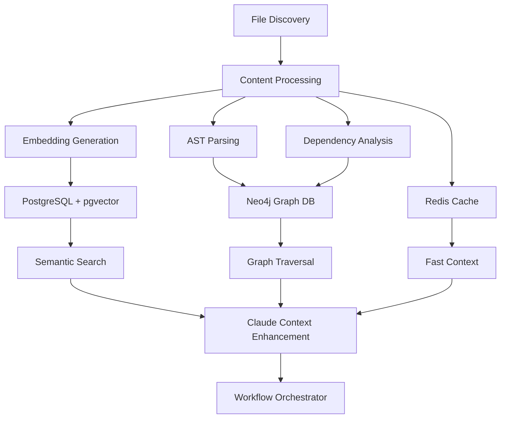

# CodeMind Data Pipeline Architecture

## 🔄 **Complete Data Flow: File Discovery → Multi-Database Intelligence**

### **Overview**
CodeMind transforms discovered project files into structured intelligence across multiple databases for semantic search, graph traversal, and AI-powered context enhancement.

## 📊 **Data Pipeline Stages**



## 🗄️ **Database Mapping**

### **1. PostgreSQL + pgvector - Semantic Intelligence**
**Purpose**: Vector similarity search and file metadata
**Tables**: `semantic_search_embeddings`, `analysis_results`, `projects`

**From File Scanner**:
```typescript
FileInfo {
  path: string          → file_path
  type: string          → content_type
  language: string      → metadata.language
  size: number          → metadata.size
}
```

**Processing Pipeline**:
1. **Content Reading**: Read file content from disk
2. **Embedding Generation**: Create vector embeddings using OpenAI/local models
3. **Storage**: Store in `semantic_search_embeddings` with vector index

### **2. Neo4j - Relationship Graph**
**Purpose**: Code relationships, imports, dependencies
**Nodes**: Files, Classes, Functions, Variables
**Relationships**: IMPORTS, EXTENDS, CALLS, DEPENDS_ON

**From File Scanner**:
```typescript
FileInfo → AST Parsing → {
  imports: string[]     → IMPORTS relationships
  exports: string[]     → EXPORTS relationships
  classes: string[]     → CLASS nodes
  functions: string[]   → FUNCTION nodes
}
```

### **3. Redis - Performance Cache**
**Purpose**: Fast context retrieval and session state
**Keys**: `project:{id}:files`, `context:{hash}`, `session:{id}`

**From File Scanner**:
```typescript
ScanResult → {
  "files:list": FileInfo[]
  "stats:type": byType counts
  "stats:language": byLanguage counts
}
```

## 🔧 **Integration Points**

### **Stage 1: Project Initialization (`/init`)**
```typescript
// src/cli/managers/project-manager.ts
async initializeProject() {
  // 1. File Discovery (FIXED)
  const scanResult = await scanner.scanProject(projectPath);

  // 2. Content Processing (NEEDS FIX)
  const processedFiles = await this.processFileContents(scanResult.files);

  // 3. Database Population (NEEDS FIX)
  await this.populateAllDatabases(processedFiles);
}
```

### **Stage 2: Semantic Search (`/search`, Claude queries)**
```typescript
// src/shared/semantic-enhancement-engine.ts
async enhanceQuery(query: string) {
  // 1. Vector Search in PostgreSQL
  const similarFiles = await this.searchSimilarFiles(query);

  // 2. Graph Expansion in Neo4j
  const relatedFiles = await this.findRelatedFiles(similarFiles);

  // 3. Context Assembly
  return this.buildEnhancementContext(similarFiles, relatedFiles);
}
```

### **Stage 3: Workflow Orchestration (Feature requests)**
```typescript
// src/cli/codemind-workflow-orchestrator.ts
async executeFeatureRequest(request: UserFeatureRequest) {
  // 1. Intent Analysis + Tool Selection
  const intent = await this.analyzeIntent(request.query);

  // 2. Semantic Context Gathering (uses all databases)
  const context = await this.semanticEngine.enhanceQuery(request.query);

  // 3. Sub-task Processing with Claude
  const results = await this.processWithClaude(context);
}
```

## 🚨 **Current Issues & Fixes Needed**

### **Issue 1: Broken Data Pipeline**
❌ **Problem**: `populateDatabases()` expects old format
✅ **Fix**: Update to use new `ScanResult` format

### **Issue 2: Missing Content Processing**
❌ **Problem**: No actual file content reading or embedding generation
✅ **Fix**: Add content processing step after file discovery

### **Issue 3: No Neo4j Integration**
❌ **Problem**: No AST parsing or relationship building
✅ **Fix**: Add semantic graph builder integration

## 🎯 **Data Requirements by Feature**

### **Semantic Search (`/search`)**
**Requires**:
- ✅ File paths (from scanner)
- ❌ File content embeddings (missing)
- ❌ Vector similarity index (missing)

### **Graph Traversal (Claude context)**
**Requires**:
- ✅ File relationships (discoverable)
- ❌ Import/export parsing (missing)
- ❌ Neo4j relationship storage (missing)

### **Workflow Orchestrator (Feature requests)**
**Requires**:
- ✅ Project file inventory (from scanner)
- ❌ Semantic context enhancement (partially broken)
- ❌ Quality feedback loop (missing)

## 🛠️ **Implementation Priority**

### **Priority 1: Fix Data Pipeline**
1. Update `populateDatabases()` to use `ScanResult` format
2. Add content reading step after file discovery
3. Integrate embedding generation service

### **Priority 2: Enable Semantic Search**
1. Generate embeddings for discovered files
2. Store in PostgreSQL with pgvector indexing
3. Test semantic similarity queries

### **Priority 3: Build Knowledge Graph**
1. Add AST parsing for discovered code files
2. Extract imports, exports, class relationships
3. Store in Neo4j with proper indexing

### **Priority 4: Complete Workflow Integration**
1. Ensure semantic engine works with new data
2. Test end-to-end feature request workflow
3. Validate quality feedback loops

## 📈 **Success Metrics**

- **File Discovery**: Scanner finds all codebase files (excluding dependencies)
- **Embeddings**: PostgreSQL contains vectors for all discovered files
- **Graph**: Neo4j contains relationships for all code dependencies
- **Search**: Semantic search returns relevant results
- **Workflow**: End-to-end feature requests complete successfully

## 🔍 **Debugging Commands**

```bash
# Check file discovery
SELECT COUNT(*) FROM semantic_search_embeddings WHERE project_id = 'your-project-id';

# Check Neo4j relationships
MATCH (f:File) RETURN COUNT(f);

# Check Redis cache
redis-cli KEYS "project:*"

# Test semantic search
# Use /search command in CLI
```