# CodeMind Ideal Dashboard Design

## Overview
This document presents the architectural design for an ideal CodeMind dashboard that provides comprehensive visibility into CLI operations, project management, orchestration workflows, planning phases, and intelligent search capabilities.

## Dashboard Architecture

```mermaid
graph TB
    %% Main Dashboard Layout
    DB[CodeMind Dashboard]
    
    %% Top Navigation
    DB --> NAV[Navigation Bar]
    NAV --> HOME[🏠 Home]
    NAV --> PROJ[📁 Projects]
    NAV --> ORCH[🎭 Orchestrator]
    NAV --> PLAN[📋 Planner]
    NAV --> SEARCH[🔍 Search]
    NAV --> SET[⚙️ Settings]
    NAV --> HELP[❓ Help]
    
    %% Home Dashboard
    HOME --> OVERVIEW[Project Overview]
    HOME --> METRICS[System Metrics]
    HOME --> ACTIVITY[Recent Activity]
    HOME --> ALERTS[Alerts & Notifications]
    
    %% Project View Module
    PROJ --> PLIST[Project List]
    PROJ --> PDETAIL[Project Details]
    PROJ --> PANALYTICS[Project Analytics]
    
    PLIST --> PFILTER[Filter & Sort]
    PLIST --> PSTATUS[Status Overview]
    PLIST --> PQUICK[Quick Actions]
    
    PDETAIL --> PINFO[Basic Info]
    PDETAIL --> PFILES[File Structure]
    PDETAIL --> PPATTERNS[Detected Patterns]
    PDETAIL --> PMETRICS[Performance Metrics]
    PDETAIL --> PINIT[Initialization Progress]
    PDETAIL --> PGRAPH[Dependency Graph]
    
    %% CLI Data Visibility
    PDETAIL --> CLI[CLI Operations]
    CLI --> CLILOG[Command Log]
    CLI --> CLIPERF[Performance Stats]
    CLI --> CLITOOLS[Tool Usage]
    CLI --> CLIERR[Error Tracking]
    CLI --> CLISESS[Session History]
    
    %% Orchestrator Module
    ORCH --> WORKFLOWS[Workflow Management]
    ORCH --> ORCHTASKS[Task Queue]
    ORCH --> ORCHMON[Live Monitoring]
    ORCH --> ORCHHIST[Execution History]
    
    WORKFLOWS --> WFTEMP[Workflow Templates]
    WORKFLOWS --> WFCUSTOM[Custom Workflows]
    WORKFLOWS --> WFEXEC[Active Executions]
    
    ORCHTASKS --> TASKQUEUE[Task Queue View]
    ORCHTASKS --> TASKDIST[Task Distribution]
    ORCHTASKS --> TASKPERF[Task Performance]
    
    %% Planner Module
    PLAN --> PROJECTS[Project Planning]
    PLAN --> MILESTONES[Milestone Tracking]
    PLAN --> DEPENDENCIES[Dependency Management]
    PLAN --> ROADMAP[Project Roadmap]
    
    PROJECTS --> PHASES[Project Phases]
    PROJECTS --> TIMELINE[Timeline View]
    PROJECTS --> RESOURCES[Resource Allocation]
    
    %% Semantic Search Module
    SEARCH --> SEARCHUI[Search Interface]
    SEARCH --> RECOMMEND[Recommended Searches]
    SEARCH --> SEARCHHIST[Search History]
    SEARCH --> FILTERS[Advanced Filters]
    
    SEARCHUI --> QUERY[Query Input]
    SEARCHUI --> RESULTS[Search Results]
    SEARCHUI --> CONTEXT[Contextual Info]
    
    RECOMMEND --> RECCODE[Code Patterns]
    RECOMMEND --> RECISSUES[Common Issues]
    RECOMMEND --> RECOPT[Optimizations]
    RECOMMEND --> RECBEST[Best Practices]
    
    %% Settings Module
    SET --> SYSCONFIG[System Configuration]
    SET --> USERPREFS[User Preferences]
    SET --> INTEGRATIONS[Integrations]
    SET --> SECURITY[Security Settings]
    
    %% Data Sources
    POSTGRES[(PostgreSQL<br/>Projects & Progress)]
    REDIS[(Redis<br/>Cache & Sessions)]
    NEO4J[(Neo4j<br/>Graph Relationships)]
    MONGO[(MongoDB<br/>Documents & Logs)]
    
    %% Connect data sources
    PDETAIL -.-> POSTGRES
    CLI -.-> REDIS
    PGRAPH -.-> NEO4J
    SEARCHUI -.-> POSTGRES
    SEARCHUI -.-> NEO4J
    WORKFLOWS -.-> MONGO
    CLISESS -.-> REDIS
    
    %% Styling
    classDef database fill:#e1f5fe
    classDef module fill:#f3e5f5
    classDef feature fill:#e8f5e8
    classDef search fill:#fff3e0
    
    class POSTGRES,REDIS,NEO4J,MONGO database
    class PROJ,ORCH,PLAN,SEARCH,SET module
    class CLI,WORKFLOWS,SEARCHUI feature
    class RECOMMEND,RECCODE,RECISSUES,RECOPT,RECBEST search
```

## Detailed Module Specifications

### 1. Project View Enhanced

```mermaid
graph LR
    %% Project View Details
    PV[Project View] --> INFO[📊 Project Info]
    PV --> STRUCT[🗂️ File Structure]
    PV --> PATTERNS[🔍 Code Patterns]
    PV --> DEPS[🔗 Dependencies]
    PV --> METRICS[📈 Metrics]
    PV --> CLI[💻 CLI Data]
    
    %% CLI Data Breakdown
    CLI --> COMMANDS[Command History]
    CLI --> TOOLS[Tool Usage Stats]
    CLI --> PERFORMANCE[Performance Data]
    CLI --> ERRORS[Error Logs]
    CLI --> SESSIONS[Session Analytics]
    
    COMMANDS --> CMDLIST[Recent Commands]
    COMMANDS --> CMDFREQ[Command Frequency]
    COMMANDS --> CMDSUCCESS[Success Rate]
    
    TOOLS --> TOOLUSED[Tools Used]
    TOOLS --> TOOLPERF[Tool Performance]
    TOOLS --> TOOLERR[Tool Errors]
    
    %% Real-time Updates
    CLI -.-> LIVE[🔴 Live Updates]
    LIVE --> CURRENT[Current Operations]
    LIVE --> PROGRESS[Progress Indicators]
    LIVE --> STATUS[Status Monitors]
```

### 2. Orchestrator Dashboard

```mermaid
graph TD
    %% Orchestrator Overview
    ORCH[🎭 Orchestrator] --> ACTIVE[Active Workflows]
    ORCH --> QUEUE[Task Queue]
    ORCH --> TEMPLATES[Workflow Templates]
    ORCH --> MONITOR[Live Monitoring]
    ORCH --> HISTORY[Execution History]
    
    %% Active Workflows
    ACTIVE --> WF1[Workflow 1: Code Analysis]
    ACTIVE --> WF2[Workflow 2: Testing Pipeline]
    ACTIVE --> WF3[Workflow 3: Documentation Gen]
    
    WF1 --> STEP1[Step 1: Semantic Analysis ✅]
    WF1 --> STEP2[Step 2: Pattern Detection 🔄]
    WF1 --> STEP3[Step 3: Report Generation ⏳]
    
    %% Queue Management
    QUEUE --> PENDING[Pending Tasks]
    QUEUE --> PRIORITY[Priority Queue]
    QUEUE --> RESOURCES[Resource Allocation]
    
    %% Monitoring
    MONITOR --> REALTIME[Real-time Metrics]
    MONITOR --> ALERTS[Alert System]
    MONITOR --> LOGS[Execution Logs]
```

### 3. Semantic Search Interface

### 4. Planner Interface

```mermaid
graph TB
    %% Planner Overview
    PLANNER[📋 Project Planner] --> PHASES[Project Phases]
    PLANNER --> MILESTONES[Milestones]
    PLANNER --> TIMELINE[Timeline View]
    PLANNER --> DEPENDENCIES[Dependencies]
    PLANNER --> RESOURCES[Resources]
    
    %% Project Phases
    PHASES --> P1[Phase 1: Discovery]
    PHASES --> P2[Phase 2: Analysis]
    PHASES --> P3[Phase 3: Implementation]
    PHASES --> P4[Phase 4: Testing]
    PHASES --> P5[Phase 5: Deployment]
    
    P1 --> P1T[📝 Requirements Gathering]
    P1 --> P1A[🔍 Initial Analysis]
    P1 --> P1S[📊 Stakeholder Review]
    
    P2 --> P2T[🔬 Deep Code Analysis]
    P2 --> P2P[🎯 Pattern Recognition]
    P2 --> P2R[📈 Risk Assessment]
    
    %% Milestone Tracking
    MILESTONES --> M1[✅ Project Setup Complete]
    MILESTONES --> M2[🔄 Analysis Phase 50%]
    MILESTONES --> M3[⏳ Implementation Start]
    MILESTONES --> M4[⏳ Testing Phase]
    MILESTONES --> M5[⏳ Production Deploy]
    
    %% Dependencies
    DEPENDENCIES --> DEP1[Phase Dependencies]
    DEPENDENCIES --> DEP2[Resource Dependencies]
    DEPENDENCIES --> DEP3[External Dependencies]
    
    %% Progress Visualization
    TIMELINE --> GANTT[Gantt Chart View]
    TIMELINE --> CALENDAR[Calendar View]
    TIMELINE --> KANBAN[Kanban Board]
```

### 5. Settings & Configuration

```mermaid
graph LR
    %% Settings Overview
    SETTINGS[⚙️ Settings] --> SYSTEM[System Config]
    SETTINGS --> USER[User Preferences]
    SETTINGS --> INTEGRATIONS[Integrations]
    SETTINGS --> SECURITY[Security]
    SETTINGS --> ADVANCED[Advanced]
    
    %% System Configuration
    SYSTEM --> DB[Database Settings]
    SYSTEM --> PERF[Performance Tuning]
    SYSTEM --> LOGS[Logging Configuration]
    SYSTEM --> CACHE[Cache Settings]
    
    %% User Preferences
    USER --> THEME[Theme & UI]
    USER --> NOTIFICATIONS[Notifications]
    USER --> SHORTCUTS[Keyboard Shortcuts]
    USER --> DASHBOARD[Dashboard Layout]
    
    %% Integrations
    INTEGRATIONS --> CLAUDE[Claude Integration]
    INTEGRATIONS --> GIT[Git Repositories]
    INTEGRATIONS --> IDE[IDE Plugins]
    INTEGRATIONS --> WEBHOOK[Webhooks]
    
    %% Security Settings
    SECURITY --> AUTH[Authentication]
    SECURITY --> PERMISSIONS[Permissions]
    SECURITY --> API[API Keys]
    SECURITY --> AUDIT[Audit Logs]
```

## Key Features Summary

### 🎯 **Enhanced Project Visibility**
- Real-time CLI command tracking and analytics
- Comprehensive file structure visualization
- Pattern detection and analysis results
- Performance metrics and optimization suggestions

### 🎭 **Orchestrator Management**
- Live workflow execution monitoring
- Task queue management with priority handling
- Workflow template library
- Execution history and analytics

### 📋 **Strategic Planning**
- Multi-phase project planning with dependencies
- Milestone tracking and progress visualization
- Resource allocation and timeline management
- Risk assessment and mitigation planning

### 🔍 **Intelligent Search**
- Semantic code search with natural language queries
- Curated recommended searches by category
- Contextual search results with quick actions
- Advanced filtering and search history

### ⚙️ **Comprehensive Configuration**
- System-wide configuration management
- User preference customization
- Third-party integrations
- Security and audit controls

This ideal dashboard design provides a comprehensive view of all CodeMind operations while maintaining intuitive navigation and powerful search capabilities.